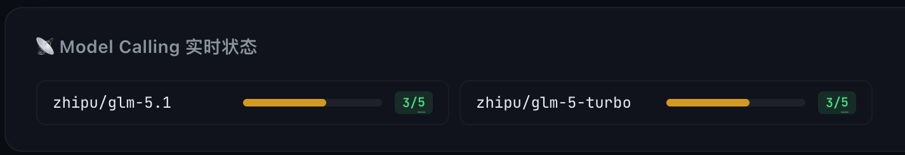
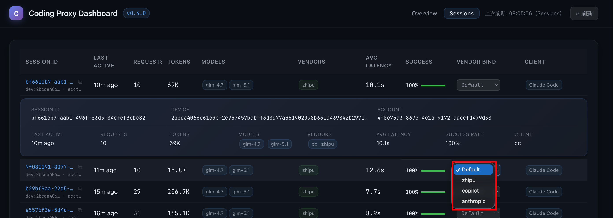

# Changelog

本文件基于 [Keep a Changelog](https://keepachangelog.com/zh-CN/) 规范维护，版本号遵循 [语义化版本](https://semver.org/lang/zh-CN/)。

## [Unreleased]

## [v0.5.2a7](https://github.com/ThreeFish-AI/coding-proxy/releases/tag/v0.5.2a7) - 2026-07-04

- style(dashboard): Overview 页 6 张 KPI 卡片（今日请求数 / Token 总量 / 输出 Token / 费用估算 / 故障转移 / 平均延迟）固定单行不折行——`.kpi-grid` 由 `repeat(auto-fit, minmax(200px, 1fr))`（视口 < ~1289px 即减列换行）改为 `repeat(6, minmax(0, 1fr))`，`minmax(0,…)` 覆盖 grid 默认 `min-width:auto` 杜绝内容撑列引发的横向溢出，桌面/笔记本/平板横屏（≥1024px）恒定 6 列单行；`gap` 由 off-grid 的 `5px` 归一为 `--gap-section`（12px）；`.kpi-value` 采用 `clamp(20px, 2.2vw, 32px)` 平滑缩放使中宽度不裁剪数值，费用卡 `#kpi-cost-today` 允许在 `" + "` 处换行使双币种始终完整可见；新增 ≤1023px→3 列、≤480px→2 列 优雅降级，`header` 补 `flex-wrap` 修复窄屏横向溢出（Playwright 8 档宽度实测：1440/1280/1024px 均 6 列单行、无横向滚动、无数值裁剪）(#276)；
- a11y(dashboard): 为 `.range-btn` / `.btn-refresh` / `.page-btn` / `.copy-btn` 补 `:focus-visible` 键盘焦点环，统一交互元素键盘可达性；新增 `@media (prefers-reduced-motion: reduce)` 降级 `fadeInUp` 动画与 hover 过渡，照顾前庭敏感用户 (#276)；
- fix(dashboard): 补定义 `--bg-secondary` / `--text-muted` 两个此前**未定义**的 CSS 变量（消除 `.mc-model-row` / `.mc-empty` 背景与文字色回退瑕疵）；Google Fonts 补载 JetBrains Mono `700` 字重，修正 `.kpi-value` 合成粗体渲染 (#276)；
- docs(readme): 页脚补充作者主页（ThreeFish-AI）与 Apache License 2.0 开源协议超链接；

## [v0.5.2a6](https://github.com/ThreeFish-AI/coding-proxy/releases/tag/v0.5.2a6) - 2026-07-04

- style(branding): 品牌图标（logo/favicon）迭代至「通透青绿圆环 + Tabler prompt `>_` 笔划」（方案 d05）：全透明底 + 青绿渐变（`#22d3ee` → `#2dd4bf`）细圆环（stroke 0.5，仅原 1/3、通透若隐）+ 饱和青绿渐变 `>_`（stroke 2.5），极细环与饱和笔划形成权重对比、`>_` 为视觉主角，青绿承载终端/代码语义；基础笔划改用 Tabler prompt（chevron `M5 7l5 5l-5 5` + 下划线 `M13 17l6 0`，下划线长 6 单位、不会小尺寸点化）；渐变改 `gradientUnits="userSpaceOnUse"` 绝对坐标，修复纯水平下划线（包围盒高度 0）在默认 objectBoundingBox 渐变下不着色而「消失」的问题；`_LOGO_DEFS` / `_PROMPT_PATHS` 单一事实源统一供 SVG favicon、ICO 回退（省略 0.5px 细环、保留饱和笔划）与页面 logo 消费；`.logo` 容器改全透明、SVG 内嵌圆环 + 青绿 drop-shadow 辉光（实机验证）(#274)；
- style(branding): 品牌图标醒目度前置优化（同主题演进过程，已并入本版）：容器由「淡色磨砂卡片」改为「玻璃雾卡」（半透明白 + hairline 描边环）与深色毛玻璃 header 语言统一、消除「亮白贴片」压制感，`>_` 笔划加粗 stroke-width 2→2.5 并撑开间距避免粘连、防止下划线小尺寸退化为圆点 (#274)；

## [v0.5.2a5](https://github.com/ThreeFish-AI/coding-proxy/releases/tag/v0.5.2a5) - 2026-07-04

- fix(dashboard): 供应商队列拖拽由原生 HTML5 DnD 改为 Pointer Events 实现，修复 v0.5.2a4 引入的拖拽排序功能在浏览器中无法拖动的问题；引入 4px 拖拽阈值、乐观实时重排与指针捕获机制，同步支持触屏设备；拖拽完成后顺序立即影响 cc 运行时供应商优先级调度（实机验证）；为 `/dashboard` 响应增加 `Cache-Control: no-cache`，防止浏览器缓存旧内联脚本；补齐前端守卫测试断言 (#271)；
- style(branding): 重设计 logo/favicon 为 `#f5f6fb` 淡色磨砂卡片 + 品牌渐变（`#667eea` → `#764ba2`）`>_` 笔划 + 半透明细描边环，轮廓成为视觉主角、小尺寸下更清晰（Linear/Vercel 风）；抽取 `_LOGO_DEFS` 作为品牌渐变 `<defs>` 单一事实源，统一供 SVG favicon、ICO 回退与页面 logo 消费 (#272)；

## [v0.5.2a4](https://github.com/ThreeFish-AI/coding-proxy/releases/tag/v0.5.2a4) - 2026-07-03

- feat(dashboard): 供应商状态模块支持拖拽调整供应商优先级，新增纯重排序端点 `PUT /api/tier-order`（复用 `router.reorder_tiers`，不重置熔断器/配额守卫/rate limit），拖拽后配额与用量统计保持当日值不变；与 `reset -v` 同源、运行时内存生效，失败自动回滚至服务端真实顺序 (#269)；
- feat(session): 扩充标题豁免前缀，新增 `[Session]` 过滤注入式 Prompt 候选；
- chore(pricing): 更新智谱 GLM-5.2 模型定价配置；

## [v0.5.2a3](https://github.com/ThreeFish-AI/coding-proxy/releases/tag/v0.5.2a3) - 2026-07-02

- fix(session): 标题豁免前缀扩展至全层级兜底标题，修复 `[Session] <model>` 等 Level 4 合成标题无法豁免（原 `title_exempt_prefixes` 仅 Level 1 生效）；改为在 `_extract_session_title` 编排层对 L1/L2/L3/L4 候选统一拦截，命中回退、全豁免返回空串待后续真实输入回填，默认行为零影响 (#267)；

## [v0.5.2a2](https://github.com/ThreeFish-AI/coding-proxy/releases/tag/v0.5.2a2) - 2026-07-02

- feat(session): 新增 Session 标题豁免前缀配置 `title_exempt_prefixes`，过滤注入式 Prompt（典型如 "Write the title in the language the user wrote in..."）被误用为 Session 标题；首条 user 输入经噪声剥离后命中豁免前缀则跳过、继续向后查找 title 候选，Level 2/3/4 回退不受影响 (#265)；

## [v0.5.2a1](https://github.com/ThreeFish-AI/coding-proxy/releases/tag/v0.5.2a1) - 2026-06-30

- fix(zhipu): 将 429/529 兜底退避抖动从 Full Jitter 改为 Equal Jitter（`[0, ceiling]` → `[ceiling/2, ceiling]`），修复 529 过载重试延迟非单调（实测 418.8→1857.7→961.6→3769.7ms）问题，重试延迟呈单调非递减指数形态；429 与 529 共用退避路径同步受益，server `retry-after` 优先级不变 (#263)；
- feat(dashboard): Model Calling 实时监控扩展至全 vendor / 全 model（仅 CC 场景），其他 vendor 在 monitor 模式下仅计数不限流，Zhipu 保留 limited 模式 + FIFO 排队；
- feat(concurrency): 新增 `peak_pending_recent` 最近 10s 排队峰值追踪，瞬时排队释放后前端仍可见"曾排队 N" 余晖徽章；
- perf(dashboard): Model Calling 轮询间隔由 5000ms 缩短至 1500ms，提升瞬时排队可观测性；
- refactor(vendors): `ModelConcurrencyLimiter` 重构为 `ModelConcurrencyController`，统一 monitor / limited 双模式抽象（保留旧名别名）；并发控制由 vendor 内部迁移至 executor 层 `track_in_flight` 包裹，行为对所有 vendor 一致；

> [!NOTE]
> 本版另补记 v0.5.1 Release Note 遗漏的 4 项并发与监控改动（feat/perf/refactor，代码已随 v0.5.1 上线，文档此前未记录）。

## [v0.5.0](https://github.com/ThreeFish-AI/coding-proxy/releases/tag/v0.5.0) - 2026-05-27

> [!IMPORTANT]
>
> **🚀 Model Calling 实时状态！**
>
> 模型并发与排队深度一目了然，运行时动态调整每个模型并行度，预防 vendor 侧的 429 幺蛾子。

### ✨ 核心亮点

- feat(concurrency): 新增 Model Calling 实时状态模块，可视化每模型并发与排队深度，支持运行时动态修改每模型并行度 (#250) (#251)
- feat(zhipu): 新增每模型并发限制，默认 3 个并行请求 FIFO 排队 (#248)
- feat(zhipu): 为 429 Rate Limit 添加指数退避重试挽回机制 (#242)

### 🔧 更多特性

- fix(antigravity): 修复 v1internal 模式检测逻辑并新增 E2E 测试; (#234)
- fix(routes): 修复 count_tokens 路由对 target_vendor.name 的错误属性访问; (#235)
- fix(vendor-channels): 修复 zhipu→anthropic 通道 tool_use/tool_result 配对漏洞; (#236)
- fix(native-api): 修复 Gemini :verb 路径中 %3A URL 编码导致上游 400 的兼容问题; (#237)
- fix(zhipu): 诊断首选 tier 语义拒绝降级问题，增强可观测性并提取跨供应商清洗共享函数 (#243)

## [v0.4.0](https://github.com/ThreeFish-AI/coding-proxy/releases/tag/v0.4.0) — 2026-05-01

> [!IMPORTANT]
>
> **🚀 Session 级专属路由策略！**
>
> 给每个 Session 指定专属的 vendor，动态调节不同 vendors 间的 LLM 流量。

### ✨ 核心亮点

- feat(session-policy): 新增 Session 级专属路由策略 (#219)
- feat(dashboard): 新增会话活动面板 (#222)

### 🔧 更多特性

- refactor(logging): 移除已被 ModelCall 汇总行覆盖的冗余 DEBUG 日志 (#203)
- style(dashboard): 加宽图表 tooltip 令模型名称与用量值单行显示 (#211)
- fix(usage-parser): 补充 OpenAI/Gemini SSE 流式分支的 model_served 提取 (#214)
- fix(usage-parser): 兼容 SSE chunk 中 usage 字段为 null 的极端格式 (#212)

## [v0.3.0](https://github.com/ThreeFish-AI/coding-proxy/releases/tag/v0.3.0) — 2026-04-20

> [!IMPORTANT]
>
> **🚀 OpenAI、Anthropic、Gemini 原生 API 进驻 Coding Proxy！**
>
> 服务对象不在局限 Claude Code，凡兼容 OpenAI、Anthropic、Gemini 三巨头 API 协议的客户端，出口 LLM 流量可统一收敛到 Coding Proxy。

### ✨ 核心亮点

- feat(native-api): 新增 `/api/{openai,gemini,anthropic}/**` 原生 LLM API 全量 catch-all 透传通道；
- feat(dashboard): 新增实时 Web Dashboard 页面，聚合展示流量与用量统计;
- feat(usage): `usage` 区分 Claude Code 场景（`'cc'`）与原生 API 场景（`'api'`）；
- refactor(vendor-channels): 将供应商转换通道从目标专属重构为源→目标绑定模型;
- docs(user-guide): 补充 POST /v1/messages 完整 API 参考文档;

### 🔧 更多特性

- feat(server): 默认监听端口 `8046` → `3392`，规范化 [Negentropy](https://github.com/ThreeFish-AI/negentropy) 体系端口；

## [v0.2.3](https://github.com/ThreeFish-AI/coding-proxy/releases/tag/v0.2.3) — 2026-04-16

- feat(dashboard): 新增实时 Web Dashboard 页面，聚合展示流量与用量统计;
- docs(user-guide): 补充 POST /v1/messages 完整 API 参考文档;
- fix(request-normalizer): misplaced tool_result 从剥离改为重定位，修复跨供应商降级后 Anthropic 恢复失败;

## [v0.2.2](https://github.com/ThreeFish-AI/coding-proxy/releases/tag/v0.2.2) — 2026-04-13

- feat(reset): CLI reset 命令新增 -v/--vendor 参数，支持运行时 N-tier 链路重排序（逗号分隔的 vendor 列表）;
- fix(logging): 修复 uvicorn.error 日志在文件中重复打印的问题;

## [v0.2.1](https://github.com/ThreeFish-AI/coding-proxy/releases/tag/v0.2.1) — 2026-04-11

- feat(logging): 实现日志双写（控制台 + 本地文件），日志文件支持 5MB 自动轮转及 gzip 压缩备份；ModelCall 日志降级为 DEBUG 级别；
- feat(circuit-breaker): 补全熔断器状态转换日志的 vendor 上下文信息;

## [v0.2.0](https://github.com/ThreeFish-AI/coding-proxy/releases/tag/v0.2.0) — 2026-04-09

> [!IMPORTANT]
>
> **🚀 供应商大扩军 × 用量仪表盘全面进化，双线暴击！**
>
> 卡在一家供应商的限额天花板下抬不起头？现在你手握 **九条命**——新增 MiniMax、小米 MiMo、阿里千问、Kimi、豆包五路援军，全部原生讲 Anthropic 话，无缝接入 N-tier。 Token 烧到哪儿心里没数？新版 `usage` 命令解锁日/周/月/全量四档视角，多供应商并排比，汇总行一行看全局。**备用仓更满，账单更透，从此宕机只是别人家的故事。**

### ✨ 核心亮点

- **5 家供应商集体入场**：MiniMax、小米 MiMo、阿里千问、Kimi、豆包（火山引擎）正式入编 N-tier。备用通道数量直接翻倍，不怕堵；
- **`usage` 命令全面升级**：从"只有天数"进化为**日 / 周 / 月 / 全量**四档时间维度（`-d 7` / `-w` / `-m` / `-t`）。支持多值过滤——`-v anthropic,kimi` 或 `--model claude-opus-4-6,glm-5.1` 用逗号隔开随便选。表格末行自动追加**汇总行**，请求总量、Token 总计、总成本、加权平均延迟四项一览无余。Token 花在哪家、烧了多少、谁最能扛——这张表给你答案；

### 🔧 更多特性

- **品牌横幅正式上线**：`proxy start` 启动时打印 Coding Proxy 专属 ASCII Banner 与版本号，告别冷冰冰的裸日志起手式；
- **529 过载纳入降级触发**：HTTP `529 overloaded_error` 正式加入故障转移白名单，Anthropic 喊"我堵了"时 Proxy 不再干等；
- **Zhipu 跨供应商级联故障根治**：`Internal Network Failure` 纳入 500 降级条件；`tool_result` 角色错位导致的下游级联崩溃彻底斩断，再也不因历史 message 的"历史遗留问题"把整条链拖下水；

## [v0.1.3](https://github.com/ThreeFish-AI/coding-proxy/releases/tag/v0.1.3) — 2026-04-07

> [!IMPORTANT]
>
> **🔥 跨供应商"身份危机" + 熔断器"装死"双杀！**
>
> Zhipu 的 thinking blocks 偷渡到 Anthropic 被当场识破 → 400 无限循环降级？斩了。429 限流后熔断器嘴上说"我没事"身体却已躺平？修了。两大隐蔽 Bug 一锅端，跨供应商丝滑切换从此告别"薛定谔的可用性"。

### ✨ 核心亮点

- **Thinking Blocks "安检门"**：Anthropic 对请求体 deepcopy 后，**精准剥离** assistant messages 中的 `thinking` / `redacted_thinking` blocks。Zhipu → Anthropic 迁移时历史思考签名不再越界，400 `invalid_request_error` 彻底根除，其他供应商零影响；
- **熔断器 Force-Open 闪电响应**：为 `record_failure()` 新增 `force_open` 参数——当检测到 429/403 携带 `retry_after_seconds`（即 Rate Limit 硬信号）时，**跳过累积阈值直接 OPEN**，状态展示与实际可用性分秒对齐；非 429 错误（5xx、超时等）保持原有累积行为不变。

## [v0.1.2](https://github.com/ThreeFish-AI/coding-proxy/releases/tag/v0.1.2) — 2026-04-06

> [!IMPORTANT]
>
> **🔓 count_tokens 终于不再"偏心" Anthropic 了！**
>
> 全面拥抱多供应商泛化透传。配合全局活跃 Vendor 状态追踪机制，智能跟随 Vendor 当前移位，熔断降级？无缝切换，零感知！

### ✨ 核心亮点

- **全局活跃 Vendor 状态追踪**：🧠 Router 新增活跃 Vendor 属性，Executor 在每次流式/非流式请求成功后自动写入当前活跃供应商名称。精准锁定"此刻谁在干活"，完美适配熔断降级等动态切换场景；

### 🔧 更多特性

- 🔧 **CI 三合一修复**：一次性根治 ruff lint 的 F821/F401 导入幽灵、formatter 行长规范对齐，CI 绿灯常亮！

## [v0.1.1](https://github.com/ThreeFish-AI/coding-proxy/releases/tag/v0.1.1) — 2026-04-05

> [!IMPORTANT]
>
> **🎉 coding-proxy MVP 惊艳登场！**
>
> 仅需配置一行环境变量，立刻为你的 Claude Code 接入“永不宕机”的多源智能引擎。主供应商打盹？毫秒级自动无缝切换备用通道，全天候护航你的编码心流，向打断大声说不！

### ✨ 核心亮点

- **N-tier 高可用接力**：随心编排供应商优先级；默认内置 `Claude → GitHub Copilot → Antigravity → GLM` 丝滑降级链路，天塌下来有 Proxy 顶着；
- **自愈式智能熔断**：微秒级状态机严防“雪崩效应”，搭配指数退避重试，一旦主干回血，静默自愈切回；
- **账单刺客克星**：极客专属的 SQLite 本地账本 + CLI 多维看板（按维度：日/模型/供应商），把 Token 消耗拆解到每一比特，精打细算不背锅；
- **OAuth2 丝滑接入**：原生集成 GitHub Device Flow 与 Google OAuth。告别干枯的断更密钥，令牌到期自动接力轮转，专注写码不分心；
- **多协议“同传专家”**：Anthropic 与 OpenAI / Gemini 协议底层双向无损翻译，鸡同鸭讲？在 proxy 层是不存在的；
- **模型指名道姓**：随需定制你的神级转发地图，`claude-opus-*` 秒变 `glm-5v-turbo`，指哪打哪，模型矩阵全由你做主；
- **全透明“隐身衣”**：FastAPI 强劲异步驱动，开箱即用。仅需覆盖注入 `ANTHROPIC_BASE_URL`，对上层应用百分百零侵入、零违和；
- **SSE 星际流水线**：彻底打破协议壁垒，流式连线跨体系无损透传，体验每一颗 Token 如丝般顺滑的输出快感；
- **双擎配额守卫**：“5小时滑动窗口 + 固化周配额”双重护城河。余额濒临红线？主动预警机制，断然拒绝突然“断奶”；

### 🔧 更多特性

- 💰 **细粒度计价引擎**：内置主流大模型实时公开保价，调用开销追踪精确至每分每厘，资本家也薅不到你一根毛；
- 🔄 **强迫症级重试流**：深度可配的指数退避策略（不仅是次数，还有倍率），将偶发性异常全部静默拦截在黑盒之中；
- 🧠 **Vendor 降级脑图**：内置多维度供应商能力全息映射，危机时刻全自动施行“损失最小”的兼容降级路线；
- ⏱️ **RateLimit 算命仪**：智能嗅探并解析 Rate Limit Headers，精准算准每一秒 CD 冷却，弹无虚发；
- 🛡️ **神秘 421 疫苗**：专治 GitHub Copilot 偶尔抽风的著名 `421 Misdirection` 顽疾，内置“即刻重试”自愈特效药；
- 🧹 **洁癖级优雅退出**：挥一挥衣袖不带走一片云彩，挂起、清理、落数据，进程结束得干干净净，像风一样自由；
