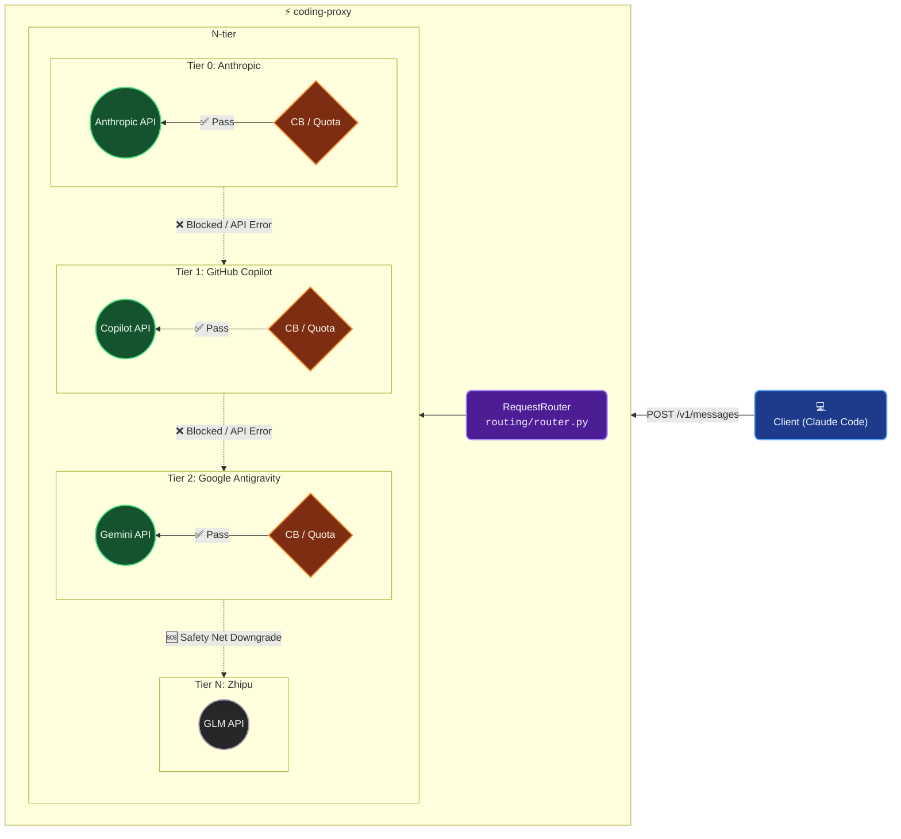

[English](./README.md) | [简体中文](./docs/zh-CN/README.md)

<div align="center">

# ⚡ coding-proxy

**A High-Availability, Transparent, and Smart Multi-Vendor Proxy for Claude Code**

[](https://www.python.org/)
[](#)
[](https://github.com/astral-sh/uv)
[](#)

</div>

---

## 💡 Why Do We Even Need coding-proxy?

When you're deeply immersed in your coding "zone" with **Claude Code** (or any AI assistant relying on Anthropic's Messages API), there's nothing quite as soul-crushing as having your flow violently interrupted by:

- 🛑 **Rate Limiting**: High-frequency pings trigger the dreaded `429 rate_limit_error`. Forced to stare at the screen and rethink your life choices.
- 💸 **Usage Cap**: Aggressive code generation drains your daily/monthly quota, slamming you with a cold, heartless `403` error.
- 🌋 **Overloaded Servers**: Anthropic's official servers melt down during peak hours, tossing back a merciless `503 overloaded_error`.

**coding-proxy** was forged in the developer fires to terminate these exact pain points. Serving as a **purely transparent** intermediate layer, it blesses your Claude Code with millisecond-level "N-tier chained fallback disaster recovery." When your primary vendor goes belly up, it seamlessly and instantly switches your requests to the next smartest available fallback (like GitHub Copilot, Google Antigravity, or even Zhipu GLM)—**with zero manual intervention, and zero perceived interruption.**

---

## 🌟 Core Features

- **⛓️ N-tier Chained Failover**: Automatically downgrades from official Claude Plans, gracefully falling back to GitHub Copilot, then Google Antigravity, with Zhipu GLM acting as the ultimate safety net.
- **🛡️ Smart Resilience & Quota Guardians**: Every single vendor node comes fully armed with an independent **Circuit Breaker** and **Quota Guard** to proactively dodge avalanches without breaking a sweat.
- **👻 Phantom-like Transparency**: **100% transparent** to the client! No code tweaks required. Overwrite `ANTHROPIC_BASE_URL` with a single line, and you're good to go.
- **🔄 Universal Alchemy (Formats & Models)**: Native support for two-way request/streaming (SSE) translations between Anthropic ←→ Gemini. Plus, auto/DIY model name mapping (e.g., effortlessly morphing `claude-*` into `glm-*`).
- **📊 Extreme Observability**: Built-in, zero-BS local monitoring powered by a `SQLite WAL`. The CLI provides a one-click detailed Token usage dashboard (`coding-proxy usage`).
- **⚡ Featherweight Standalone Deployment**: A fully asynchronous architecture (`FastAPI` + `httpx`). Zero dependency on Redis, message queues, or other heavy machinery—absolutely no extra baggage for your dev rig.

---

## 🚀 Quick Start

### 1. Prerequisite Checks
Make sure your rig has **Python 3.13+** and the **`uv`** package manager installed (highly recommended, because life is too short for slow package managers).

### 2. Grab the Code & Install
```bash
git clone https://github.com/ThreeFish-AI/coding-proxy
cd coding-proxy
uv sync
```

### 3. Configure Keys (Using Zhipu GLM as a fallback example)
```bash
cp config.example.yaml config.yaml
# Use environment variables to defensively inject your keys
export ZHIPU_API_KEY="your-api-key-here"
```

### 4. Ignite the Proxy Server
```bash
uv run coding-proxy start
#  INFO:     Started server process
#  INFO:     Uvicorn running on http://127.0.0.1:8046 (Press CTRL+C to quit)
```

### 5. Seamless Claude Code Integration
Open a fresh terminal tab, point to the proxy server when firing up Claude Code, and enjoy blissful, uninterrupted coding nirvana:
```bash
export ANTHROPIC_BASE_URL=http://127.0.0.1:8046
claude
```

---

## 🛠️ The CLI Console Guide

`coding-proxy` comes equipped with a badass suite of CLI tools to help you boss around your proxy state.

| Command  | Description                                                                                                                                         | Example Usage                                 |
| :------- | :-------------------------------------------------------------------------------------------------------------------------------------------------- | :-------------------------------------------- |
| `start`  | **Fire up the proxy server.** Supports custom ports and configuration paths.                                                                        | `coding-proxy start -p 8080 -c ~/config.yaml` |
| `status` | **Check proxy health.** Shows circuit breaker states (OPEN/CLOSED) and quota status across all tiers.                                               | `coding-proxy status`                         |
| `usage`  | **Token Stats Dashboard.** Stalks every single token consumed, failovers triggered, and latency across day/vendor/model dimensions.                | `coding-proxy usage -d 7 -v anthropic`        |
| `reset`  | **The emergency flush button.** Force-reset all circuit breakers and quotas instantly when you've confirmed the main vendor is back from the dead. | `coding-proxy reset`                          |

---

## 📐 Architectural Panorama

When a request inevitably hits the fan, the `RequestRouter` slides gracefully down the N-tier tree, juggling circuit breakers and token quotas to decide the ultimate destination:



*For a deep dive into the architecture and under-the-hood wizardry, consult [framework.md](./docs/framework.md) (Currently in Chinese).*

---

## 📚 Detailed Documentation Map

To ensure this project outlives us all (long-term maintainability), we offer exhaustive, Evidence-Based documentation:

- 📖 **[User Guide](./docs/user-guide.md)** — From installation and bare-minimum configs to the semantic breakdown of every `config.yaml` field and common troubleshooting manuals. (Currently in Chinese)
- 🏗️ **[Architecture Framework](./docs/framework.md)** — A meticulous decoding of underlying design patterns (Template Method, Circuit Breaker, State Machine, etc.), targeted at devs who want to peek into the matrix or contribute new vendors. (Currently in Chinese)
- 🤝 **[Engineering Guidelines (AGENTS.md)](./AGENTS.md)** — The systemic context mindset and AI Agent collaboration protocol. It preaches **refactoring, reuse, and orthogonal abstractions** and serves as the ultimate guiding light for all development in this repository.

---

## 💡 Inspiration & Acknowledgements

During our chaotic yet rewarding exploration of engineering practices, we were heavily inspired by cutting-edge tech ecosystems and brilliant designs. Special shoutouts:

- A massive thank you to **[Claude Code](https://platform.claude.com/docs/en/intro)** for sparking our obsession with crafting the ultimate, seamless programming assistant experience.
- Endless gratitude to the open-source community's myriad of **API Proxy** projects. Your trailblazing in reverse proxies, high-availability setups (circuit breakers/streaming proxies), and dynamic routing provided the rock-solid theoretical foundation for `coding-proxy`'s elastic N-Tier mechanisms.

---

<div align="center">
  <sub>Built with 🧠, ❤️, and an absurd amount of coffee by ThreeFish-AI </sub>
</div>
