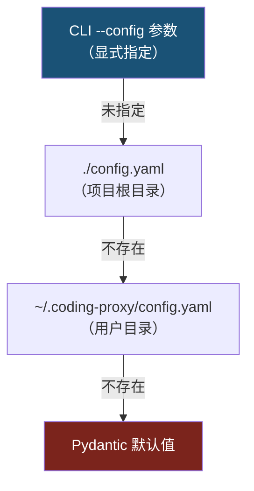

# 配置字段参考

> **路径约定**：本文档中模块路径均相对于 `src/coding/proxy/`。
>
> **定位**：本文档是所有配置参数的**规范来源（Single Source of Truth）**。设计模式章节和模块详情中引用参数默认值时，统一链接至此。

[TOC]

---

## 1. 配置模块结构

配置模型已从单体 `schema.py` 正交拆分为 5 个子模块：

| 子模块          | 文件                                                             | 核心类型                                                                                                                                                  |
| --------------- | ---------------------------------------------------------------- | --------------------------------------------------------------------------------------------------------------------------------------------------------- |
| **server**      | [`config/server.py`](../../src/coding/proxy/config/server.py)    | `ServerConfig`, `DatabaseConfig`, `LoggingConfig`                                                                                                         |
| **vendors**     | [`config/vendors.py`](../../src/coding/proxy/config/vendors.py)  | `AnthropicConfig`, `CopilotConfig`, `AntigravityConfig`, `ZhipuConfig`, `MinimaxConfig`, `KimiConfig`, `DoubaoConfig`, `XiaomiConfig`, `AlibabaConfig`  |
| **resiliency**  | [`config/resiliency.py`](../../src/coding/proxy/config/resiliency.py) | `CircuitBreakerConfig`, `RetryConfig`, `FailoverConfig`, `QuotaGuardConfig`                                                                          |
| **routing**     | [`config/routing.py`](../../src/coding/proxy/config/routing.py)  | `VendorType`, `VendorConfig`, `ModelMappingRule`, `ModelPricingEntry`                                                                                     |
| **auth_schema** | [`config/auth_schema.py`](../../src/coding/proxy/config/auth_schema.py) | `AuthConfig`                                                                                                                                       |

`config/schema.py` 作为聚合入口点 re-export 所有符号，并保留 `ProxyConfig` 顶层模型及旧格式迁移逻辑。

---

## 2. 配置搜索优先级

[`config/loader.py`](../../src/coding/proxy/config/loader.py) 按以下顺序搜索配置文件：



**环境变量展开**：语法 `${VARIABLE_NAME}`，递归处理 dict/list/str，未定义变量保留原文。

---

## 3. 服务器配置

### 3.1 ServerConfig

| 字段   | 类型 | 默认值        | 说明     |
| ------ | ---- | ------------- | -------- |
| `host` | str  | `"127.0.0.1"` | 监听地址 |
| `port` | int  | `8046`        | 监听端口 |

### 3.2 DatabaseConfig

| 字段                       | 类型 | 默认值                        | 说明                  |
| -------------------------- | ---- | ----------------------------- | --------------------- |
| `path`                     | str  | `"~/.coding-proxy/usage.db"`  | SQLite 数据库文件路径 |
| `compat_state_path`        | str  | `"~/.coding-proxy/compat.db"` | 兼容性会话存储路径    |
| `compat_state_ttl_seconds` | int  | `86400`                       | 兼容性会话 TTL（秒）  |

### 3.3 LoggingConfig

| 字段           | 类型        | 默认值   | 说明                                                         |
| -------------- | ----------- | -------- | ------------------------------------------------------------ |
| `level`        | str         | `"INFO"` | 控制台日志级别                                               |
| `file`         | str \| null | `null`   | 文件日志路径（`null` 时输出到控制台）                        |
| `max_bytes`    | int         | `5242880` | 单个日志文件最大字节数（5 MB），触发轮转                     |
| `backup_count` | int         | `5`      | 保留的已压缩备份文件数                                       |

### 3.4 AuthConfig

| 字段               | 类型 | 默认值 | 说明                                 |
| ------------------ | ---- | ------ | ------------------------------------ |
| `token_store_path` | str  | `""`   | Token Store 文件路径（空则使用默认） |

---

## 4. VendorConfig 通用字段

| 字段         | 类型 | 默认值   | 说明                                                                                                                                                                |
| ------------ | ---- | -------- | ------------------------------------------------------------------------------------------------------------------------------------------------------------------- |
| `vendor`     | enum | --       | 供应商类型：`anthropic` / `copilot` / `antigravity` / `zhipu` / `minimax` / `kimi` / `doubao` / `xiaomi` / `alibaba`                                             |
| `enabled`    | bool | `true`   | 是否启用                                                                                                                                                            |
| `base_url`   | str  | `""`     | API 基础 URL（留空使用各供应商默认值）                                                                                                                              |
| `timeout_ms` | int  | `300000` | 请求超时（毫秒）                                                                                                                                                    |

---

## 5. VendorConfig 弹性字段

| 字段                 | 类型           | 默认值               | 说明                        |
| -------------------- | -------------- | -------------------- | --------------------------- |
| `circuit_breaker`    | config \| None | `None`               | 熔断器配置（None = 终端层） |
| `retry`              | config         | `RetryConfig()`      | 重试策略配置                |
| `quota_guard`        | config         | `QuotaGuardConfig()` | 日度配额守卫配置            |
| `weekly_quota_guard` | config         | `QuotaGuardConfig()` | 周度配额守卫配置            |

<a id="elastic-params"></a>

### 5.1 CircuitBreakerConfig — 熔断器参数

> **设计语义**：参见 [设计模式 -- Circuit Breaker](./design-patterns.md#circuit-breaker)

| 字段                       | 类型 | 默认值 | 说明                             |
| -------------------------- | ---- | ------ | -------------------------------- |
| `failure_threshold`        | int  | `3`    | 触发 OPEN 的连续失败次数         |
| `recovery_timeout_seconds` | int  | `300`  | OPEN → HALF_OPEN 等待秒数        |
| `success_threshold`        | int  | `2`    | HALF_OPEN → CLOSED 所需连续成功数 |
| `max_recovery_seconds`     | int  | `3600` | 指数退避最大恢复时间（秒）       |

### 5.2 QuotaGuardConfig — 配额守卫参数

> **设计语义**：参见 [设计模式 -- QuotaGuard State Machine](./design-patterns.md#quota-guard)

| 字段                     | 类型  | 默认值  | 说明                                 |
| ------------------------ | ----- | ------- | ------------------------------------ |
| `enabled`                | bool  | `false` | 是否启用配额守卫                     |
| `token_budget`           | int   | `0`     | 滑动窗口内的 Token 预算上限          |
| `window_hours`           | float | `5.0`   | 滑动窗口大小（小时）                 |
| `threshold_percent`      | float | `99.0`  | 触发 QUOTA_EXCEEDED 的用量百分比阈值 |
| `probe_interval_seconds` | int   | `300`   | QUOTA_EXCEEDED 状态下探测间隔（秒）  |

### 5.3 RetryConfig — 重试策略参数

> **设计语义**：参见 [设计模式 -- Retry with Full Jitter](./design-patterns.md#retry)

| 字段                 | 类型  | 默认值 | 说明         |
| -------------------- | ----- | ------ | ------------ |
| `max_retries`        | int   | `2`    | 最大重试次数 |
| `initial_delay_ms`   | int   | `500`  | 初始延迟（毫秒）     |
| `max_delay_ms`       | int   | `5000` | 最大延迟（毫秒）     |
| `backoff_multiplier` | float | `2.0`  | 退避倍数     |
| `jitter`             | bool  | `true` | 是否启用抖动 |

### 5.4 FailoverConfig — 故障转移参数

> **设计语义**：参见 [请求生命周期 -- 故障转移判定](../framework.md#fault-overhead)

| 字段                      | 类型         | 默认值                                          |
| ------------------------- | ------------ | ----------------------------------------------- |
| `status_codes`            | list[int]    | `[429, 403, 503, 500, 529]`                                          |
| `error_types`             | list[str]    | `["rate_limit_error", "overloaded_error", "api_error"]` |
| `error_message_patterns`  | list[str]    | `["quota", "limit exceeded", "usage cap", "capacity", "internal network failure"]`  |

---

## 6. 供应商专属字段

### 6.1 Copilot 专属字段

| 字段                       | 类型 | 默认值          | 说明                                               |
| -------------------------- | ---- | --------------- | -------------------------------------------------- |
| `github_token`             | str  | `""`            | GitHub OAuth token / PAT（支持 `${ENV_VAR}`）      |
| `account_type`             | str  | `"individual"`  | 账号类型：`individual` / `business` / `enterprise` |
| `token_url`                | str  | `"https://..."` | Token 交换端点                                     |
| `models_cache_ttl_seconds` | int  | `300`           | 模型列表缓存 TTL                                   |

### 6.2 Antigravity 专属字段

| 字段             | 类型 | 默认值                              | 说明                        |
| ---------------- | ---- | ----------------------------------- | --------------------------- |
| `client_id`      | str  | `""`                                | Google OAuth2 Client ID     |
| `client_secret`  | str  | `""`                                | Google OAuth2 Client Secret |
| `refresh_token`  | str  | `""`                                | Google OAuth2 Refresh Token |
| `model_endpoint` | str  | `"models/claude-sonnet-4-20250514"` | Gemini 模型端点路径         |

### 6.3 原生 Anthropic 兼容供应商共用字段

适用于 `zhipu` / `minimax` / `kimi` / `doubao` / `xiaomi` / `alibaba`。

| 字段      | 类型 | 默认值 | 说明                           |
| --------- | ---- | ------ | ------------------------------ |
| `api_key` | str  | `""`   | API Key（支持 `${ENV_VAR}`）   |

---

## 7. 模型映射规则

### 7.1 ModelMappingRule 字段

| 字段       | 类型      | 说明                                       |
| ---------- | --------- | ------------------------------------------ |
| `pattern`  | str       | 匹配模式（精确/通配符/正则）               |
| `target`   | str       | 目标模型名称                               |
| `is_regex` | bool      | 是否为正则表达式（默认 `false`）           |
| `vendors`  | list[str] | 规则作用域（留空应用于所有原生兼容供应商） |

### 7.2 ModelPricingEntry 字段

| 字段                        | 类型  | 说明                                                 |
| --------------------------- | ----- | ---------------------------------------------------- |
| `vendor`                    | str   | 供应商名称                                           |
| `model`                     | str   | 实际模型名                                           |
| `input_cost_per_mtok`       | float | 输入 Token 单价（$/百万 token，支持 `$`/`¥` 前缀）   |
| `output_cost_per_mtok`      | float | 输出 Token 单价                                      |
| `cache_write_cost_per_mtok` | float | 缓存创建 Token 单价                                  |
| `cache_read_cost_per_mtok`  | float | 缓存读取 Token 单价                                  |

---

## 8. tiers — 显式优先级

| 字段    | 类型                     | 说明                                        |
| ------- | ------------------------ | ------------------------------------------- |
| `tiers` | list[VendorType] \| None | 降级链路优先级（None 时回退 vendors 顺序）  |

---

## 9. vendors 列表格式（推荐）

推荐使用 `vendors` 列表格式，每个 vendor 自包含其弹性配置：

```yaml
vendors:
  - vendor: anthropic
    enabled: true
    base_url: https://api.anthropic.com
    timeout_ms: 300000
    circuit_breaker:
      failure_threshold: 3
      recovery_timeout_seconds: 300
    quota_guard:
      enabled: false
    weekly_quota_guard:
      enabled: false

  - vendor: copilot
    enabled: false
    github_token: "${GITHUB_TOKEN}"
    account_type: individual
    circuit_breaker:
      failure_threshold: 3
    quota_guard:
      enabled: true
      token_budget: 3000000
      window_hours: 4.0

  - vendor: zhipu
    enabled: true
    api_key: "${ZHIPU_API_KEY}"
    # 无 circuit_breaker -> 终端层

  - vendor: minimax
    enabled: false
    api_key: "${MINIMAX_API_KEY}"

tiers: [anthropic, copilot, zhipu]  # 显式优先级（可选）
```

### Legacy Flat 格式（向后兼容）

旧的 flat 格式字段（`primary`/`copilot`/`antigravity`/`fallback`/`circuit_breaker`/`*_quota_guard`）仍受支持，通过 `ProxyConfig._migrate_legacy_fields()` 自动迁移为 vendors 列表格式。

迁移规则：
1. `anthropic` 字段名 → `primary`
2. `zhipu` 字段名 → `fallback`
3. 若无 `vendors` 字段，从 legacy flat 字段自动生成 vendors 列表
4. 迁移时发出 INFO 日志建议迁移至新格式
