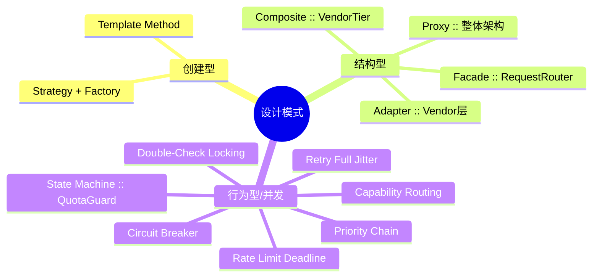
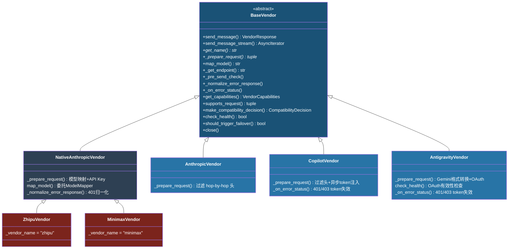
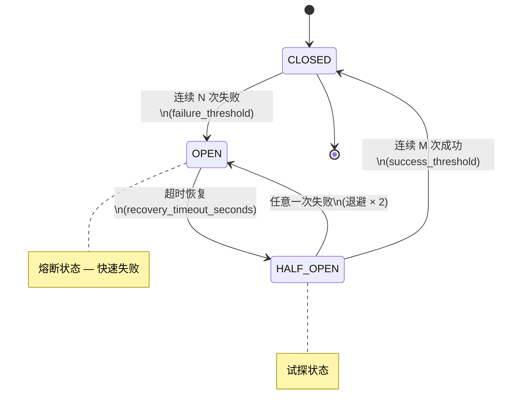
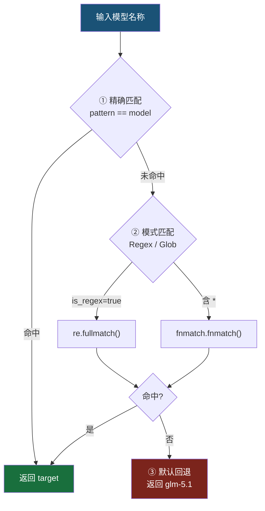
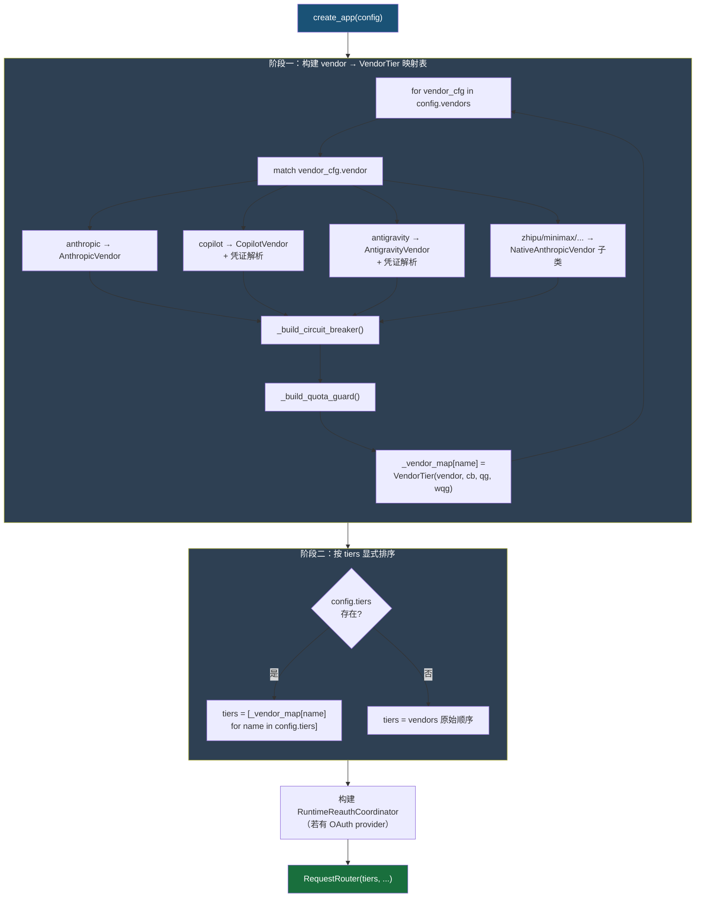
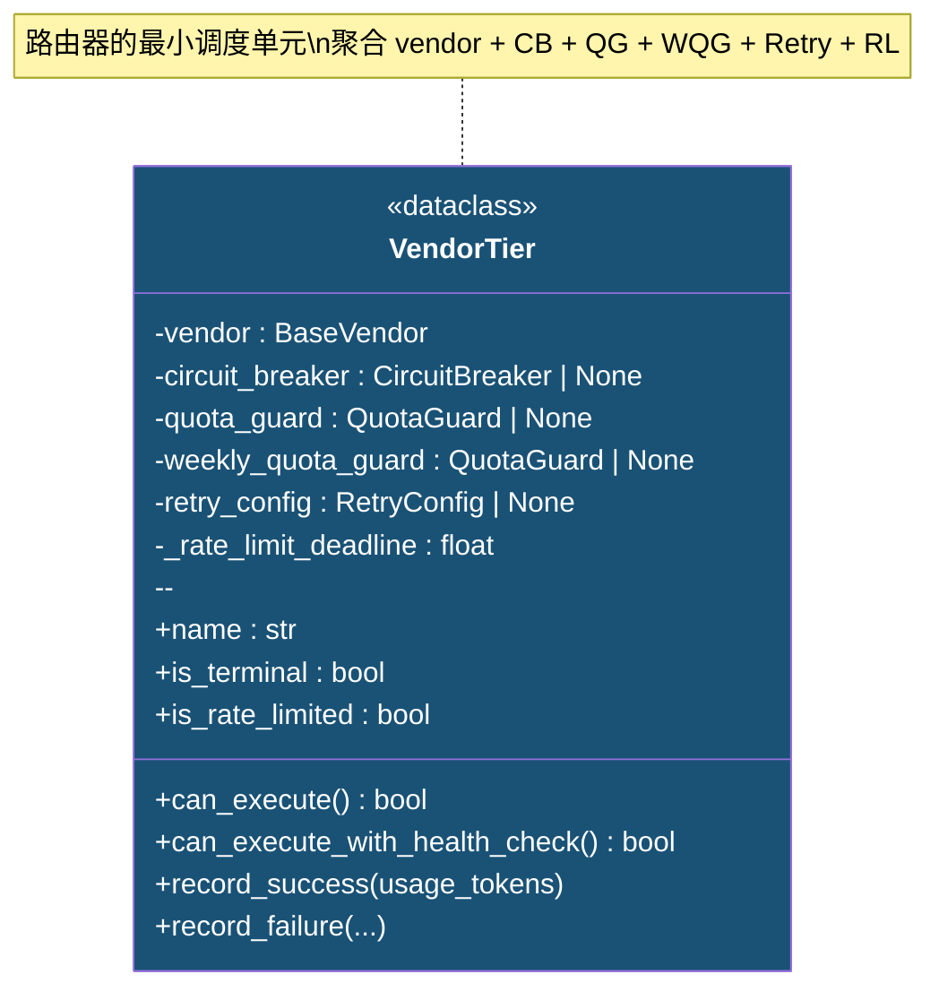
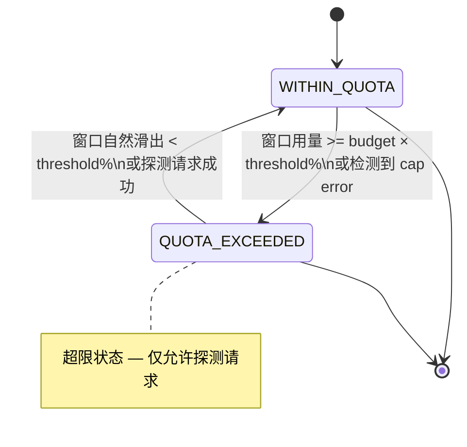
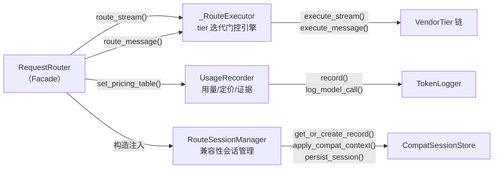
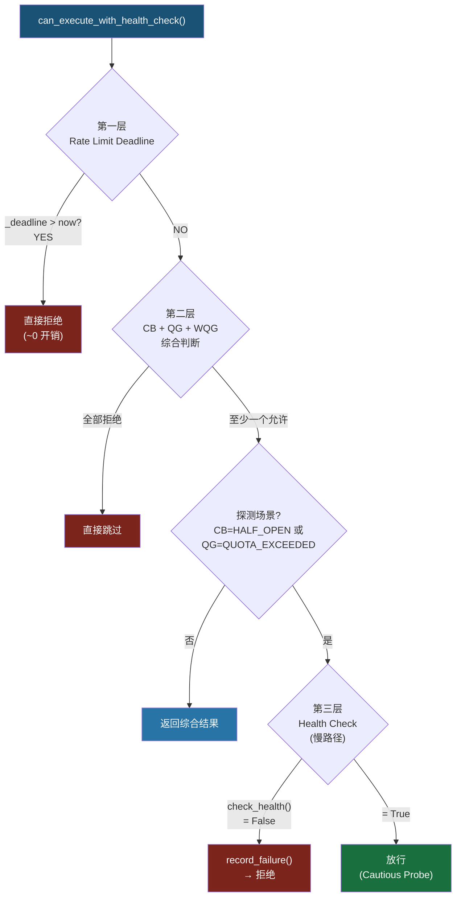

# 设计模式详解

> **路径约定**：本文档中模块路径均相对于 `src/coding/proxy/`。
>
> **定位**：本文档从 `framework.md` 中提取，详细阐述 coding-proxy 中运用的 13 种设计模式与工程模式。

[TOC]

---

本章涵盖 coding-proxy 中运用的 **13 种设计模式与工程模式**，按职责域正交分为三类：**创建型**（对象构建策略）、**结构型**（组件组织方式）、**行为型与并发**（运行时行为控制）。



---

## 3.1 Template Method（模板方法模式）

> **经典出处**：GoF《Design Patterns: Elements of Reusable Object-Oriented Software》<sup>[[1]](#ref1)</sup> — 定义算法骨架，将某些步骤延迟到子类实现。

**应用位置**：[`vendors/base.py`](../../src/coding/proxy/vendors/base.py) — `BaseVendor` 抽象基类

**设计要点**：

`BaseVendor` 定义了请求处理的算法骨架，将差异化的逻辑延迟到子类：



三类 Vendor 子类的差异化实现：

| 方法                 | AnthropicVendor（直接透传） | CopilotVendor（协议转换） | AntigravityVendor（协议转换）      | NativeAnthropicVendor 子类（薄透传） |
| -------------------- | --------------------------- | ------------------------- | ---------------------------------- | ------------------------------------ |
| `_prepare_request()` | 过滤 hop-by-hop 头          | 过滤头 + 异步 token 注入  | Gemini 格式转换 + OAuth token      | 模型映射 + API Key 替换              |
| `map_model()`        | 恒等映射                    | 恒等映射                  | 恒等映射                           | **委托 ModelMapper**                 |
| `_get_endpoint()`    | `/v1/messages`              | `/v1/chat/completions`    | `/{model}:generateContent`         | `/v1/messages`（继承）               |
| `_on_error_status()` | 继承基类（空操作）          | 401/403 token 失效        | 401/403 token 失效                 | 继承基类（空操作）                   |
| `get_capabilities()` | 全部支持                    | 不支持 thinking           | 不支持 tools/thinking/metadata     | 全部支持（NATIVE）                   |
| `check_health()`     | 继承（True）                | 继承（True）              | **覆写**（OAuth token 有效性检查） | 继承（True）                         |

> **供应商分类体系**详情参见 [供应商模块 -- 分类体系](./vendors.md#vendor-classification)。

---

## 3.2 Circuit Breaker（熔断器模式）

<a id="circuit-breaker"></a>

> **经典出处**：Martin Fowler "CircuitBreaker" (2014)<sup>[[2]](#ref2)</sup>；M. Nygard《Release It! Design and Deploy Production-Ready Software》第 5 章<sup>[[3]](#ref3)</sup> — 通过快速失败防止级联故障。

**应用位置**：[`routing/circuit_breaker.py`](../../src/coding/proxy/routing/circuit_breaker.py) — `CircuitBreaker` 类

**状态机**：



**状态转换条件**：

| 转换               | 条件                                    |
| ------------------ | --------------------------------------- |
| CLOSED → OPEN      | 连续失败次数 ≥ `failure_threshold`      |
| OPEN → HALF_OPEN   | 距上次失败 ≥ `recovery_timeout_seconds` |
| HALF_OPEN → CLOSED | 连续成功次数 ≥ `success_threshold`      |
| HALF_OPEN → OPEN   | 任意一次失败                            |

**指数退避 (Exponential Backoff)**：每次从 HALF_OPEN 回退到 OPEN 时，恢复等待时间翻倍（`recovery_timeout *= 2`），上限为 `max_recovery_seconds`。避免对仍未恢复的后端频繁重试。

**线程安全**：所有状态变更通过 `threading.Lock` 保护，确保并发请求下状态一致。

> **参数默认值**：参见 [配置参考 -- CircuitBreakerConfig](./config-reference.md#elastic-params)

---

## 3.3 Priority Chain（优先级匹配链）

**应用位置**：[`routing/model_mapper.py`](../../src/coding/proxy/routing/model_mapper.py) — `ModelMapper` 类

**设计要点**：

ModelMapper 采用三级优先级匹配链，按精确度递减依次尝试：



**默认映射规则**：

| 模式               | 目标          | 类型         |
| ------------------ | ------------- | ------------ |
| `claude-sonnet-.*` | `glm-5.1`     | 正则         |
| `claude-opus-.*`   | `glm-5.1`     | 正则         |
| `claude-haiku-.*`  | `glm-4.5-air` | 正则         |
| `claude-.*`        | `glm-5.1`     | 正则（兜底） |

正则表达式在 `__init__` 时预编译（`re.compile()`），`map()` 调用时直接使用编译后的对象，避免重复编译开销。

---

## 3.4 Strategy + Factory（策略 + 工厂方法模式）

> **经典出处**：GoF《Design Patterns》<sup>[[1]](#ref1)</sup> — 定义创建对象的接口，由策略选择决定实例化哪个类。

**应用位置**：[`server/factory.py`](../../src/coding/proxy/server/factory.py) — `_create_vendor_from_config()` 函数

**组装顺序**（两阶段构建）：



**凭证合并优先级**：Token Store（持久化） > config.yaml（显式配置）。确保用户通过 CLI 认证命令获取的凭证优先于配置文件中的硬编码值。

---

## 3.5 Proxy（代理模式）— 整体架构

> **经典出处**：GoF《Design Patterns》<sup>[[1]](#ref1)</sup> — 为其他对象提供一种代理以控制对这个对象的访问。

**应用位置**：整体架构

coding-proxy 本身即是一个代理服务：

- 对外暴露与 Anthropic Messages API 完全兼容的 `POST /v1/messages` 接口
- Claude Code 客户端只需将 `ANTHROPIC_BASE_URL` 指向代理地址
- 代理在幕后完成后端选择、故障转移、模型映射、用量记录、请求标准化等增值逻辑
- 支持流式（SSE `text/event-stream`）和非流式（JSON）两种响应模式
- 额外透传 `/v1/messages/count_tokens` 端点至 Anthropic 主供应商

---

## 3.6 Composite（组合模式）— VendorTier

> **经典出处**：GoF《Design Patterns》<sup>[[1]](#ref1)</sup> — 将对象组合成树形结构以表示"部分-整体"的层次结构。

**应用位置**：[`routing/tier.py`](../../src/coding/proxy/routing/tier.py) — `VendorTier` 数据类

**设计要点**：

VendorTier 将多个正交关注点聚合为路由器的最小调度单元：



**关键方法**：

| 方法                                                                     | 逻辑                                                                      |
| ------------------------------------------------------------------------ | ------------------------------------------------------------------------- |
| `name`                                                                   | → `vendor.get_name()`                                                     |
| `is_terminal`                                                            | → `circuit_breaker is None`（终端层无故障转移）                           |
| `can_execute()`                                                          | CB.can_execute() AND QG.can_use_primary() AND WQG.can_use_primary()       |
| `can_execute_with_health_check()`                                        | 三层恢复门控：Rate Limit Deadline → Health Check → Cautious Probe         |
| `record_success(usage_tokens)`                                           | CB.record_success() + QG/WQG 探测恢复 + 用量记录 + 清除 RL deadline       |
| `record_failure(is_cap_error, retry_after_seconds, rate_limit_deadline)` | CB.record_failure(+retry) + 若 cap error 则通知 QG/WQG + 更新 RL deadline |
| `is_rate_limited`                                                        | `_rate_limit_deadline > time.monotonic()`                                 |

---

## 3.7 State Machine（状态机模式）— QuotaGuard

<a id="quota-guard"></a>

**应用位置**：[`routing/quota_guard.py`](../../src/coding/proxy/routing/quota_guard.py) — `QuotaGuard` 类

**设计要点**：

基于滑动窗口的双态状态机，通过 Token 预算追踪主动避免触发上游配额限制：



**核心机制**：

- **滑动窗口**：`deque[(timestamp, tokens)]`，`_expire()` 清除超出 `window_seconds` 的条目
- **双窗口支持**：同一 `QuotaGuard` 类同时服务于日度 (`quota_guard`) 和周度 (`weekly_quota_guard`) 两个独立实例
- **探测恢复**：QUOTA_EXCEEDED 状态下，每隔 `probe_interval_seconds` 放行一个探测请求
- **cap error 模式**：由外部 `_is_cap_error()` 触发，不做预算自动恢复，仅允许探测恢复
- **基线加载**：启动时从数据库加载历史用量，防止重启后误判配额状态
- **线程安全**：所有状态变更通过 `threading.Lock` 保护

> **参数默认值**：参见 [配置参考 -- QuotaGuardConfig](./config-reference.md#elastic-params)

---

## 3.8 Double-Check Locking（双重检查锁模式）

**应用位置**：
- [`vendors/copilot.py`](../../src/coding/proxy/vendors/copilot.py) — `CopilotTokenManager`
- [`vendors/antigravity.py`](../../src/coding/proxy/vendors/antigravity.py) — `GoogleOAuthTokenManager`

**设计要点**：

两个 Token Manager 均采用相同的异步 DCL 模式，确保高并发下 token 交换仅执行一次：

```python
# 快速路径（无锁）
if self._access_token and time.monotonic() < self._expires_at:
    return self._access_token

# 慢路径（加锁后二次检查）
async with self._lock:
    if self._access_token and time.monotonic() < self._expires_at:
        return self._access_token
    await self._exchange()  # 或 self._refresh()
```

| Token Manager             | 认证流程                                                                  | 有效期   | 提前刷新余量 |
| ------------------------- | ------------------------------------------------------------------------- | -------- | ------------ |
| `CopilotTokenManager`     | GitHub token -> GET `copilot_internal/v2/token` -> `token`/`access_token` | ~30 分钟 | 60 秒        |
| `GoogleOAuthTokenManager` | refresh_token -> POST oauth2.googleapis.com/token -> access_token         | ~1 小时  | 120 秒       |

两者均支持**被动刷新**：当后端返回 401/403 时，通过 `_on_error_status()` 调用 `invalidate()` 标记 token 失效，下次请求自动触发重新获取。若 `needs_reauth=True`，还会联动 `RuntimeReauthCoordinator` 触发后台重认证流程。

---

## 3.9 Facade（外观模式）

> **经典出处**：GoF《Design Patterns》<sup>[[1]](#ref1)</sup> — 为子系统中的一组接口提供一个统一的高层接口。

**应用位置**：[`routing/router.py`](../../src/coding/proxy/routing/router.py) — `RequestRouter` 类

**设计要点**：

`RequestRouter` 作为薄代理门面（Facade），将路由系统的复杂内部实现封装为简洁的公开接口，内部委托给三个正交分解的子组件：



**委托关系**：

| 公开方法                       | 内部委托                                      |
| ------------------------------ | --------------------------------------------- |
| `route_stream(body, headers)`  | -> `_executor.execute_stream(body, headers)`  |
| `route_message(body, headers)` | -> `_executor.execute_message(body, headers)` |
| `set_pricing_table(table)`     | -> `_recorder.set_pricing_table(table)`       |
| `close()`                      | -> 遍历 `tiers` 调用 `tier.vendor.close()`    |

这种正交 decomposition 使得每个子组件可以独立演进和测试，同时 `RequestRouter` 保持对外接口稳定。

---

## 3.10 Adapter（适配器模式）— Vendor 层

> **经典出处**：GoF《Design Patterns》<sup>[[1]](#ref1)</sup> — 将一个类的接口转换成客户期望的另一个接口。

**应用位置**：[`vendors/`](../../src/coding/proxy/vendors/) — `BaseVendor` 及其具体实现

**设计要点**：

每个 Vendor 子类充当 Adapter 角色，将异构的上游 API 适配为统一的 `BaseVendor` 接口：

| Vendor                        | 上游协议                    | 适配行为                                                      |
| ----------------------------- | --------------------------- | ------------------------------------------------------------- |
| `AnthropicVendor`             | Anthropic Messages API      | 透传（近乎零适配开销）                                        |
| `CopilotVendor`               | OpenAI Chat Completions API | 请求体/响应体双向格式转换 + token 注入                        |
| `AntigravityVendor`           | Gemini GenerateContent API  | Anthropic ↔ Gemini 双向格式转换 + SSE 流适配 + OAuth          |
| `ZhipuVendor` 等 6 个原生兼容 | Anthropic-compatible API    | 模型名映射 + API Key 认证头替换（继承 NativeAnthropicVendor） |

此外，[`convert/`](../../src/coding/proxy/convert/) 模块提供独立的纯函数适配器层，支持三向格式转换：

| 转换方向                    | 模块                                                                                      | 说明               |
| --------------------------- | ----------------------------------------------------------------------------------------- | ------------------ |
| Anthropic -> Gemini         | [`convert/anthropic_to_gemini.py`](../../src/coding/proxy/convert/anthropic_to_gemini.py) | 请求格式转换       |
| Gemini -> Anthropic         | [`convert/gemini_to_anthropic.py`](../../src/coding/proxy/convert/gemini_to_anthropic.py) | 响应格式转换       |
| Gemini SSE -> Anthropic SSE | [`convert/gemini_sse_adapter.py`](../../src/coding/proxy/convert/gemini_sse_adapter.py)   | 流式事件重构       |
| Anthropic -> OpenAI         | [`convert/anthropic_to_openai.py`](../../src/coding/proxy/convert/anthropic_to_openai.py) | Copilot 请求适配   |
| OpenAI -> Anthropic         | [`convert/openai_to_anthropic.py`](../../src/coding/proxy/convert/openai_to_anthropic.py) | Copilot 响应逆适配 |

---

## 3.11 Capability-Based Routing（基于能力的路由）

**应用位置**：
- [`routing/error_classifier.py`](../../src/coding/proxy/routing/error_classifier.py) — `build_request_capabilities()`
- [`vendors/base.py`](../../src/coding/proxy/vendors/base.py) — `BaseVendor.supports_request()` / `get_capabilities()` / `make_compatibility_decision()`
- [`model/vendor.py`](../../src/coding/proxy/model/vendor.py) — `RequestCapabilities` / `VendorCapabilities` / `CapabilityLossReason`

**设计要点**：

基于请求能力画像与供应商能力声明的正交匹配矩阵，在路由阶段即排除无法无损承接请求的层级：

| 维度 \ 能力  | `tools` | `thinking` | `images` | `metadata` | `vend_tools` |
| :----------- | :-----: | :--------: | :------: | :--------: | :----------: |
| **tools**    |  ✅ OK   |     —      |    —     |     —      |    ❌ skip    |
| **thinking** |    —    |    ✅ OK    |    —     |     —      |      —       |
| **images**   |    —    |     —      |   ✅ OK   |     —      |      —       |
| **metadata** |    —    |     —      |    —     |    ✅ OK    |      —       |

> ✅ = 可承接；❌ = `CapabilityLossReason`（跳过此 tier）

**匹配流程**：

1. **能力硬过滤**：`supports_request(request_caps)` -> 返回 `(bool, list[CapabilityLossReason])`
   - 若有任何 `CapabilityLossReason`，直接跳过该 tier 并记录原因
2. **兼容性决策**：`make_compatibility_decision(canonical_request)` -> 返回 `CompatibilityDecision`
   - `NATIVE`：完全原生支持，直接放行
   - `SIMULATED`：可通过模拟/投影方式支持（如 thinking 剥离、tool_calling 降级）
   - `UNSAFE`：存在不可弥补的语义缺失，跳过该 tier

**CompatibilityDecision 三态决策矩阵**：

| 请求特征                   | NATIVE | SIMULATED               | UNSAFE |
| -------------------------- | ------ | ----------------------- | ------ |
| thinking + 支持 thinking   | OK     |                         |        |
| thinking + 不支持 thinking |        | thinking_simulation     | X      |
| tools + 支持 tools         | OK     |                         |        |
| tools + 不支持 tools       |        | tool_calling_simulation | X      |
| metadata + 支持 metadata   | OK     |                         |        |
| metadata + 不支持 metadata |        | metadata_projection     | X      |
| json_output + 支持         | OK     |                         |        |
| json_output + 不支持       |        | json_output_projection  | X      |

---

## 3.12 Retry with Full Jitter（带完全抖动的重试模式）

<a id="retry"></a>

> **参考**：M. Nygard《Release It!》第 5 章<sup>[[3]](#ref3)</sup>；AWS Architecture Center "Retry Pattern"<sup>[[4]](#ref4)</sup>

**应用位置**：[`routing/retry.py`](../../src/coding/proxy/routing/retry.py) — `RetryConfig` / `calculate_delay()`

**设计要点**：

传输层重试策略处理瞬态网络故障，与 CircuitBreaker 形成正交互补：

| 维度         | Retry                                 | CircuitBreaker         |
| ------------ | ------------------------------------- | ---------------------- |
| 处理范围     | 单次请求内的瞬态抖动                  | 跨请求的持续故障       |
| 恢复时间尺度 | 秒级（500ms ~ 5s）                    | 分钟级（300s ~ 3600s） |
| 触发条件     | TimeoutException / ConnectError / 5xx | 连续 N 次失败          |
| 失败贡献     | 每次 retry 失败仅向 CB 贡献 1 次计数  | 累积计数触发 OPEN      |

**Full Jitter 计算**：

$$
\text{delay} = \text{random}\left(0,\; \min\left(\text{initial\_delay} \times \text{backoff}^{\text{attempt}},\; \text{max\_delay}\right)\right)
$$

**可重试异常判定**（`is_retryable_error()`）：

| 异常类型                      | 可重试 | 原因                       |
| ----------------------------- | ------ | -------------------------- |
| `httpx.TimeoutException`      | OK     | 瞬态超时                   |
| `httpx.ConnectError`          | OK     | 网络连接失败               |
| `httpx.HTTPStatusError` (5xx) | OK     | 服务端瞬时错误             |
| `httpx.HTTPStatusError` (4xx) | NO     | 客户端错误（不应重试）     |
| `TokenAcquireError`           | NO     | 认证层错误（应触发重认证） |

> **参数默认值**：参见 [配置参考 -- RetryConfig](./config-reference.md#elastic-params)

---

## 3.13 Rate Limit Deadline Tracking（速率限制截止追踪）

**应用位置**：
- [`routing/rate_limit.py`](../../src/coding/proxy/routing/rate_limit.py) — `RateLimitInfo` / `parse_rate_limit_headers()` / `compute_rate_limit_deadline()`
- [`routing/tier.py`](../../src/coding/proxy/routing/tier.py) — `VendorTier._rate_limit_deadline` / `is_rate_limited` / `can_execute_with_health_check()`

**设计要点**：

从 HTTP 429/403 响应头精确解析上游速率限制信息，并转化为 monotonic 时间戳用于门控：

**解析的信息源**：

| Header                               | 格式              | 含义                 |
| ------------------------------------ | ----------------- | -------------------- |
| `Retry-After`                        | 秒数或 HTTP Date  | 标准速率限制恢复时间 |
| `anthropic-ratelimit-requests-reset` | ISO 8601 datetime | 请求计数重置时间     |
| `anthropic-ratelimit-tokens-reset`   | ISO 8601 datetime | Token 配额重置时间   |

**计算策略**：

- 取所有可用信号的最大值，并加 **10% 安全余量**
- `compute_effective_retry_seconds()` -> 返回相对秒数（供 CircuitBreaker 退避计算）
- `compute_rate_limit_deadline()` -> 返回绝对 monotonic 时间戳（供 VendorTier 精确门控）

**三层恢复门控集成**：

`can_execute_with_health_check()` 方法实现了三层渐进式恢复机制：



---

## 参考文献

<a id="ref1"></a>[1] E. Gamma, R. Helm, R. Johnson, and J. Vlissides, *Design Patterns: Elements of Reusable Object-Oriented Software*, Addison-Wesley, 1994.

<a id="ref2"></a>[2] M. Fowler, "CircuitBreaker," *martinfowler.com*, 2014.

<a id="ref3"></a>[3] M. Nygard, *Release It!: Design and Deploy Production-Ready Software*, 2nd ed., Pragmatic Bookshelf, 2018.

<a id="ref4"></a>[4] AWS Architecture Center, "Retry Pattern," *docs.aws.amazon.com*, 2022.
