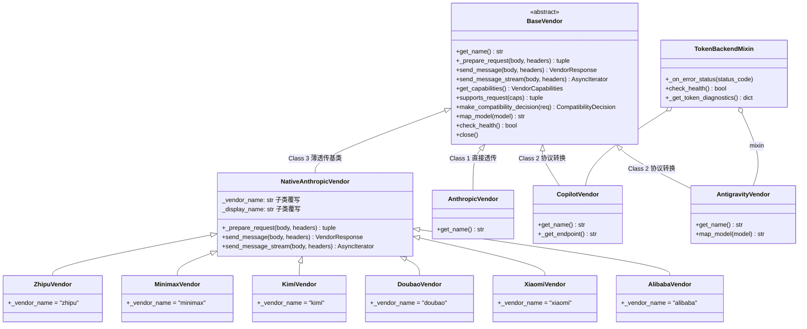

# 供应商模块（vendors/）

> 路径约定：相对于 `src/coding/proxy/`
> 定位：从 [framework.md](./framework.md) 提取，详述供应商分类体系与各供应商实现。

[TOC]

## 1. 供应商分类体系

供应商模块按协议适配深度分为三个层级：

### Class 1: 直接 Anthropic（Direct）

- **基类**: [BaseVendor](../../src/coding/proxy/vendors/base.py)（直接子类）
- **供应商**: `AnthropicVendor` — 零适配，直接透传
- **能力**: 全能力支持，客户端 OAuth token 原样转发

### Class 2: 协议转换（Protocol Conversion）

- **基类**: `BaseVendor` + [TokenBackendMixin](../../src/coding/proxy/vendors/mixins.py)
- **供应商**:
  - `CopilotVendor` — Anthropic ↔ OpenAI 双向协议转换 + token 注入
  - `AntigravityVendor` — Anthropic ↔ Gemini 双向协议转换 + SSE 适配 + OAuth2
- **能力**: 部分能力支持（因供应商而异，通过 `CompatibilityProfile` 声明）

### Class 3: 原生 Anthropic 兼容（Native Anthropic Compatible）

- **基类**: [NativeAnthropicVendor](../../src/coding/proxy/vendors/native_anthropic.py)（继承 `BaseVendor`）
- **供应商**: `ZhipuVendor`、`MinimaxVendor`、`KimiVendor`、`DoubaoVendor`、`XiaomiVendor`、`AlibabaVendor`
- **适配方式**: 薄透传 — 仅模型名映射 + API Key 认证头替换 + 401 错误归一化
- **能力**: 全 NATIVE 能力画像

### 类层次结构



## 2. BaseVendor 抽象基类

文件: [vendors/base.py](../../src/coding/proxy/vendors/base.py)

`BaseVendor` 采用**模板方法模式**，固化了请求发送的核心流程，子类仅通过抽象方法和钩子方法注入差异化逻辑。

### API 签名

```python
class BaseVendor(ABC):
    def __init__(self, base_url: str, timeout_ms: int, failover_config: FailoverConfig | None = None)

    # ── 抽象方法（子类必须实现） ──────────────────────────
    @abstractmethod
    def get_name(self) -> str

    @abstractmethod
    async def _prepare_request(self, body: dict, headers: dict) -> tuple[dict, dict]

    # ── 核心方法（模板固定流程） ──────────────────────────
    async def send_message(self, body: dict, headers: dict) -> VendorResponse
    async def send_message_stream(self, body: dict, headers: dict) -> AsyncIterator[bytes]

    # ── 能力与兼容性 ─────────────────────────────────────
    def get_capabilities(self) -> VendorCapabilities
    def supports_request(self, caps: RequestCapabilities) -> tuple[bool, list[CapabilityLossReason]]
    def make_compatibility_decision(self, request: CanonicalRequest) -> CompatibilityDecision
    def map_model(self, model: str) -> str   # 默认恒等映射

    # ── 钩子方法（子类可选覆写） ──────────────────────────
    def _get_endpoint(self) -> str                       # 默认 /v1/messages
    def _pre_send_check(self, body, headers) -> None     # 快速失败（如缺少 API key）
    def _normalize_error_response(self, status, resp, vendor_resp) -> VendorResponse
    def _on_error_status(self, status_code: int) -> None  # 错误状态码钩子
    async def check_health(self) -> bool                  # 默认 True

    # ── 故障转移 ─────────────────────────────────────────
    def should_trigger_failover(self, status_code: int, body: dict | None) -> bool

    # ── 生命周期 ─────────────────────────────────────────
    async def close() -> None
```

### 模板方法流程

`send_message` / `send_message_stream` 遵循固定流程：

1. **`_pre_send_check()`** — 发送前快速失败检查
2. **`_prepare_request()`** — 子类注入差异化逻辑（协议转换、认证注入等）
3. **HTTP 请求** — 通过惰性创建的 `httpx.AsyncClient` 发送
4. **错误处理** — `_on_error_status()` 钩子 + `_normalize_error_response()` 归一化
5. **响应解析** — 构建标准化的 `VendorResponse`

## 3. NativeAnthropicVendor 基类

文件: [vendors/native_anthropic.py](../../src/coding/proxy/vendors/native_anthropic.py)

适用于端点已完整支持 Anthropic Messages API 协议的供应商。仅执行两项最小适配：

1. **模型名映射** — Claude 模型名 → 供应商模型名（完全委托 `ModelMapper`）
2. **认证头替换** — 剥离原始 `authorization` / `x-api-key`，注入供应商 `x-api-key`

此外提供 **401 错误归一化**，覆盖流式和非流式两种响应路径，确保跨供应商错误格式一致性。

### 子类约定

子类仅需覆写两个类属性：

| 属性            | 类型  | 说明                                                               |
| --------------- | ----- | ------------------------------------------------------------------ |
| `_vendor_name`  | `str` | 供应商标识名（`get_name()` 返回值 & `ModelMapper` 的 vendor 参数） |
| `_display_name` | `str` | 错误消息中的显示名（如 `"Zhipu"`、`"MiniMax"`）                    |

### 能力声明

所有 `NativeAnthropicVendor` 子类自动继承全 NATIVE 能力画像：

```
thinking=NATIVE, tool_calling=NATIVE, tool_streaming=NATIVE,
mcp_tools=NATIVE, images=NATIVE, metadata=NATIVE,
json_output=NATIVE, usage_tokens=NATIVE
```

## 4. 供应商注册表

| 供应商            | 文件                                                                    | 协议                     | 认证方式                          | 能力                                                  |
| ----------------- | ----------------------------------------------------------------------- | ------------------------ | --------------------------------- | ----------------------------------------------------- |
| AnthropicVendor   | [vendors/anthropic.py](../../src/coding/proxy/vendors/anthropic.py)     | Anthropic Messages API   | OAuth token 透传                  | 全能力支持                                            |
| CopilotVendor     | [vendors/copilot.py](../../src/coding/proxy/vendors/copilot.py)         | OpenAI Chat Completions  | GitHub token → Copilot token 交换 | thinking 为 SIMULATED                                 |
| AntigravityVendor | [vendors/antigravity.py](../../src/coding/proxy/vendors/antigravity.py) | Gemini GenerateContent   | Google OAuth2 refresh_token       | tool_streaming / metadata / usage_tokens 为 SIMULATED |
| ZhipuVendor       | [vendors/zhipu.py](../../src/coding/proxy/vendors/zhipu.py)             | Anthropic-compatible API | x-api-key                         | 全能力 (NATIVE)                                       |
| MinimaxVendor     | [vendors/minimax.py](../../src/coding/proxy/vendors/minimax.py)         | Anthropic-compatible API | x-api-key                         | 全能力 (NATIVE)                                       |
| KimiVendor        | [vendors/kimi.py](../../src/coding/proxy/vendors/kimi.py)               | Anthropic-compatible API | x-api-key                         | 全能力 (NATIVE)                                       |
| DoubaoVendor      | [vendors/doubao.py](../../src/coding/proxy/vendors/doubao.py)           | Anthropic-compatible API | x-api-key                         | 全能力 (NATIVE)                                       |
| XiaomiVendor      | [vendors/xiaomi.py](../../src/coding/proxy/vendors/xiaomi.py)           | Anthropic-compatible API | x-api-key                         | 全能力 (NATIVE)                                       |
| AlibabaVendor     | [vendors/alibaba.py](../../src/coding/proxy/vendors/alibaba.py)         | Anthropic-compatible API | x-api-key                         | 全能力 (NATIVE)                                       |

> 各供应商的默认 `base_url`、超时等配置项详见 [config-reference.md](./config-reference.md)。

## 5. 数据类型

文件: [model/vendor.py](../../src/coding/proxy/model/vendor.py)

### UsageInfo

```python
@dataclass
class UsageInfo:
    """一次调用的 Token 用量."""
    input_tokens: int = 0
    output_tokens: int = 0
    cache_creation_tokens: int = 0
    cache_read_tokens: int = 0
    request_id: str = ""
```

### VendorResponse

```python
@dataclass
class VendorResponse:
    """供应商响应结果."""
    status_code: int = 200
    usage: UsageInfo = field(default_factory=UsageInfo)
    is_streaming: bool = False
    raw_body: bytes = b"{}"
    error_type: str | None = None
    error_message: str | None = None
    model_served: str | None = None
    response_headers: dict[str, str] = field(default_factory=dict)
```

### CapabilityLossReason

```python
class CapabilityLossReason(Enum):
    """请求语义与供应商能力不匹配的原因."""
    TOOLS = "tools"
    THINKING = "thinking"
    IMAGES = "images"
    VENDOR_TOOLS = "vendor_tools"
    METADATA = "metadata"
```

### RequestCapabilities

```python
@dataclass(frozen=True)
class RequestCapabilities:
    """一次请求实际使用到的能力画像."""
    has_tools: bool = False
    has_thinking: bool = False
    has_images: bool = False
    has_metadata: bool = False
```

### VendorCapabilities

```python
@dataclass(frozen=True)
class VendorCapabilities:
    """供应商能力声明."""
    supports_tools: bool = True
    supports_thinking: bool = True
    supports_images: bool = True
    emits_vendor_tool_events: bool = False
    supports_metadata: bool = True
```

### NoCompatibleVendorError

```python
class NoCompatibleVendorError(RuntimeError):
    """当前请求没有可安全承接的供应商."""
    def __init__(self, message: str, *, reasons: list[str] | None = None) -> None
```

## 6. 辅助模块

### TokenBackendMixin

文件: [vendors/mixins.py](../../src/coding/proxy/vendors/mixins.py)

为基于 token 的供应商（Copilot、Antigravity）提供共享行为：

- `_on_error_status()` — 401/403 时自动调用 `token_manager.invalidate()` 触发被动刷新
- `check_health()` — 基于 token 可获取性的健康检查
- `_get_token_diagnostics()` — 收集 token 管理、模型解析、请求适配等诊断信息

使用方式：通过 Python Mixin 模式与 `BaseVendor` 组合，需在 `__init__` 中显式调用 `TokenBackendMixin.__init__(self, token_manager)`。

### BaseTokenManager

文件: [vendors/token_manager.py](../../src/coding/proxy/vendors/token_manager.py)

Token 缓存与自动刷新的抽象基类，提供 **DCL（Double-Check Locking）** 并发安全骨架：

- `get_token()` — 获取有效 token（带缓存 + 自动刷新 + DCL 并发安全）
- `invalidate()` — 标记当前 token 失效（触发下次请求时被动刷新）
- `_acquire()` — 抽象方法，子类实现具体 token 获取逻辑

子类仅需实现 `_acquire()` 返回 `(access_token, expires_in_seconds)` 元组。内置 `_REFRESH_MARGIN = 60s` 提前刷新余量。

### CopilotTokenManager

文件: [vendors/copilot_token_manager.py](../../src/coding/proxy/vendors/copilot_token_manager.py)

GitHub token → Copilot token 交换管理：

- **流程**: `GitHub token` → `GET copilot_internal/v2/token` → `Copilot access_token`
- **有效期**: ~30 分钟，内置 60s 提前刷新余量
- **诊断**: 维护 `CopilotExchangeDiagnostics` 记录最近一次交换详情
- **热更新**: `update_github_token()` 支持运行时重认证后 token 替换

### GoogleOAuthTokenManager

文件: [vendors/antigravity.py](../../src/coding/proxy/vendors/antigravity.py)（内嵌）

Google OAuth2 refresh_token → access_token 刷新管理：

- 继承 `BaseTokenManager`，实现 `_acquire()` 通过 Google OAuth2 token endpoint 刷新 access_token
- 内嵌于 `antigravity.py` 而非独立文件，因仅 AntigravityVendor 使用

### CopilotModelResolver

文件: [vendors/copilot_models.py](../../src/coding/proxy/vendors/copilot_models.py)

Copilot 模型目录管理与解析策略：

- **目录缓存**: 维护 `CopilotModelCatalog`，基于可配置 TTL 判断新鲜度
- **依赖倒置**: 通过 `request_fn` 回调注入 HTTP 请求能力，不直接持有 client 引用
- **解析策略**: 优先配置规则显式映射 → 次级内部家族匹配策略（同家族优先，不跨家族降级）
- **错误处理**: `build_model_not_supported_response()` 构建标准化的模型不支持错误响应

## 7. 向后兼容别名

代码库从 "Backend" 命名体系迁移至 "Vendor" 命名体系，保留了以下别名（计划 v2 移除）：

| 旧名称                     | 新名称                    | 定义位置                                                                |
| -------------------------- | ------------------------- | ----------------------------------------------------------------------- |
| `BaseBackend`              | `BaseVendor`              | [vendors/base.py](../../src/coding/proxy/vendors/base.py)               |
| `NoCompatibleBackendError` | `NoCompatibleVendorError` | [vendors/base.py](../../src/coding/proxy/vendors/base.py)               |
| `BackendCapabilities`      | `VendorCapabilities`      | [model/vendor.py](../../src/coding/proxy/model/vendor.py)               |
| `BackendResponse`          | `VendorResponse`          | [model/vendor.py](../../src/coding/proxy/model/vendor.py)               |
| `TierConfig`               | `VendorConfig`            | [config/routing.py](../../src/coding/proxy/config/routing.py)           |
| `BackendType`              | `VendorType`              | [config/routing.py](../../src/coding/proxy/config/routing.py)           |
| `AnthropicBackend`         | `AnthropicVendor`         | [vendors/anthropic.py](../../src/coding/proxy/vendors/anthropic.py)     |
| `CopilotBackend`           | `CopilotVendor`           | [vendors/copilot.py](../../src/coding/proxy/vendors/copilot.py)         |
| `AntigravityBackend`       | `AntigravityVendor`       | [vendors/antigravity.py](../../src/coding/proxy/vendors/antigravity.py) |
| `ZhipuBackend`             | `ZhipuVendor`             | [vendors/zhipu.py](../../src/coding/proxy/vendors/zhipu.py)             |

## 8. 添加新供应商指南

### Path A: 原生 Anthropic 兼容供应商（推荐，适用于简单场景）

当新供应商的端点已完整支持 Anthropic Messages API 协议时，仅需薄透传：

1. **创建子类** — 在 [vendors/](../../src/coding/proxy/vendors/) 目录下新建文件，继承 `NativeAnthropicVendor`

```python
# vendors/example.py
from ..config.schema import FailoverConfig
from ..config.vendors import ExampleConfig
from ..routing.model_mapper import ModelMapper
from .native_anthropic import NativeAnthropicVendor


class ExampleVendor(NativeAnthropicVendor):
    _vendor_name = "example"
    _display_name = "Example"

    def __init__(self, config: ExampleConfig, model_mapper: ModelMapper,
                 failover_config: FailoverConfig | None = None) -> None:
        super().__init__(config, model_mapper, failover_config)
```

2. **添加 `VendorType` 枚举值** — 在 [config/routing.py](../../src/coding/proxy/config/routing.py) 的 `VendorType` Literal 中追加 `"example"`
3. **添加供应商配置类** — 在 [config/schema.py](../../src/coding/proxy/config/schema.py) 或 [config/vendors.py](../../src/coding/proxy/config/vendors.py) 中定义 `ExampleConfig`（或复用已有的 `api_key` 字段）
4. **添加工厂分支** — 在 [server/factory.py](../../src/coding/proxy/server/factory.py) 的 `_create_vendor_from_config()` 中添加 `case "example":` 分支
5. **添加配置条目** — 在 `config.yaml` 的 `vendors` 列表中添加对应条目

### Path B: 自定义协议供应商（适用于需要协议转换的场景）

当新供应商使用非 Anthropic 协议（如 OpenAI、Gemini 等）时：

1. **创建子类** — 在 [vendors/](../../src/coding/proxy/vendors/) 目录下新建文件，继承 `BaseVendor`
2. **实现抽象方法** — `get_name()` 和 `_prepare_request()`
3. **覆写可扩展方法** — 按需覆写 `map_model()`、`get_capabilities()`、`_get_endpoint()` 等；如需声明非默认兼容性画像则覆写 `get_compatibility_profile()`
4. **如需 token 管理** — 组合 `TokenBackendMixin`，实现 `BaseTokenManager` 子类
5. **后续步骤** — 同 Path A 的 2-5 步
