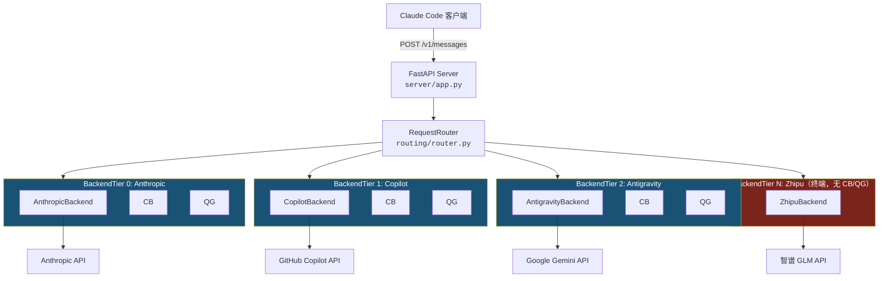

# coding-proxy 架构设计与工程方案

> **路径约定**：本文档中模块路径均相对于 `src/coding/proxy/`，例如 `backends/base.py` 指 `src/coding/proxy/backends/base.py`。

---

## 1. 项目概述

### 1.1 项目动机与背景

Claude Code 作为日常 AI 编程助手，其底层依赖 Anthropic Messages API (`/v1/messages`)。在实际使用过程中，以下场景时有发生：

- **限流 (Rate Limiting)**：高频请求触发 `429 rate_limit_error`，导致短时间内无法继续使用
- **配额耗尽 (Usage Cap)**：月度/日度配额用尽后返回 `403` 错误，含 "usage cap" 等提示
- **服务过载 (Overloaded)**：Anthropic 服务端高峰期返回 `503 overloaded_error`
- **网络波动**：国际链路不稳定导致连接超时

与此同时，多个 Anthropic 兼容或可转换的 API 通道为构建多后端容灾体系提供了可能：

- **GitHub Copilot**：提供 Anthropic 兼容的 Claude API 端点，通过 GitHub PAT 认证
- **Google Antigravity Claude**：通过 Google Gemini/Vertex AI 端点提供 Claude 模型访问，需 Anthropic ↔ Gemini 双向格式转换
- **智谱 (Zhipu)**：提供与 Anthropic 兼容的 GLM API 接口（`/api/anthropic`），作为终端兜底

**coding-proxy 的核心诉求**：当任一后端不可用时，自动、无缝地沿 N-tier 层级链降级到下一个可用后端，对 Claude Code 客户端完全透明，用户无需手动干预。

### 1.2 设计目标

| 目标 | 说明 |
|------|------|
| **透明代理** | 对 Claude Code 完全透明，客户端无需修改任何协议或配置（仅需指定代理地址） |
| **N-tier 链式降级** | 支持 N 个后端层级按优先级链式降级，每个层级独立配置弹性设施 |
| **配额管理** | 基于滑动窗口的 Token 预算追踪，主动避免触发上游配额限制 |
| **可观测性** | Token 用量持久化追踪、各层级熔断器/配额守卫状态实时查询 |
| **可扩展性** | 易于添加新后端实现、新模型映射规则、新故障转移策略 |
| **轻量部署** | 单进程运行，仅依赖 SQLite（无外部数据库/消息队列），适合本地开发环境 |

---

## 2. 系统架构总览

### 2.1 架构分层图



**术语表**：

| 缩写 | 全称 | 来源 |
|------|------|------|
| **CB** | CircuitBreaker（熔断器） | [`routing/circuit_breaker.py`](../src/coding/proxy/routing/circuit_breaker.py) |
| **QG** | QuotaGuard（配额守卫） | [`routing/quota_guard.py`](../src/coding/proxy/routing/quota_guard.py) |
| **Tier** | BackendTier（后端层级） | [`routing/tier.py`](../src/coding/proxy/routing/tier.py) |

### 2.2 模块职责一览

| 模块 | 路径 | 职责 |
|------|------|------|
| **server** | [`server/app.py`](../src/coding/proxy/server/app.py) | 应用工厂、HTTP 端点定义、生命周期管理 |
| **backends** | [`backends/`](../src/coding/proxy/backends/) | 后端抽象基类与具体实现（Anthropic、Copilot、Antigravity、Zhipu） |
| **convert** | [`convert/`](../src/coding/proxy/convert/) | Anthropic ↔ Gemini 双向格式转换（请求、响应、SSE 流） |
| **routing** | [`routing/`](../src/coding/proxy/routing/) | N-tier 链式路由、BackendTier 聚合、熔断器、配额守卫、模型映射 |
| **config** | [`config/`](../src/coding/proxy/config/) | Pydantic 配置模型定义与 YAML 加载 |
| **logging** | [`logging/`](../src/coding/proxy/logging/) | Token 用量 SQLite 持久化、统计查询与 Rich 格式化展示 |
| **cli** | [`cli.py`](../src/coding/proxy/cli.py) | Typer 命令行入口（start、status、usage、reset） |

### 2.3 技术选型

| 技术 | 选型理由 |
|------|---------|
| **Python 3.13+** | 原生 async/await 成熟、类型提示完善、生态丰富 |
| **FastAPI** | 原生异步、`StreamingResponse` 支持 SSE、自动 OpenAPI 文档 |
| **httpx** | 同时支持同步/异步、流式请求、完整的 HTTP 客户端功能 |
| **Pydantic v2** | 配置校验与类型安全、性能显著优于 v1 |
| **aiosqlite** | 异步 SQLite 访问、WAL 模式支持并发读写 |
| **Typer + Rich** | 现代化 CLI 体验、类型安全的参数声明、美观的终端输出 |
| **UV** | 极速包管理器、lockfile 确保可复现构建 |

---

## 3. 设计模式详解

### 3.1 Template Method（模板方法模式）

> **经典出处**：GoF《Design Patterns: Elements of Reusable Object-Oriented Software》— 定义算法骨架，将某些步骤延迟到子类实现。

**应用位置**：[`backends/base.py`](../src/coding/proxy/backends/base.py) — `BaseBackend` 抽象基类

**设计要点**：

`BaseBackend` 定义了请求处理的算法骨架，将差异化的逻辑延迟到子类：

```
BaseBackend（模板）
├── send_message()          ← 固定流程：prepare → send → parse response
├── send_message_stream()   ← 固定流程：prepare → stream → yield chunks
├── _get_client()           ← 公共逻辑：惰性初始化 httpx.AsyncClient
├── close()                 ← 公共逻辑：关闭 HTTP 客户端
│
├── _prepare_request()      ← 【抽象·异步】子类实现请求转换（支持 token 刷新等异步操作）
├── _get_endpoint()         ← 【钩子】端点路径（默认 /v1/messages）
├── _on_error_status()      ← 【钩子】错误状态码处理（如 token 失效标记）
├── get_name()              ← 【抽象】子类返回后端标识
└── should_trigger_failover() ← 基于 FailoverConfig 判断故障转移
```

四个具体子类的差异化实现：

| 方法 | AnthropicBackend | CopilotBackend | AntigravityBackend | ZhipuBackend |
|------|-----------------|----------------|-------------------|--------------|
| `_prepare_request()` | 过滤 hop-by-hop 头 | 过滤头 + 异步 token 注入 | Gemini 格式转换 + OAuth token | 模型映射 + API Key |
| `_on_error_status()` | 继承基类（空操作） | 401/403 token 失效 | 401/403 token 失效 | 继承基类（空操作） |
| `send_message()` | 继承基类 | 继承基类 | **覆写**（Gemini 端点 + 响应转换） | 继承基类 |
| `send_message_stream()` | 继承基类 | 继承基类 | **覆写**（Gemini SSE 流适配） | 继承基类 |
| `close()` | 继承基类 | **覆写**（关闭 TokenManager） | **覆写**（关闭 TokenManager） | 继承基类 |

### 3.2 Circuit Breaker（熔断器模式）

> **经典出处**：Martin Fowler "CircuitBreaker" (2014)；Michael Nygard《Release It! Design and Deploy Production-Ready Software》第 5 章 — 通过快速失败防止级联故障。

**应用位置**：[`routing/circuit_breaker.py`](../src/coding/proxy/routing/circuit_breaker.py) — `CircuitBreaker` 类

**状态机**：

```
                  连续 N 次失败
 ┌────────┐ ──────────────────→ ┌────────┐
 │ CLOSED │                     │  OPEN  │ ◄──┐
 │ (正常)  │                     │ (熔断)  │    │
 └────────┘                     └───┬────┘    │
      ▲                             │          │
      │ 连续 M 次成功      超时恢复  │          │ 失败（退避×2）
      │                             ▼          │
      │                       ┌──────────┐     │
      └───────────────────────│HALF_OPEN │─────┘
                              │ (试探)    │
                              └──────────┘
```

**状态转换条件**：

| 转换 | 条件 | 默认值 |
|------|------|--------|
| CLOSED → OPEN | 连续失败次数 ≥ `failure_threshold` | 3 次 |
| OPEN → HALF_OPEN | 距上次失败 ≥ `recovery_timeout_seconds` | 300 秒 |
| HALF_OPEN → CLOSED | 连续成功次数 ≥ `success_threshold` | 2 次 |
| HALF_OPEN → OPEN | 任意一次失败 | — |

**指数退避 (Exponential Backoff)**：每次从 HALF_OPEN 回退到 OPEN 时，恢复等待时间翻倍（`recovery_timeout *= 2`），上限为 `max_recovery_seconds`（默认 3600 秒）。避免对仍未恢复的后端频繁重试。

**线程安全**：所有状态变更通过 `threading.Lock` 保护，确保并发请求下状态一致。

### 3.3 Priority Chain（优先级匹配链）

**应用位置**：[`routing/model_mapper.py`](../src/coding/proxy/routing/model_mapper.py) — `ModelMapper` 类

**设计要点**：

ModelMapper 采用三级优先级匹配链，按精确度递减依次尝试：

```
输入模型名称
    │
    ▼
 1. 精确匹配（Exact Match）
    │ pattern == model（无通配符、非正则）
    ├─ 命中 → 返回 target
    │
    ▼
 2. 模式匹配（Regex / Glob Match）
    │ is_regex=true → re.fullmatch()
    │ 含 * → fnmatch.fnmatch()
    ├─ 命中 → 返回 target
    │
    ▼
 3. 默认值（Default Fallback）
    └─ 返回 "glm-5.1"
```

**默认映射规则**：

| 模式 | 目标 | 类型 |
|------|------|------|
| `claude-sonnet-.*` | `glm-5.1` | 正则 |
| `claude-opus-.*` | `glm-5.1` | 正则 |
| `claude-haiku-.*` | `glm-4.5-air` | 正则 |
| `claude-.*` | `glm-5.1` | 正则（兜底） |

正则表达式在 `__init__` 时预编译（`re.compile()`），`map()` 调用时直接使用编译后的对象，避免重复编译开销。

### 3.4 Factory Method（工厂方法模式）

> **经典出处**：GoF《Design Patterns》— 定义创建对象的接口，由子类决定实例化哪个类。

**应用位置**：[`server/app.py`](../src/coding/proxy/server/app.py) — `create_app()` 函数

**组装顺序**：

```
create_app(config)
    │
    ├─ 1. TokenLogger(config.db_path)
    ├─ 2. ModelMapper(config.model_mapping)
    ├─ 3. 构建 BackendTier 链（每个 tier 使用独立的 CB/QG 配置）：
    │     ├─ Tier 0: AnthropicBackend
    │     │    + _build_circuit_breaker(config.circuit_breaker)
    │     │    + _build_quota_guard(config.quota_guard)
    │     ├─ Tier 1: CopilotBackend（enabled 时）
    │     │    + _build_circuit_breaker(config.copilot_circuit_breaker)
    │     │    + _build_quota_guard(config.copilot_quota_guard)
    │     ├─ Tier 2: AntigravityBackend（enabled 时）
    │     │    + _build_circuit_breaker(config.antigravity_circuit_breaker)
    │     │    + _build_quota_guard(config.antigravity_quota_guard)
    │     └─ Tier N: ZhipuBackend（终端，无 CB/QG）
    ├─ 4. RequestRouter(tiers, token_logger)
    │
    └─ 5. FastAPI(lifespan=lifespan)
         ├─ app.state.router = router
         ├─ app.state.token_logger = token_logger
         └─ app.state.config = config
```

### 3.5 Proxy（代理模式）

> **经典出处**：GoF《Design Patterns》— 为其他对象提供一种代理以控制对这个对象的访问。

**应用位置**：整体架构

coding-proxy 本身即是一个代理服务：

- 对外暴露与 Anthropic Messages API 完全兼容的 `POST /v1/messages` 接口
- Claude Code 客户端只需将 `ANTHROPIC_BASE_URL` 指向代理地址
- 代理在幕后完成后端选择、故障转移、模型映射、用量记录等增值逻辑
- 支持流式（SSE `text/event-stream`）和非流式（JSON）两种响应模式

### 3.6 Composite（组合模式）— BackendTier

> **经典出处**：GoF《Design Patterns》— 将对象组合成树形结构以表示"部分-整体"的层次结构。

**应用位置**：[`routing/tier.py`](../src/coding/proxy/routing/tier.py) — `BackendTier` 数据类

**设计要点**：

BackendTier 将三个正交关注点聚合为路由器的最小调度单元：

```
┌───────────────┐
│  BackendTier  │ ← 路由器的最小调度单元
├───────────────┤
│  backend      │ ← BaseBackend 实例（实际请求执行）
│  circuit_breaker │ ← CircuitBreaker | None（弹性熔断）
│  quota_guard  │ ← QuotaGuard | None（配额管控）
└───────────────┘
```

**关键方法**：

| 方法 | 逻辑 |
|------|------|
| `can_execute()` | `CB.can_execute() AND QG.can_use_primary()`（两者都通过才放行） |
| `record_success(usage_tokens)` | `CB.record_success()` + `QG.record_primary_success()` + `QG.record_usage(tokens)` |
| `record_failure(is_cap_error)` | `CB.record_failure()` + 若 `is_cap_error` 则 `QG.notify_cap_error()` |
| `is_terminal` | `circuit_breaker is None` → 终端层不触发故障转移 |

### 3.7 State Machine（状态机模式）— QuotaGuard

**应用位置**：[`routing/quota_guard.py`](../src/coding/proxy/routing/quota_guard.py) — `QuotaGuard` 类

**设计要点**：

基于滑动窗口的双态状态机，通过 Token 预算追踪主动避免触发上游配额限制：

```
                 窗口用量 ≥ budget × threshold%
                 或检测到 cap error
 ┌──────────────┐ ─────────────────────→ ┌──────────────────┐
 │ WITHIN_QUOTA │                        │ QUOTA_EXCEEDED   │
 │ （正常）      │                        │ （超限）          │
 └──────────────┘ ←───────────────────── └──────────────────┘
                 窗口用量自然滑出 < threshold%
                 或探测请求成功
```

**核心机制**：

- **滑动窗口**：`deque[(timestamp, tokens)]`，`_expire()` 清除超出 `window_seconds` 的条目
- **探测恢复**：QUOTA_EXCEEDED 状态下，每隔 `probe_interval_seconds` 放行一个探测请求
- **cap error 模式**：由外部 `_is_cap_error()` 触发，不做预算自动恢复，仅允许探测恢复
- **基线加载**：启动时从数据库加载历史用量，防止重启后误判配额状态
- **线程安全**：所有状态变更通过 `threading.Lock` 保护

### 3.8 Double-Check Locking（双重检查锁模式）

**应用位置**：[`backends/copilot.py`](../src/coding/proxy/backends/copilot.py) — `CopilotTokenManager`；[`backends/antigravity.py`](../src/coding/proxy/backends/antigravity.py) — `GoogleOAuthTokenManager`

**设计要点**：

两个 Token Manager 均采用相同的异步 DCL 模式，确保高并发下 token 交换仅执行一次：

```python
# 快速路径（无锁）
if self._access_token and time.monotonic() < self._expires_at:
    return self._access_token

# 慢路径（加锁后二次检查）
async with self._lock:
    if self._access_token and time.monotonic() < self._expires_at:
        return self._access_token
    await self._exchange()  # 或 self._refresh()
```

| Token Manager | 认证流程 | 有效期 | 提前刷新余量 |
|---------------|---------|--------|-------------|
| `CopilotTokenManager` | GitHub PAT → POST token_url → access_token | ~30 分钟 | 60 秒 |
| `GoogleOAuthTokenManager` | refresh_token → POST oauth2.googleapis.com/token → access_token | ~1 小时 | 120 秒 |

两者均支持**被动刷新**：当后端返回 401/403 时，通过 `_on_error_status()` 调用 `invalidate()` 标记 token 失效，下次请求自动触发重新获取。

---

## 4. 请求生命周期

### 4.1 完整请求流程

```
Client POST /v1/messages
        │
        ▼
 app.messages() 解析 body + headers
        │
        ├─ stream=true ──→ route_stream()
        └─ stream=false ─→ route_message()
                │
                ▼
     ┌── for tier in tiers ──────────┐
     │                                │
     │  tier.can_execute()?           │
     │  = CB.can_execute()            │
     │    AND QG.can_use_primary()    │
     │        │                       │
     │   ┌────┴────┐                  │
     │   │ Yes      │ No              │
     │   ▼          │(skip, 非终端)   │
     │ tier.backend │  │              │
     │ .send_xxx()  │  │              │
     │   │          │  │              │
     │ ┌─┴──┐       │  │              │
     │ │成功 │ 失败   │  │              │
     │ │    │        │  │              │
     │ │ record     should            │
     │ │ success   failover?          │
     │ │    │        │                │
     │ │    │   ┌────┴───┐            │
     │ │    │   │Yes     │No          │
     │ │    │   │        │            │
     │ │    │  record   return        │
     │ │    │  failure  error         │
     │ │    │  (+cap?)   │            │
     │ │    │   ▼        │            │
     │ │    │  next tier  │            │
     └─┼────┼────────────┘            │
       │    │                         │
       ▼    ▼                         │
    TokenLogger.log()                 │
            │                         │
            ▼                         │
      Response → Client ◄─────────────┘
```

### 4.2 流式请求处理

流式请求使用 `StreamingResponse` + 异步生成器 `_stream_proxy()`：

1. `RequestRouter.route_stream()` 返回 `AsyncIterator[tuple[bytes, str]]`
2. 每个 SSE chunk 通过 `_parse_usage_from_chunk()` 提取 Token 用量：
   - `message_start` 事件：提取 `input_tokens`、`cache_creation_input_tokens`、`cache_read_input_tokens`、`request_id`
   - `message_delta` 事件：提取 `output_tokens`
3. chunk 原样透传给客户端
4. 流结束后：
   - `tier.record_success(input_tokens + output_tokens)` — 通知 CB 成功 + QG 记录用量
   - `_record_usage()` — 记录完整用量到 TokenLogger

**故障转移时**：清空已收集的 usage 数据，从下一个 tier 重新开始流式传输。

### 4.3 非流式请求处理

非流式请求直接调用 `send_message()` 获取完整响应：

1. 主后端返回成功（`status_code < 400`）→ `record_success()` → 返回
2. 主后端返回错误 → 检查 `should_trigger_failover()`：
   - 是 → `record_failure(is_cap_error=_is_cap_error(resp))` → 尝试下一个 tier
   - 否 → 直接返回错误响应
3. 捕获 `httpx.TimeoutException` / `httpx.ConnectError` → `record_failure()` → 故障转移

**cap error 检测**（`RequestRouter._is_cap_error()`）：当 `status_code in (429, 403)` 且 `error_message` 包含 `"usage cap"` / `"quota"` / `"limit exceeded"` 时，判定为配额上限错误，通过 `record_failure(is_cap_error=True)` 联动 QG 进入 QUOTA_EXCEEDED 状态。

### 4.4 故障转移判定逻辑

故障转移的判定在 `BaseBackend.should_trigger_failover()` 中实现，依据三层条件（可通过配置文件自定义）：

| 层级 | 条件 | 默认值 |
|------|------|--------|
| HTTP 状态码 | `status_code in failover.status_codes` | `[429, 403, 503, 500]` |
| 错误类型 | `error.type in failover.error_types` | `["rate_limit_error", "overloaded_error", "api_error"]` |
| 错误消息 | `pattern in error.message`（不区分大小写） | `["quota", "limit exceeded", "usage cap", "capacity"]` |

**特殊规则**：对于 429 和 503 状态码，即使无法解析响应体（body），也会强制触发故障转移。

**终端后端行为**：ZhipuBackend 因构造时不传入 `failover_config`，`should_trigger_failover()` 始终返回 `False`。

### 4.5 生命周期管理

通过 `lifespan` 异步上下文管理器管理应用生命周期：

**启动 (Startup)**：
1. `TokenLogger.init()` — 创建 SQLite 数据库表和索引
2. 为每个启用了 QuotaGuard 的 tier 加载基线：
   - `token_logger.query_window_total(window_hours, backend=tier.name)` — 查询历史用量
   - `quota_guard.load_baseline(total_tokens)` — 初始化滑动窗口

**关闭 (Shutdown)**：
1. `router.close()` — 关闭所有后端 HTTP 客户端（含 TokenManager 客户端）
2. `token_logger.close()` — 关闭数据库连接

---

## 5. 模块详细设计

### 5.1 backends/ — 后端模块

**数据结构**（[`backends/base.py`](../src/coding/proxy/backends/base.py)）：

```python
@dataclass
class UsageInfo:
    input_tokens: int = 0
    output_tokens: int = 0
    cache_creation_tokens: int = 0
    cache_read_tokens: int = 0
    request_id: str = ""

@dataclass
class BackendResponse:
    status_code: int = 200
    usage: UsageInfo = field(default_factory=UsageInfo)
    is_streaming: bool = False
    raw_body: bytes = b"{}"
    error_type: str | None = None
    error_message: str | None = None
```

**AnthropicBackend**（Tier 0，[`backends/anthropic.py`](../src/coding/proxy/backends/anthropic.py)）：
- 构造：`AnthropicBackend(config: AnthropicConfig, failover_config: FailoverConfig)`
- 过滤 hop-by-hop 头（`host`、`content-length`、`transfer-encoding`、`connection`）
- 透传客户端的 OAuth token（`authorization` 头）和请求体
- 不修改请求体

**CopilotBackend**（Tier 1，[`backends/copilot.py`](../src/coding/proxy/backends/copilot.py)）：
- 构造：`CopilotBackend(config: CopilotConfig, failover_config: FailoverConfig)`
- 内置 `CopilotTokenManager`：GitHub PAT → Copilot access_token 交换（有效期 ~30 分钟，提前 60 秒刷新）
- 过滤 hop-by-hop 头并注入 `Authorization: Bearer {copilot_token}`
- 透传请求体（Claude 模型名原生支持，无需映射）
- 401/403 时自动 invalidate token 触发被动刷新
- 覆写 `close()` 释放 TokenManager 客户端资源

**AntigravityBackend**（Tier 2，[`backends/antigravity.py`](../src/coding/proxy/backends/antigravity.py)）：
- 构造：`AntigravityBackend(config: AntigravityConfig, failover_config: FailoverConfig)`
- 内置 `GoogleOAuthTokenManager`：refresh_token → Google access_token（有效期 ~1 小时，提前 120 秒刷新）
- 调用 `convert/` 模块进行 Anthropic → Gemini 请求格式转换
- 覆写 `send_message()`：POST `/{model_endpoint}:generateContent`，响应经 `convert_response()` 逆转换
- 覆写 `send_message_stream()`：POST `/{model_endpoint}:streamGenerateContent?alt=sse`，经 `adapt_sse_stream()` 适配
- 401/403 时自动 invalidate OAuth token
- 覆写 `close()` 释放 TokenManager 客户端资源

**ZhipuBackend**（终端 Tier N，[`backends/zhipu.py`](../src/coding/proxy/backends/zhipu.py)）：
- 构造：`ZhipuBackend(config: ZhipuConfig, model_mapper: ModelMapper)`（无 `failover_config`）
- 浅拷贝请求体（`{**request_body}`），避免修改原始数据
- 调用 `ModelMapper.map()` 映射模型名称（claude-* → glm-*）
- 替换认证头为 `x-api-key`，保持 `anthropic-version` 头兼容

**HTTP 客户端管理**：
- 惰性初始化 `httpx.AsyncClient`（首次调用时创建）
- 自动检测并重建已关闭的客户端（`is_closed` 检查）
- `close()` 方法释放连接资源

### 5.2 routing/ — 路由模块

**BackendTier**（[`routing/tier.py`](../src/coding/proxy/routing/tier.py)）：

```python
@dataclass
class BackendTier:
    backend: BaseBackend
    circuit_breaker: CircuitBreaker | None = None
    quota_guard: QuotaGuard | None = None
```

| 属性/方法 | 说明 |
|---------|------|
| `name` | → `backend.get_name()` |
| `is_terminal` | → `circuit_breaker is None`（终端层无故障转移） |
| `can_execute()` | CB + QG 综合可用性判断 |
| `record_success(usage_tokens)` | 通知 CB 成功 + QG 探测恢复 + QG 用量记录 |
| `record_failure(is_cap_error)` | 通知 CB 失败 + 若 cap error 则通知 QG |

**RequestRouter**（[`routing/router.py`](../src/coding/proxy/routing/router.py)）：
- 持有 `tiers: list[BackendTier]` + `token_logger`，支持 N-tier 链式降级
- `route_message()` → 非流式路由，按优先级逐层尝试，返回 `BackendResponse`
- `route_stream()` → 流式路由，按优先级逐层尝试，yield `(chunk, backend_name)`
- `_record_usage()` → 统一记录用量到 TokenLogger
- `_is_cap_error()` → 静态方法，检测 429/403 + 配额相关关键词，联动 QG

**CircuitBreaker 参数**（[`routing/circuit_breaker.py`](../src/coding/proxy/routing/circuit_breaker.py)）：

| 参数 | 类型 | 默认值 | 说明 |
|------|------|--------|------|
| `failure_threshold` | int | 3 | 触发 OPEN 的连续失败次数 |
| `recovery_timeout_seconds` | int | 300 | OPEN → HALF_OPEN 等待秒数 |
| `success_threshold` | int | 2 | HALF_OPEN → CLOSED 所需连续成功次数 |
| `max_recovery_seconds` | int | 3600 | 指数退避上限秒数 |

**QuotaGuard 参数**（[`routing/quota_guard.py`](../src/coding/proxy/routing/quota_guard.py)）：

| 参数 | 类型 | 默认值 | 说明 |
|------|------|--------|------|
| `enabled` | bool | False | 是否启用配额守卫 |
| `token_budget` | int | 0 | 滑动窗口内的 Token 预算上限 |
| `window_seconds` | int | 18000 | 滑动窗口大小（秒），默认 5 小时 |
| `threshold_percent` | float | 99.0 | 触发 QUOTA_EXCEEDED 的用量百分比阈值 |
| `probe_interval_seconds` | int | 300 | QUOTA_EXCEEDED 状态下探测间隔（秒） |

**QuotaGuard 公共方法**：

| 方法 | 说明 |
|------|------|
| `can_use_primary()` | 综合判断是否允许使用此后端 |
| `record_usage(tokens)` | 记录 Token 用量到滑动窗口 |
| `record_primary_success()` | 探测成功后恢复为 WITHIN_QUOTA |
| `notify_cap_error()` | 外部通知检测到 cap 错误，强制进入 QUOTA_EXCEEDED |
| `load_baseline(total_tokens)` | 从数据库加载历史用量基线 |
| `reset()` | 手动重置为 WITHIN_QUOTA |
| `get_info()` | 获取状态信息（供 `/api/status` 使用） |

### 5.3 config/ — 配置模块

**配置搜索优先级**（[`config/loader.py`](../src/coding/proxy/config/loader.py)）：

```
CLI --config 参数（显式指定）
    ↓ 未指定时
./config.yaml（项目根目录）
    ↓ 不存在时
~/.coding-proxy/config.yaml（用户目录）
    ↓ 不存在时
Pydantic 默认值
```

**环境变量展开**：
- 语法：`${VARIABLE_NAME}`
- 实现：正则 `\$\{([^}]+)\}` 匹配，递归处理 dict/list/str
- 未定义的变量保留原始 `${VAR}` 文本
- 适用场景：API Key 等敏感信息不宜写入配置文件

**向后兼容**（[`config/schema.py`](../src/coding/proxy/config/schema.py) `@model_validator`）：
- 配置中的 `anthropic` 字段自动迁移为 `primary`
- 配置中的 `zhipu` 字段自动迁移为 `fallback`

### 5.4 logging/ — 日志模块

**usage_log 表结构**（[`logging/db.py`](../src/coding/proxy/logging/db.py)）：

| 列名 | 类型 | 说明 |
|------|------|------|
| `id` | INTEGER PK | 自增主键 |
| `ts` | TEXT | 时间戳（ISO 8601 格式，UTC） |
| `backend` | TEXT | 后端标识（`"anthropic"` / `"copilot"` / `"antigravity"` / `"zhipu"`） |
| `model_requested` | TEXT | 客户端请求的模型名称 |
| `model_served` | TEXT | 实际使用的模型名称 |
| `input_tokens` | INTEGER | 输入 Token 数 |
| `output_tokens` | INTEGER | 输出 Token 数 |
| `cache_creation_tokens` | INTEGER | 缓存创建 Token 数 |
| `cache_read_tokens` | INTEGER | 缓存读取 Token 数 |
| `duration_ms` | INTEGER | 请求耗时（毫秒） |
| `success` | BOOLEAN | 是否成功 |
| `failover` | BOOLEAN | 是否经过故障转移 |
| `request_id` | TEXT | Anthropic 请求 ID |

**索引**：`idx_usage_ts`（时间戳）、`idx_usage_backend`（后端名）

**SQLite 优化**：WAL (Write-Ahead Logging) 模式，支持读写并发而不互相阻塞。

**查询方法**：

| 方法 | 说明 |
|------|------|
| `log()` | 插入单条使用记录 |
| `query_daily(days, backend, model)` | 按日期/后端/模型聚合统计 |
| `query_window_total(window_hours, backend)` | 查询滑动窗口内指定后端的 token 总用量（供 QG 基线加载） |

**统计展示**（[`logging/stats.py`](../src/coding/proxy/logging/stats.py)）：
- `show_usage()` 使用 Rich Table 格式化展示统计结果
- 列：日期、后端、请求模型、实际模型、请求数、输入 Token、输出 Token、故障转移数、平均耗时

### 5.5 server/ — 服务模块

**API 端点**（[`server/app.py`](../src/coding/proxy/server/app.py)）：

| 端点 | 方法 | 说明 |
|------|------|------|
| `/v1/messages` | POST | 代理 Anthropic Messages API（流式 + 非流式） |
| `/health` | GET | 健康检查，返回 `{"status": "ok"}` |
| `/api/status` | GET | 各 tier 的 CB/QG 状态信息，返回 `{"tiers": [{name, circuit_breaker?, quota_guard?}]}` |
| `/api/reset` | POST | 重置所有 tier 的熔断器和配额守卫，返回 `{"status": "ok"}` |

---

## 6. 配置系统设计

### 6.1 完整配置字段参考

**server — 服务器配置**

| 字段 | 类型 | 默认值 | 说明 |
|------|------|--------|------|
| `host` | str | `"127.0.0.1"` | 监听地址 |
| `port` | int | `8046` | 监听端口 |

**primary — 主后端（Anthropic）配置**

| 字段 | 类型 | 默认值 | 说明 |
|------|------|--------|------|
| `enabled` | bool | `true` | 是否启用 |
| `base_url` | str | `"https://api.anthropic.com"` | API 基础地址 |
| `timeout_ms` | int | `300000` | 请求超时（毫秒），默认 5 分钟 |

**copilot — GitHub Copilot 后端配置**

| 字段 | 类型 | 默认值 | 说明 |
|------|------|--------|------|
| `enabled` | bool | `false` | 是否启用 |
| `github_token` | str | `""` | GitHub PAT（支持 `${ENV_VAR}`） |
| `token_url` | str | `"https://github.com/github-copilot/chat/token"` | Token 交换端点 |
| `base_url` | str | `"https://api.individual.githubcopilot.com"` | Copilot API 基础地址 |
| `timeout_ms` | int | `300000` | 请求超时（毫秒），默认 5 分钟 |

**antigravity — Google Antigravity Claude 后端配置**

| 字段 | 类型 | 默认值 | 说明 |
|------|------|--------|------|
| `enabled` | bool | `false` | 是否启用 |
| `client_id` | str | `""` | Google OAuth2 Client ID（支持 `${ENV_VAR}`） |
| `client_secret` | str | `""` | Google OAuth2 Client Secret（支持 `${ENV_VAR}`） |
| `refresh_token` | str | `""` | Google OAuth2 Refresh Token（支持 `${ENV_VAR}`） |
| `base_url` | str | `"https://generativelanguage.googleapis.com/v1beta"` | Gemini API 基础地址 |
| `model_endpoint` | str | `"models/claude-sonnet-4-20250514"` | Gemini 模型端点路径 |
| `timeout_ms` | int | `300000` | 请求超时（毫秒），默认 5 分钟 |

**fallback — 备选后端（智谱）配置**

| 字段 | 类型 | 默认值 | 说明 |
|------|------|--------|------|
| `enabled` | bool | `true` | 是否启用 |
| `base_url` | str | `"https://open.bigmodel.cn/api/anthropic"` | 智谱 Anthropic 兼容接口地址 |
| `api_key` | str | `""` | 智谱 API Key，支持 `${ENV_VAR}` 引用 |
| `timeout_ms` | int | `3000000` | 请求超时（毫秒），默认 50 分钟 |

**circuit_breaker — 熔断器配置**

| 字段 | 类型 | 默认值 | 说明 |
|------|------|--------|------|
| `failure_threshold` | int | `3` | 触发熔断的连续失败次数 |
| `recovery_timeout_seconds` | int | `300` | 熔断后恢复等待时间（秒） |
| `success_threshold` | int | `2` | 半开状态恢复所需连续成功次数 |
| `max_recovery_seconds` | int | `3600` | 指数退避最大恢复时间（秒） |

> 除全局 `circuit_breaker` 外，还支持 `copilot_circuit_breaker` 和 `antigravity_circuit_breaker` 独立配置，字段与全局相同。

**quota_guard — 配额守卫配置**

| 字段 | 类型 | 默认值 | 说明 |
|------|------|--------|------|
| `enabled` | bool | `false` | 是否启用配额守卫 |
| `token_budget` | int | `0` | 滑动窗口内的 Token 预算上限 |
| `window_hours` | float | `5.0` | 滑动窗口大小（小时） |
| `threshold_percent` | float | `99.0` | 触发 QUOTA_EXCEEDED 的用量百分比阈值 |
| `probe_interval_seconds` | int | `300` | QUOTA_EXCEEDED 状态下探测间隔（秒） |

> 同理支持 `copilot_quota_guard` 和 `antigravity_quota_guard` 独立配置。

**failover — 故障转移触发条件**

| 字段 | 类型 | 默认值 | 说明 |
|------|------|--------|------|
| `status_codes` | list[int] | `[429, 403, 503, 500]` | 触发转移的 HTTP 状态码 |
| `error_types` | list[str] | `["rate_limit_error", "overloaded_error", "api_error"]` | 触发转移的错误类型 |
| `error_message_patterns` | list[str] | `["quota", "limit exceeded", "usage cap", "capacity"]` | 触发转移的消息关键词 |

**model_mapping — 模型名称映射规则**

| 字段 | 类型 | 说明 |
|------|------|------|
| `pattern` | str | 匹配模式（支持精确匹配、glob 通配符、正则表达式） |
| `target` | str | 目标模型名称 |
| `is_regex` | bool | 是否为正则表达式（默认 `false`） |

**database — 数据库配置**

| 字段 | 类型 | 默认值 | 说明 |
|------|------|--------|------|
| `path` | str | `"~/.coding-proxy/usage.db"` | SQLite 数据库文件路径 |

**logging — 日志配置**

| 字段 | 类型 | 默认值 | 说明 |
|------|------|--------|------|
| `level` | str | `"INFO"` | 日志级别 |
| `file` | str \| null | `null` | 日志文件路径（null 输出到控制台） |

**向后兼容**：配置中的 `anthropic` 字段会自动迁移为 `primary`，`zhipu` 字段自动迁移为 `fallback`。

---

## 7. 可扩展性设计

### 7.1 添加新后端

1. 在 `backends/` 下创建新模块，继承 `BaseBackend`
2. 实现必需的抽象方法：
   - `get_name()` — 返回后端标识字符串
   - `_prepare_request()` — 转换请求体和请求头（异步，支持 token 刷新）
3. 按需覆写钩子方法：
   - `_on_error_status()` — 错误时标记 token 失效
   - `send_message()` / `send_message_stream()` — 自定义端点或格式转换
   - `close()` — 释放额外资源
4. 在 `config/schema.py` 中添加后端配置模型和对应的 CB/QG 配置字段
5. 在 `server/app.py` 的 `create_app()` 中构建 `BackendTier` 并插入到 `tiers` 链中

### 7.2 添加新映射规则

在配置文件的 `model_mapping` 节添加规则即可，无需修改代码：

```yaml
model_mapping:
  - pattern: "claude-sonnet-4-6"   # 精确匹配
    target: "glm-5.1"
  - pattern: "claude-haiku-.*"      # 正则匹配
    target: "glm-4.5-air"
    is_regex: true
  - pattern: "claude-*"             # Glob 通配符
    target: "glm-5.1"
```

匹配优先级确保精确匹配不会被通配符覆盖。

### 7.3 自定义故障转移策略

通过配置文件调整 `failover` 节的三个字段即可自定义触发条件：

- 增减 `status_codes` 控制哪些 HTTP 状态码触发切换
- 增减 `error_types` 控制哪些 Anthropic 错误类型触发切换
- 增减 `error_message_patterns` 控制哪些错误消息关键词触发切换

如需更复杂的策略，可重写子类的 `should_trigger_failover()` 方法。

### 7.4 自定义配额管理策略

通过配置文件分别调整 `quota_guard` / `copilot_quota_guard` / `antigravity_quota_guard` 的参数，可为每个后端独立配置配额管理策略：

```yaml
quota_guard:                # Anthropic 主后端
  enabled: true
  token_budget: 5000000
  window_hours: 5.0
  threshold_percent: 95.0
  probe_interval_seconds: 600

copilot_quota_guard:        # Copilot 中间层
  enabled: true
  token_budget: 3000000
  window_hours: 4.0
```

---

## 8. convert/ 模块设计

### 8.1 请求转换（Anthropic → Gemini）

**应用位置**：[`convert/anthropic_to_gemini.py`](../src/coding/proxy/convert/anthropic_to_gemini.py) — `convert_request()`

**转换映射**：

| Anthropic 字段 | Gemini 字段 | 说明 |
|---------------|------------|------|
| `system`（str \| list） | `systemInstruction.parts[].text` | 支持字符串和文本块列表两种格式 |
| `messages[]` | `contents[]` | 角色映射：`assistant` → `model`，`user` → `user` |
| `content`（text） | `parts[].text` | 文本内容块 |
| `content`（image） | `parts[].inlineData` | Base64 数据 + MIME 类型 |
| `content`（tool_use） | `parts[].functionCall` | `name` + `input` → `args` |
| `content`（tool_result） | `parts[].functionResponse` | `tool_use_id` → `name`，`content` → `response.result` |
| `max_tokens` | `generationConfig.maxOutputTokens` | |
| `temperature` / `top_p` / `top_k` | `generationConfig.*` | 参数名驼峰转换 |
| `stop_sequences` | `generationConfig.stopSequences` | |

**不支持的字段**（静默剥离并记录 WARNING）：`tools`、`tool_choice`、`metadata`、`extended_thinking`、`thinking`

### 8.2 响应转换（Gemini → Anthropic）

**应用位置**：[`convert/gemini_to_anthropic.py`](../src/coding/proxy/convert/gemini_to_anthropic.py) — `convert_response()` / `extract_usage()`

**finishReason 映射**：

| Gemini | Anthropic |
|--------|-----------|
| `STOP` | `end_turn` |
| `MAX_TOKENS` | `max_tokens` |
| `SAFETY` / `RECITATION` / `OTHER` | `end_turn` |

**Parts 转换**：
- `text` → `{"type": "text", "text": "..."}`
- `functionCall` → `{"type": "tool_use", "id": "toolu_...", "name": "...", "input": {...}}`

**Usage 提取**：
- `usageMetadata.promptTokenCount` → `input_tokens`
- `usageMetadata.candidatesTokenCount` → `output_tokens`
- 缓存字段填 0（Gemini 不直接暴露缓存信息）

### 8.3 SSE 流适配

**应用位置**：[`convert/gemini_sse_adapter.py`](../src/coding/proxy/convert/gemini_sse_adapter.py) — `adapt_sse_stream()`

将 Gemini SSE 流重构为 Anthropic 消息生命周期事件序列：

```
Gemini SSE chunks
    │
    ▼
message_start           ← 首次收到内容时发出
    │
content_block_start     ← 内容块开始
    │
content_block_delta*    ← 增量文本（每个 text part 一个）
    │
content_block_stop      ← 内容块结束
    │
message_delta           ← stop_reason + output_tokens
    │
message_stop            ← 消息结束
```

**边界情况处理**：
- 空 parts 后跟有 text 的 chunk → 延迟发出 `message_start` + `content_block_start`
- 流结束但未收到 `finishReason` → 补发默认 `message_delta`（`stop_reason: "end_turn"`）+ `message_stop`

---

## 9. 测试策略

### 9.1 单元测试覆盖

| 测试文件 | 覆盖范围 |
|---------|---------|
| `test_circuit_breaker.py` | 状态转换（CLOSED→OPEN→HALF_OPEN→CLOSED）、恢复超时、指数退避、手动重置 |
| `test_quota_guard.py` | 配额守卫状态机、预算追踪、探测机制、基线加载 |
| `test_model_mapper.py` | 精确匹配、正则匹配、Glob 匹配、默认回退、空规则集 |
| `test_tier.py` | BackendTier 可执行判断、成功/失败记录、终端判定 |
| `test_backends.py` | 请求头过滤、模型映射、故障转移判断、数据类默认值 |
| `test_copilot.py` | CopilotTokenManager 交换/缓存/过期/失效、CopilotBackend 请求准备 |
| `test_antigravity.py` | GoogleOAuthTokenManager 刷新/缓存/过期/失效、AntigravityBackend 格式转换+token 注入 |
| `test_convert_request.py` | Anthropic→Gemini 请求转换（文本、多轮、system、图片、工具、参数映射） |
| `test_convert_response.py` | Gemini→Anthropic 响应转换（文本、多部件、usage 提取、finishReason 映射） |
| `test_convert_sse.py` | Gemini SSE→Anthropic SSE 流适配（单/多 chunk、各 finishReason、边界情况） |
| `test_router_chain.py` | N-tier 链式路由（2/3/4-tier 降级、CB/QG 跳过、流式/非流式、连接异常） |
| `test_config_loader.py` | 配置文件搜索优先级、环境变量展开、缺失文件处理、Copilot/Antigravity 配置 |
| `test_token_logger.py` | 用量记录、窗口查询、按后端/模型过滤 |

### 9.2 测试工具

- **pytest** (>=9.0) — 测试框架
- **pytest-asyncio** (>=1.3) — 异步测试支持
- **monkeypatch** — 环境变量和工作目录隔离
- **tmp_path** — 临时文件测试
