# coding-proxy 架构设计与工程方案

> **路径约定**：本文档中模块路径均相对于 `src/coding/proxy/`，例如 `vendors/base.py` 指 `src/coding/proxy/vendors/base.py`。
>
> **版本**：v2 — 反映当前代码库实际架构（vendors 主架构 + 正交分解路由系统）。

[TOC]

---

## 1. 项目概述

### 1.1 项目动机与背景

Claude Code 作为日常 AI 编程助手，其底层依赖 Anthropic Messages API (`/v1/messages`)。在实际使用过程中，以下场景时有发生：

- **限流 (Rate Limiting)**：高频请求触发 `429 rate_limit_error`，导致短时间内无法继续使用
- **配额耗尽 (Usage Cap)**：月度/日度配额用尽后返回 `403` 错误，含 "usage cap" 等提示
- **服务过载 (Overloaded)**：Anthropic 服务端高峰期返回 `503 overloaded_error`
- **网络波动**：国际链路不稳定导致连接超时
- **语义拒绝 (Semantic Rejection)**：请求包含供应商不支持的特性（如特定工具调用模式），返回 `400 invalid_request_error`

与此同时，多个 Anthropic 兼容或可转换的 API 通道为构建多后端容灾体系提供了可能：

- **GitHub Copilot**：提供 Anthropic 兼容（实际为 OpenAI Chat Completions 协议）的 Claude API 端点，通过 GitHub OAuth token / PAT 完成 token 交换
- **Google Antigravity Claude**：通过 Google Gemini/Vertex AI 端点提供 Claude 模型访问，需 Anthropic ↔ Gemini 双向格式转换
- **智谱 (Zhipu)**：提供与 Anthropic 兼容的 GLM API 接口（`/api/anthropic`），作为终端兜底

**coding-proxy 的核心诉求**：当任一后端不可用时，自动、无缝地沿 N-tier 层级链降级到下一个可用后端，对 Claude Code 客户端完全透明，用户无需手动干预。

### 1.2 设计目标

| 目标                | 说明                                                                         |
| ------------------- | ---------------------------------------------------------------------------- |
| **透明代理**        | 对 Claude Code 完全透明，客户端无需修改任何协议或配置（仅需指定代理地址）    |
| **N-tier 链式降级** | 支持 N 个后端层级按优先级链式降级，每个层级独立配置弹性设施                  |
| **能力感知路由**    | 基于请求能力画像与供应商能力声明的正交匹配，自动跳过不兼容层级               |
| **配额管理**        | 基于滑动窗口的 Token 预算追踪（日度 + 周度双窗口），主动避免触发上游配额限制 |
| **可观测性**        | Token 用量持久化追踪、各层级熔断器/配额守卫状态实时查询、定价日志输出        |
| **运行时重认证**    | OAuth 凭证过期时后台触发浏览器登录流程，热更新凭证无需重启服务               |
| **可扩展性**        | 易于添加新供应商实现、新模型映射规则、新故障转移策略                         |
| **轻量部署**        | 单进程运行，仅依赖 SQLite（无外部数据库/消息队列），适合本地开发环境         |

### 1.3 技术选型

| 技术             | 选型理由                                                        |
| ---------------- | --------------------------------------------------------------- |
| **Python 3.13+** | 原生 async/await 成熟、类型提示完善、生态丰富                   |
| **FastAPI**      | 原生异步、`StreamingResponse` 支持 SSE、自动 OpenAPI 文档       |
| **httpx**        | 同时支持同步/异步、流式请求、完整的 HTTP 客户端功能             |
| **Pydantic v2**  | 配置校验与类型安全、性能显著优于 v1；配置模型已正交拆分至子模块 |
| **aiosqlite**    | 异步 SQLite 访问、WAL 模式支持并发读写                          |
| **Typer + Rich** | 现代化 CLI 体验、类型安全的参数声明、美观的终端输出             |
| **UV**           | 极速包管理器、lockfile 确保可复现构建                           |

---

## 2. 系统架构总览

### 2.1 架构分层图

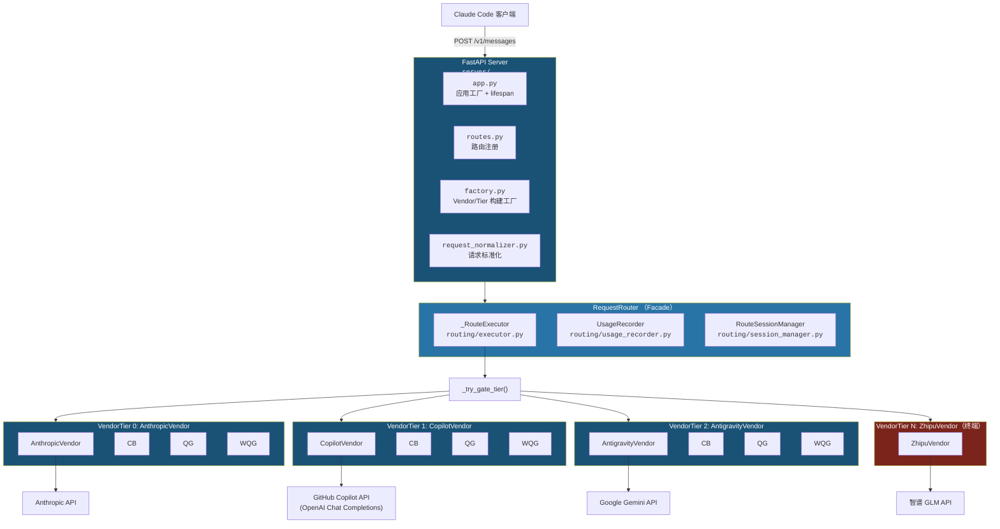

**术语表**：

| 缩写     | 全称                                | 来源                                                                                                                            |
| -------- | ----------------------------------- | ------------------------------------------------------------------------------------------------------------------------------- |
| **CB**   | CircuitBreaker（熔断器）            | [`routing/circuit_breaker.py`](../src/coding/proxy/routing/circuit_breaker.py)                                                  |
| **QG**   | QuotaGuard（配额守卫—日度）         | [`routing/quota_guard.py`](../src/coding/proxy/routing/quota_guard.py)                                                          |
| **WQG**  | WeeklyQuotaGuard（周度配额守卫）    | [`routing/quota_guard.py`](../src/coding/proxy/routing/quota_guard.py)（同一类，不同实例）                                      |
| **RL**   | Rate Limit Deadline（速率限制截止） | [`routing/tier.py`](../src/coding/proxy/routing/tier.py) + [`routing/rate_limit.py`](../src/coding/proxy/routing/rate_limit.py) |
| **Tier** | VendorTier（供应商层级）            | [`routing/tier.py`](../src/coding/proxy/routing/tier.py)                                                                        |

### 2.2 模块职责一览

| 模块          | 路径                                           | 职责                                                                                                                                             |
| ------------- | ---------------------------------------------- | ------------------------------------------------------------------------------------------------------------------------------------------------ |
| **vendors**   | [`vendors/`](../src/coding/proxy/vendors/)     | **供应商适配器（主架构）**：`BaseVendor` 抽象基类 + 4 个具体实现（Anthropic/Copilot/Antigravity/Zhipu）                                          |
| **backends**  | [`backends/`](../src/coding/proxy/backends/)   | 向后兼容层（遗留），类型别名指向 `vendors/` 模块                                                                                                 |
| **routing**   | [`routing/`](../src/coding/proxy/routing/)     | N-tier 链式路由核心（正交分解为 executor/tier/CB/QG/retry/rate_limit/error_classifier/session_manager/usage_recorder/usage_parser/model_mapper） |
| **compat**    | [`compat/`](../src/coding/proxy/compat/)       | 兼容性抽象系统：`CanonicalRequest` / `CompatibilityDecision` / `session_store`                                                                   |
| **auth**      | [`auth/`](../src/coding/proxy/auth/)           | 认证系统：OAuth providers（GitHub Device Flow / Google OAuth2）/ runtime reauth / token store                                                    |
| **model**     | [`model/`](../src/coding/proxy/model/)         | 数据模型正交分解：vendor / compat / constants / pricing / token / backend                                                                        |
| **config**    | [`config/`](../src/coding/proxy/config/)       | Pydantic v2 配置模型（正交拆分为 server/vendors/resiliency/routing/auth_schema）+ YAML 加载器                                                    |
| **convert**   | [`convert/`](../src/coding/proxy/convert/)     | API 格式转换（Anthropic ↔ Gemini ↔ OpenAI 三向转换，含 SSE 流适配）                                                                              |
| **logging**   | [`logging/`](../src/coding/proxy/logging/)     | Token 用量 SQLite 持久化、evidence 记录、统计查询与 Rich 格式化展示                                                                              |
| **server**    | [`server/`](../src/coding/proxy/server/)       | FastAPI 应用工厂与生命周期管理（正交拆分为 app.py/factory.py/routes.py/request_normalizer.py/responses.py）                                      |
| **cli**       | [`cli/`](../src/coding/proxy/cli/)             | Typer 命令行入口（start/status/usage/reset/auth）                                                                                                |
| **streaming** | [`streaming/`](../src/coding/proxy/streaming/) | Anthropic 兼容流式处理                                                                                                                           |
| **pricing**   | [`pricing.py`](../src/coding/pricing.py)       | 定价表（`PricingTable`）：按 (vendor, model) 查询单价并计算费用                                                                                  |

---

## 3. 设计模式详解

本章涵盖 coding-proxy 中运用的 **13 种设计模式与工程模式**，按职责域正交分为三类：**创建型**（对象构建策略）、**结构型**（组件组织方式）、**行为型与并发**（运行时行为控制）。

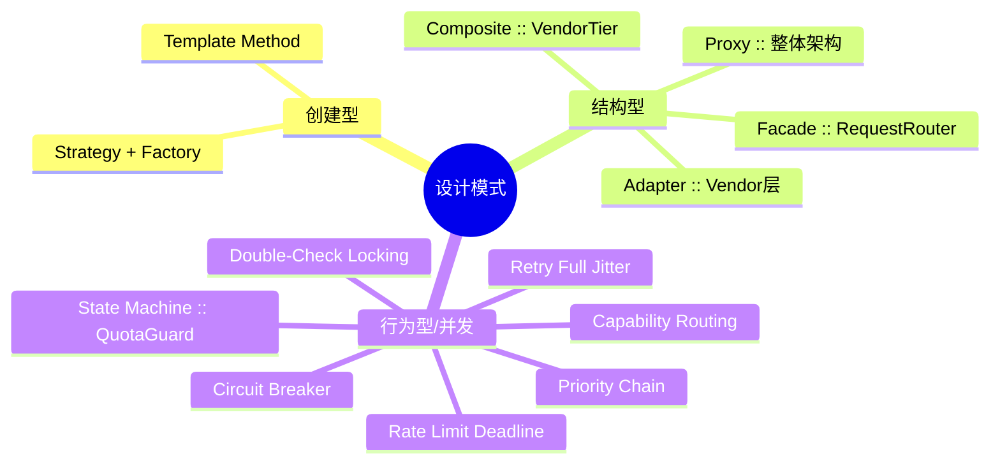

### 3.1 Template Method（模板方法模式）

> **经典出处**：GoF《Design Patterns: Elements of Reusable Object-Oriented Software》<sup>[[1]](#ref1)</sup> — 定义算法骨架，将某些步骤延迟到子类实现。

**应用位置**：[`vendors/base.py`](../src/coding/proxy/vendors/base.py) — `BaseVendor` 抽象基类

**设计要点**：

`BaseVendor` 定义了请求处理的算法骨架，将差异化的逻辑延迟到子类：

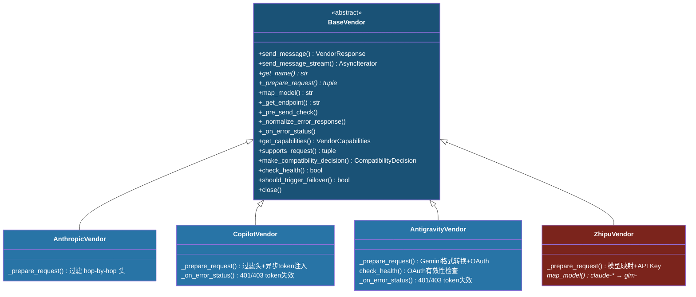

四个具体 Vendor 子类的差异化实现：

| 方法                 | AnthropicVendor    | CopilotVendor            | AntigravityVendor                  | ZhipuVendor                     |
| -------------------- | ------------------ | ------------------------ | ---------------------------------- | ------------------------------- |
| `_prepare_request()` | 过滤 hop-by-hop 头 | 过滤头 + 异步 token 注入 | Gemini 格式转换 + OAuth token      | 模型映射 + API Key              |
| `map_model()`        | 恒等映射           | 恒等映射                 | 恒等映射                           | **覆写**（claude-* → glm-*）    |
| `_get_endpoint()`    | `/v1/messages`     | `/v1/chat/completions`   | `/{model}:generateContent`         | `/api/anthropic/v1/messages`    |
| `_on_error_status()` | 继承基类（空操作） | 401/403 token 失效       | 401/403 token 失效                 | 继承基类（空操作）              |
| `get_capabilities()` | 全部支持           | 不支持 thinking          | 不支持 tools/thinking/metadata     | 不支持 thinking/images/metadata |
| `check_health()`     | 继承（True）       | 继承（True）             | **覆写**（OAuth token 有效性检查） | 继承（True）                    |

### 3.2 Circuit Breaker（熔断器模式）

> **经典出处**：Martin Fowler "CircuitBreaker" (2014)<sup>[[2]](#ref2)</sup>；M. Nygard《Release It! Design and Deploy Production-Ready Software》第 5 章<sup>[[3]](#ref3)</sup> — 通过快速失败防止级联故障。

**应用位置**：[`routing/circuit_breaker.py`](../src/coding/proxy/routing/circuit_breaker.py) — `CircuitBreaker` 类

**状态机**：

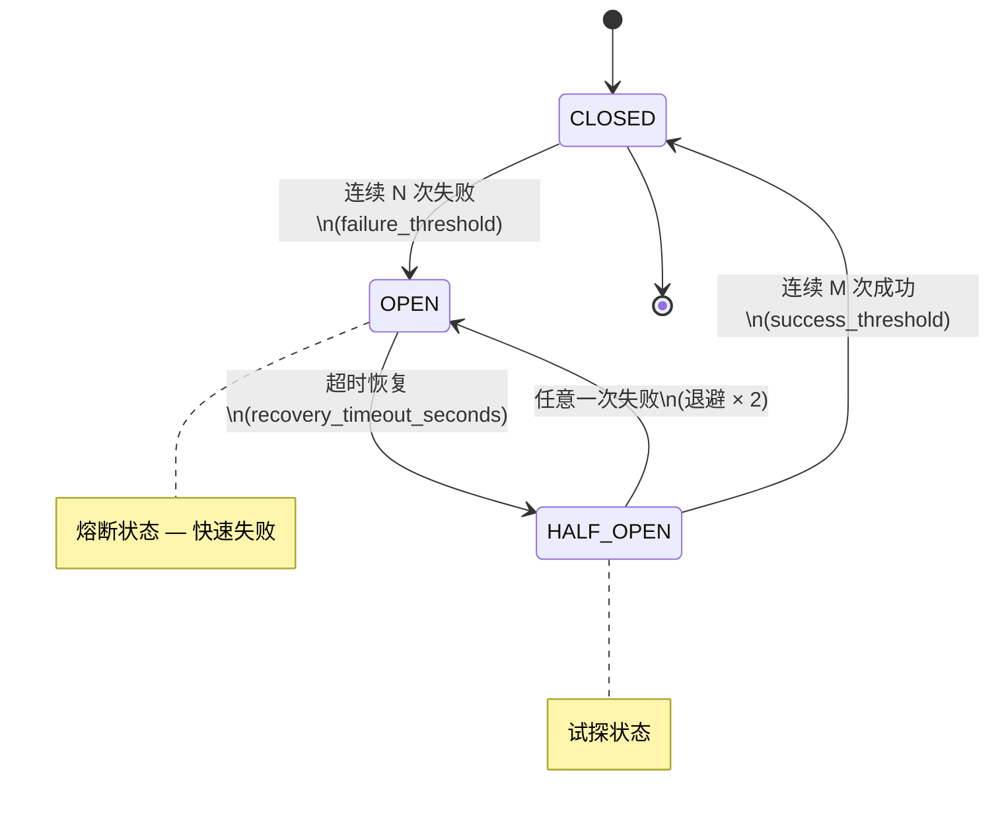

**状态转换条件**：

| 转换               | 条件                                    | 默认值 |
| ------------------ | --------------------------------------- | ------ |
| CLOSED → OPEN      | 连续失败次数 ≥ `failure_threshold`      | 3 次   |
| OPEN → HALF_OPEN   | 距上次失败 ≥ `recovery_timeout_seconds` | 300 秒 |
| HALF_OPEN → CLOSED | 连续成功次数 ≥ `success_threshold`      | 2 次   |
| HALF_OPEN → OPEN   | 任意一次失败                            | —      |

**指数退避 (Exponential Backoff)**：每次从 HALF_OPEN 回退到 OPEN 时，恢复等待时间翻倍（`recovery_timeout *= 2`），上限为 `max_recovery_seconds`（默认 3600 秒）。避免对仍未恢复的后端频繁重试。

**线程安全**：所有状态变更通过 `threading.Lock` 保护，确保并发请求下状态一致。

### 3.3 Priority Chain（优先级匹配链）

**应用位置**：[`routing/model_mapper.py`](../src/coding/proxy/routing/model_mapper.py) — `ModelMapper` 类

**设计要点**：

ModelMapper 采用三级优先级匹配链，按精确度递减依次尝试：

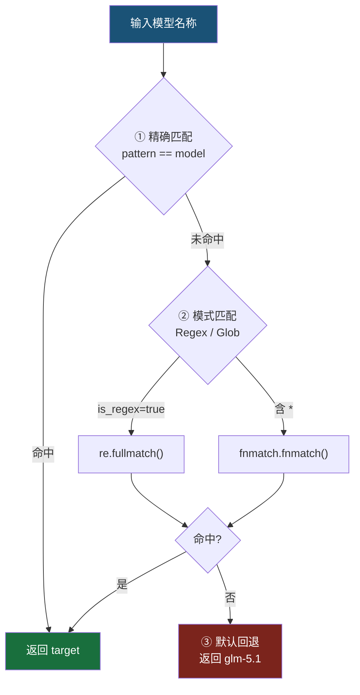

**默认映射规则**：

| 模式               | 目标          | 类型         |
| ------------------ | ------------- | ------------ |
| `claude-sonnet-.*` | `glm-5.1`     | 正则         |
| `claude-opus-.*`   | `glm-5.1`     | 正则         |
| `claude-haiku-.*`  | `glm-4.5-air` | 正则         |
| `claude-.*`        | `glm-5.1`     | 正则（兜底） |

正则表达式在 `__init__` 时预编译（`re.compile()`），`map()` 调用时直接使用编译后的对象，避免重复编译开销。

### 3.4 Strategy + Factory（策略 + 工厂方法模式）

> **经典出处**：GoF《Design Patterns》<sup>[[1]](#ref1)</sup> — 定义创建对象的接口，由策略选择决定实例化哪个类。

**应用位置**：[`server/factory.py`](../src/coding/proxy/server/factory.py) — `_create_vendor_from_config()` 函数

**组装顺序**（两阶段构建）：

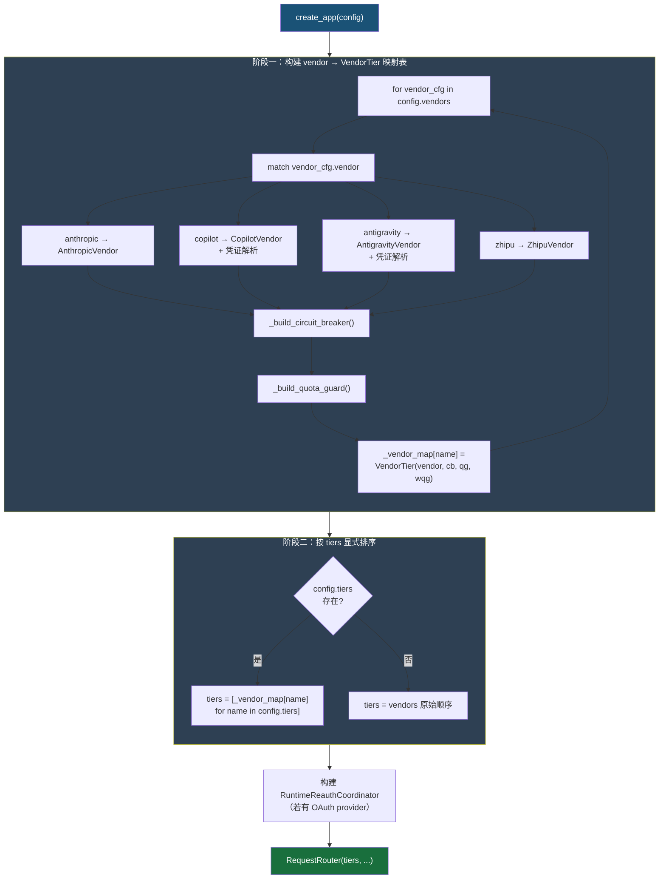

**凭证合并优先级**：Token Store（持久化） > config.yaml（显式配置）。确保用户通过 CLI 认证命令获取的凭证优先于配置文件中的硬编码值。

### 3.5 Proxy（代理模式）— 整体架构

> **经典出处**：GoF《Design Patterns》<sup>[[1]](#ref1)</sup> — 为其他对象提供一种代理以控制对这个对象的访问。

**应用位置**：整体架构

coding-proxy 本身即是一个代理服务：

- 对外暴露与 Anthropic Messages API 完全兼容的 `POST /v1/messages` 接口
- Claude Code 客户端只需将 `ANTHROPIC_BASE_URL` 指向代理地址
- 代理在幕后完成后端选择、故障转移、模型映射、用量记录、请求标准化等增值逻辑
- 支持流式（SSE `text/event-stream`）和非流式（JSON）两种响应模式
- 额外透传 `/v1/messages/count_tokens` 端点至 Anthropic 主供应商

### 3.6 Composite（组合模式）— VendorTier

> **经典出处**：GoF《Design Patterns》<sup>[[1]](#ref1)</sup> — 将对象组合成树形结构以表示"部分-整体"的层次结构。

**应用位置**：[`routing/tier.py`](../src/coding/proxy/routing/tier.py) — `VendorTier` 数据类

**设计要点**：

VendorTier 将多个正交关注点聚合为路由器的最小调度单元：

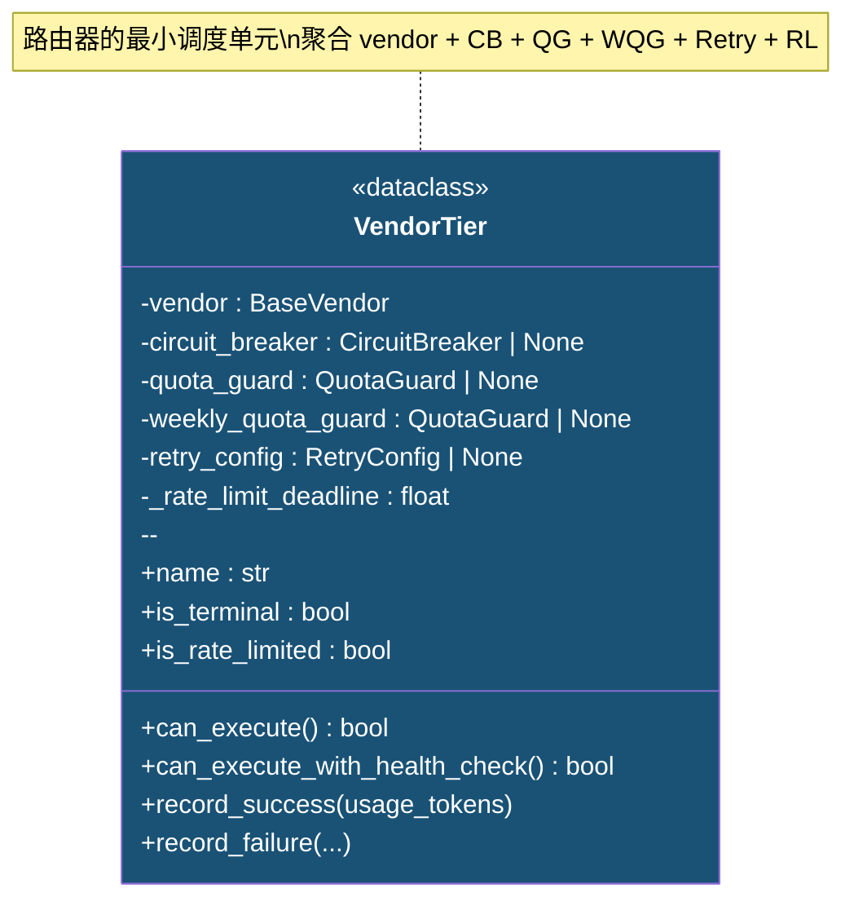

**关键方法**：

| 方法                                                                     | 逻辑                                                                      |
| ------------------------------------------------------------------------ | ------------------------------------------------------------------------- |
| `name`                                                                   | → `vendor.get_name()`                                                     |
| `is_terminal`                                                            | → `circuit_breaker is None`（终端层无故障转移）                           |
| `can_execute()`                                                          | CB.can_execute() AND QG.can_use_primary() AND WQG.can_use_primary()       |
| `can_execute_with_health_check()`                                        | 三层恢复门控：Rate Limit Deadline → Health Check → Cautious Probe         |
| `record_success(usage_tokens)`                                           | CB.record_success() + QG/WQG 探测恢复 + 用量记录 + 清除 RL deadline       |
| `record_failure(is_cap_error, retry_after_seconds, rate_limit_deadline)` | CB.record_failure(+retry) + 若 cap error 则通知 QG/WQG + 更新 RL deadline |
| `is_rate_limited`                                                        | `_rate_limit_deadline > time.monotonic()`                                 |

### 3.7 State Machine（状态机模式）— QuotaGuard

**应用位置**：[`routing/quota_guard.py`](../src/coding/proxy/routing/quota_guard.py) — `QuotaGuard` 类

**设计要点**：

基于滑动窗口的双态状态机，通过 Token 预算追踪主动避免触发上游配额限制：

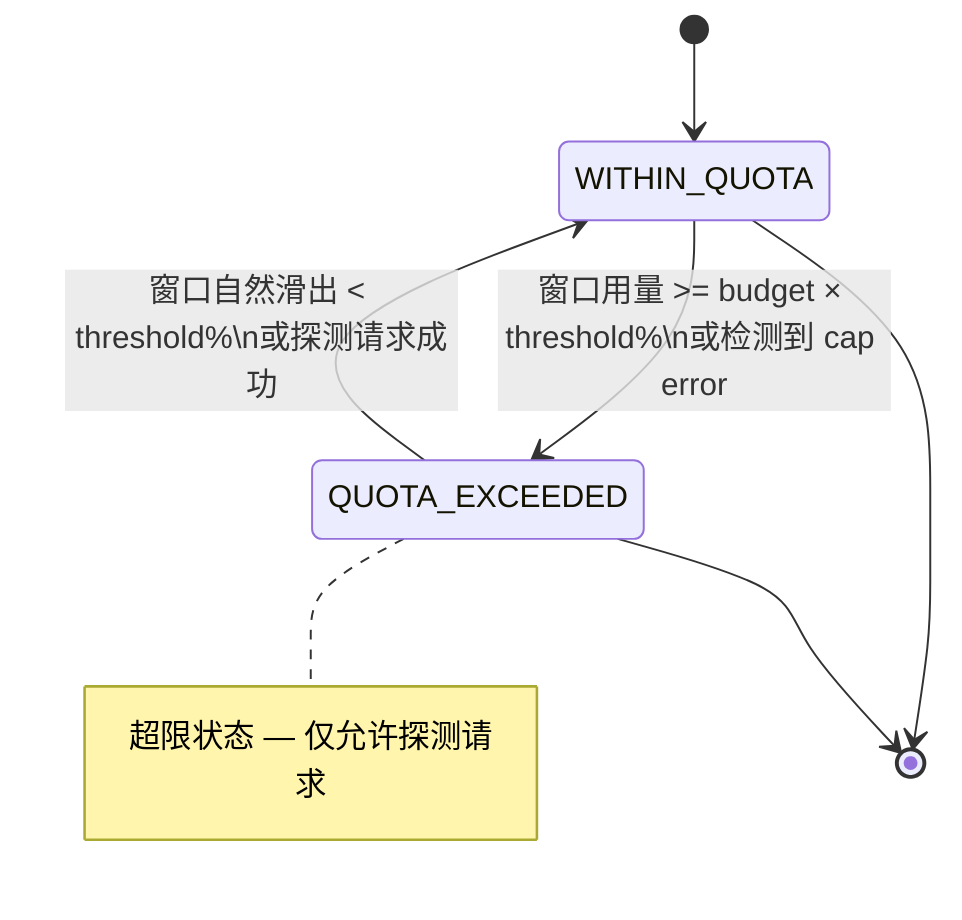

**核心机制**：

- **滑动窗口**：`deque[(timestamp, tokens)]`，`_expire()` 清除超出 `window_seconds` 的条目
- **双窗口支持**：同一 `QuotaGuard` 类同时服务于日度 (`quota_guard`) 和周度 (`weekly_quota_guard`) 两个独立实例
- **探测恢复**：QUOTA_EXCEEDED 状态下，每隔 `probe_interval_seconds` 放行一个探测请求
- **cap error 模式**：由外部 `_is_cap_error()` 触发，不做预算自动恢复，仅允许探测恢复
- **基线加载**：启动时从数据库加载历史用量，防止重启后误判配额状态
- **线程安全**：所有状态变更通过 `threading.Lock` 保护

### 3.8 Double-Check Locking（双重检查锁模式）

**应用位置**：
- [`vendors/copilot.py`](../src/coding/proxy/vendors/copilot.py) — `CopilotTokenManager`
- [`vendors/antigravity.py`](../src/coding/proxy/vendors/antigravity.py) — `GoogleOAuthTokenManager`

**设计要点**：

两个 Token Manager 均采用相同的异步 DCL 模式，确保高并发下 token 交换仅执行一次：

```python
# 快速路径（无锁）
if self._access_token and time.monotonic() < self._expires_at:
    return self._access_token

# 慢路径（加锁后二次检查）
async with self._lock:
    if self._access_token and time.monotonic() < self._expires_at:
        return self._access_token
    await self._exchange()  # 或 self._refresh()
```

| Token Manager             | 认证流程                                                                  | 有效期   | 提前刷新余量 |
| ------------------------- | ------------------------------------------------------------------------- | -------- | ------------ |
| `CopilotTokenManager`     | GitHub token -> GET `copilot_internal/v2/token` -> `token`/`access_token` | ~30 分钟 | 60 秒        |
| `GoogleOAuthTokenManager` | refresh_token -> POST oauth2.googleapis.com/token -> access_token         | ~1 小时  | 120 秒       |

两者均支持**被动刷新**：当后端返回 401/403 时，通过 `_on_error_status()` 调用 `invalidate()` 标记 token 失效，下次请求自动触发重新获取。若 `needs_reauth=True`，还会联动 `RuntimeReauthCoordinator` 触发后台重认证流程。

### 3.9 Facade（外观模式）

> **经典出处**：GoF《Design Patterns》<sup>[[1]](#ref1)</sup> — 为子系统中的一组接口提供一个统一的高层接口。

**应用位置**：[`routing/router.py`](../src/coding/proxy/routing/router.py) — `RequestRouter` 类

**设计要点**：

`RequestRouter` 作为薄代理门面（Facade），将路由系统的复杂内部实现封装为简洁的公开接口，内部委托给三个正交分解的子组件：

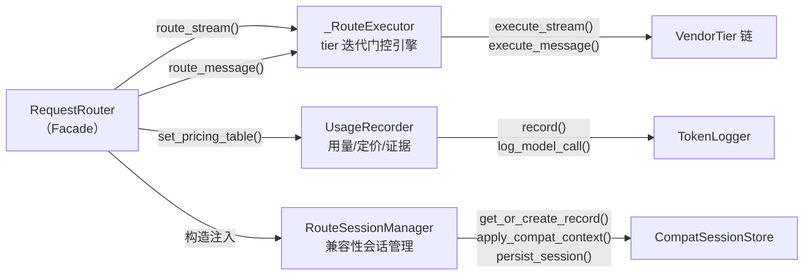

**委托关系**：

| 公开方法                       | 内部委托                                      |
| ------------------------------ | --------------------------------------------- |
| `route_stream(body, headers)`  | -> `_executor.execute_stream(body, headers)`  |
| `route_message(body, headers)` | -> `_executor.execute_message(body, headers)` |
| `set_pricing_table(table)`     | -> `_recorder.set_pricing_table(table)`       |
| `close()`                      | -> 遍历 `tiers` 调用 `tier.vendor.close()`    |

这种正交 decomposition 使得每个子组件可以独立演进和测试，同时 `RequestRouter` 保持对外接口稳定。

### 3.10 Adapter（适配器模式）— Vendor 层

> **经典出处**：GoF《Design Patterns》<sup>[[1]](#ref1)</sup> — 将一个类的接口转换成客户期望的另一个接口。

**应用位置**：[`vendors/`](../src/coding/proxy/vendors/) — `BaseVendor` 及其具体实现

**设计要点**：

每个 Vendor 子类充当 Adapter 角色，将异构的上游 API 适配为统一的 `BaseVendor` 接口：

| Vendor              | 上游协议                    | 适配行为                                               |
| ------------------- | --------------------------- | ------------------------------------------------------ |
| `AnthropicVendor`   | Anthropic Messages API      | 透传（近乎零适配开销）                                 |
| `CopilotVendor`     | OpenAI Chat Completions API | 请求体/响应体双向格式转换 + token 注入                 |
| `AntigravityVendor` | Gemini GenerateContent API  | Anthropic <-> Gemini 双向格式转换 + SSE 流适配 + OAuth |
| `ZhipuVendor`       | Anthropic-compatible API    | 模型名映射 + API Key 认证头替换                        |

此外，[`convert/`](../src/coding/proxy/convert/) 模块提供独立的纯函数适配器层，支持三向格式转换：

| 转换方向                    | 模块                                                                                   | 说明               |
| --------------------------- | -------------------------------------------------------------------------------------- | ------------------ |
| Anthropic -> Gemini         | [`convert/anthropic_to_gemini.py`](../src/coding/proxy/convert/anthropic_to_gemini.py) | 请求格式转换       |
| Gemini -> Anthropic         | [`convert/gemini_to_anthropic.py`](../src/coding/proxy/convert/gemini_to_anthropic.py) | 响应格式转换       |
| Gemini SSE -> Anthropic SSE | [`convert/gemini_sse_adapter.py`](../src/coding/proxy/convert/gemini_sse_adapter.py)   | 流式事件重构       |
| Anthropic -> OpenAI         | [`convert/anthropic_to_openai.py`](../src/coding/proxy/convert/anthropic_to_openai.py) | Copilot 请求适配   |
| OpenAI -> Anthropic         | [`convert/openai_to_anthropic.py`](../src/coding/proxy/convert/openai_to_anthropic.py) | Copilot 响应逆适配 |

### 3.11 Capability-Based Routing（基于能力的路由）

**应用位置**：
- [`routing/error_classifier.py`](../src/coding/proxy/routing/error_classifier.py) — `build_request_capabilities()`
- [`vendors/base.py`](../src/coding/proxy/vendors/base.py) — `BaseVendor.supports_request()` / `get_capabilities()` / `make_compatibility_decision()`
- [`model/vendor.py`](../src/coding/proxy/model/vendor.py) — `RequestCapabilities` / `VendorCapabilities` / `CapabilityLossReason`

**设计要点**：

基于请求能力画像与供应商能力声明的正交匹配矩阵，在路由阶段即排除无法无损承接请求的层级：

| 维度 \ 能力  | `tools` | `thinking` | `images` | `metadata` | `vend_tools` |
| :----------- | :-----: | :--------: | :------: | :--------: | :----------: |
| **tools**    |  ✅ OK   |     —      |    —     |     —      |    ❌ skip    |
| **thinking** |    —    |    ✅ OK    |    —     |     —      |      —       |
| **images**   |    —    |     —      |   ✅ OK   |     —      |      —       |
| **metadata** |    —    |     —      |    —     |    ✅ OK    |      —       |

> ✅ = 可承接；❌ = `CapabilityLossReason`（跳过此 tier）

**匹配流程**：

1. **能力硬过滤**：`supports_request(request_caps)` -> 返回 `(bool, list[CapabilityLossReason])`
   - 若有任何 `CapabilityLossReason`，直接跳过该 tier 并记录原因
2. **兼容性决策**：`make_compatibility_decision(canonical_request)` -> 返回 `CompatibilityDecision`
   - `NATIVE`：完全原生支持，直接放行
   - `SIMULATED`：可通过模拟/投影方式支持（如 thinking 剥离、tool_calling 降级）
   - `UNSAFE`：存在不可弥补的语义缺失，跳过该 tier

**CompatibilityDecision 三态决策矩阵**：

| 请求特征                   | NATIVE | SIMULATED               | UNSAFE |
| -------------------------- | ------ | ----------------------- | ------ |
| thinking + 支持 thinking   | OK     |                         |        |
| thinking + 不支持 thinking |        | thinking_simulation     | X      |
| tools + 支持 tools         | OK     |                         |        |
| tools + 不支持 tools       |        | tool_calling_simulation | X      |
| metadata + 支持 metadata   | OK     |                         |        |
| metadata + 不支持 metadata |        | metadata_projection     | X      |
| json_output + 支持         | OK     |                         |        |
| json_output + 不支持       |        | json_output_projection  | X      |

### 3.12 Retry with Full Jitter（带完全抖动的重试模式）

> **参考**：M. Nygard《Release It!》第 5 章<sup>[[3]](#ref3)</sup>；AWS Architecture Center "Retry Pattern"<sup>[[4]](#ref4)</sup>

**应用位置**：[`routing/retry.py`](../src/coding/proxy/routing/retry.py) — `RetryConfig` / `calculate_delay()`

**设计要点**：

传输层重试策略处理瞬态网络故障，与 CircuitBreaker 形成正交互补：

| 维度         | Retry                                 | CircuitBreaker         |
| ------------ | ------------------------------------- | ---------------------- |
| 处理范围     | 单次请求内的瞬态抖动                  | 跨请求的持续故障       |
| 恢复时间尺度 | 秒级（500ms ~ 5s）                    | 分钟级（300s ~ 3600s） |
| 触发条件     | TimeoutException / ConnectError / 5xx | 连续 N 次失败          |
| 失败贡献     | 每次 retry 失败仅向 CB 贡献 1 次计数  | 累积计数触发 OPEN      |

**Full Jitter 计算**：

$$
\text{delay} = \text{random}\left(0,\; \min\left(\text{initial\_delay} \times \text{backoff}^{\text{attempt}},\; \text{max\_delay}\right)\right)
$$

| 参数   | `max_retries` | `initial_delay_ms` | `max_delay_ms` | `backoff_multiplier` | `jitter` |
| ------ | :-----------: | :----------------: | :------------: | :------------------: | :------: |
| 默认值 |       2       |        500         |      5000      |         2.0          |  ✅ true  |

**可重试异常判定**（`is_retryable_error()`）：

| 异常类型                      | 可重试 | 原因                       |
| ----------------------------- | ------ | -------------------------- |
| `httpx.TimeoutException`      | OK     | 瞬态超时                   |
| `httpx.ConnectError`          | OK     | 网络连接失败               |
| `httpx.HTTPStatusError` (5xx) | OK     | 服务端瞬时错误             |
| `httpx.HTTPStatusError` (4xx) | NO     | 客户端错误（不应重试）     |
| `TokenAcquireError`           | NO     | 认证层错误（应触发重认证） |

### 3.13 Rate Limit Deadline Tracking（速率限制截止追踪）

**应用位置**：
- [`routing/rate_limit.py`](../src/coding/proxy/routing/rate_limit.py) — `RateLimitInfo` / `parse_rate_limit_headers()` / `compute_rate_limit_deadline()`
- [`routing/tier.py`](../src/coding/proxy/routing/tier.py) — `VendorTier._rate_limit_deadline` / `is_rate_limited` / `can_execute_with_health_check()`

**设计要点**：

从 HTTP 429/403 响应头精确解析上游速率限制信息，并转化为 monotonic 时间戳用于门控：

**解析的信息源**：

| Header                               | 格式              | 含义                 |
| ------------------------------------ | ----------------- | -------------------- |
| `Retry-After`                        | 秒数或 HTTP Date  | 标准速率限制恢复时间 |
| `anthropic-ratelimit-requests-reset` | ISO 8601 datetime | 请求计数重置时间     |
| `anthropic-ratelimit-tokens-reset`   | ISO 8601 datetime | Token 配额重置时间   |

**计算策略**：

- 取所有可用信号的最大值，并加 **10% 安全余量**
- `compute_effective_retry_seconds()` -> 返回相对秒数（供 CircuitBreaker 退避计算）
- `compute_rate_limit_deadline()` -> 返回绝对 monotonic 时间戳（供 VendorTier 精确门控）

**三层恢复门控集成**：

`can_execute_with_health_check()` 方法实现了三层渐进式恢复机制：

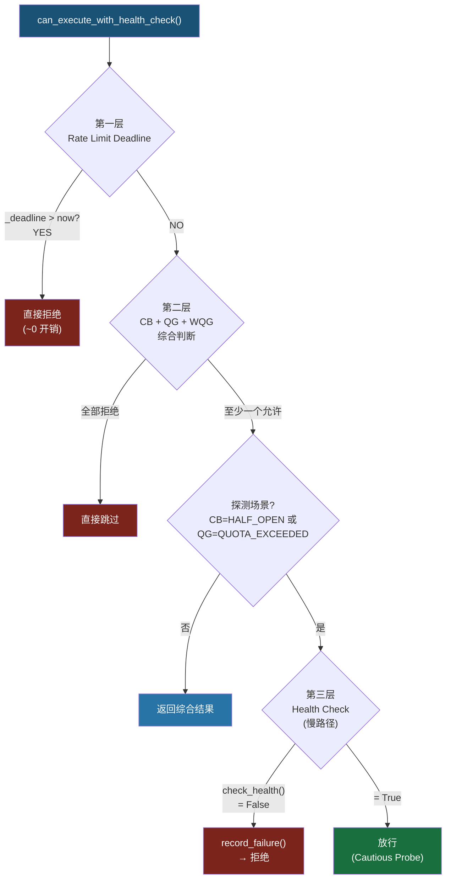

---

## 4. 请求生命周期

### 4.1 完整请求流程

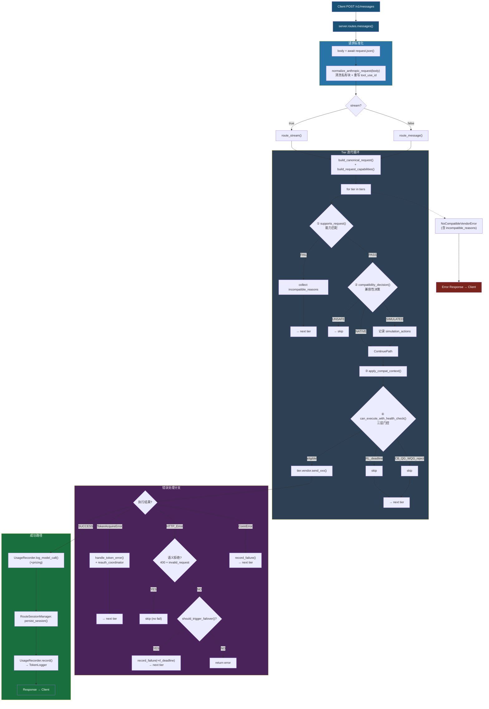

### 4.2 流式请求处理

流式请求使用 `StreamingResponse` + 异步生成器 `_stream_proxy()`：

1. `RequestRouter.route_stream()` 委托给 `_RouteExecutor.execute_stream()`
2. 每个 SSE chunk 通过 `parse_usage_from_chunk()` ([`routing/usage_parser.py`](../src/coding/proxy/routing/usage_parser.py)) 提取 Token 用量：
   - `message_start` 事件：提取 `input_tokens`、`cache_creation_input_tokens`、`cache_read_input_tokens`、`request_id`
   - `message_delta` 事件：提取 `output_tokens`
3. chunk 原样透传给客户端
4. 流结束后：
   - `UsageRecorder.build_usage_info(usage)` 构建结构化用量信息
   - 检查缺失信号并 WARNING 日志
   - `tier.record_success(input_tokens + output_tokens)` -- 通知 CB 成功 + QG/WQG 记录用量 + 清除 RL deadline
   - `UsageRecorder.log_model_call()` -- 输出含定价信息的 Access Log
   - `RouteSessionManager.persist_session()` -- 持久化兼容性会话状态
   - `UsageRecorder.record()` -- 记录完整用量到 TokenLogger（含 evidence_records）

**故障转移时**：清空已收集的 usage 数据，从下一个 tier 重新开始流式传输。

**最终层异常处理**（`_stream_proxy` 生成器内）：

| 异常类型                                  | SSE 错误事件                              |
| ----------------------------------------- | ----------------------------------------- |
| `NoCompatibleVendorError`                 | `error` event + `invalid_request_error`   |
| `TokenAcquireError`                       | `error` event + `authentication_error`    |
| `TimeoutException/ConnectError/ReadError` | `error` event + `api_error`               |
| `HTTPStatusError`                         | `error` event + 提取的 error type/message |

### 4.3 非流式请求处理

非流式请求直接调用 `send_message()` 获取完整 `VendorResponse`：

1. 主后端返回成功（`status_code < 400`）-> 定价日志 + 会话持久化 + 用量记录 -> 返回
2. 主后端返回错误 -> 分支处理：
   - **语义拒绝**（400 + `invalid_request_error` 或特定消息模式）-> **不记录 failure**，直接尝试下一 tier
   - **可故障转移**（`should_trigger_failover()` 为 True）-> 解析 rate limit headers -> `record_failure(is_cap_error, retry_after_seconds, rate_limit_deadline)` -> 下一 tier
   - **不可转移的错误** -> 记录用量 -> 返回原始响应
3. 捕获 `TokenAcquireError` -> `handle_token_error()` + 触发 reauth -> 下一 tier（非最后一层）
4. 捕获 `TimeoutException/ConnectError/ReadError` -> `record_failure()` -> 下一 tier

**VendorResponse 新增字段**：

| 字段               | 类型             | 说明                                          |
| ------------------ | ---------------- | --------------------------------------------- |
| `model_served`     | `str \| None`    | 后端实际使用的模型名（可能经 map_model 转换） |
| `response_headers` | `dict[str, str]` | 原始响应头（用于 rate limit 解析）            |

### 4.4 故障转移判定逻辑

故障转移的判定在 `BaseVendor.should_trigger_failover()` 中实现，依据三层条件（可通过配置文件自定义）：

| 层级        | 条件                                       | 默认值                                                  |
| ----------- | ------------------------------------------ | ------------------------------------------------------- |
| HTTP 状态码 | `status_code in failover.status_codes`     | `[429, 403, 503, 500]`                                  |
| 错误类型    | `error.type in failover.error_types`       | `["rate_limit_error", "overloaded_error", "api_error"]` |
| 错误消息    | `pattern in error.message`（不区分大小写） | `["quota", "limit exceeded", "usage cap", "capacity"]`  |

**特殊规则**：对于 429 和 503 状态码，即使无法解析响应体（body），也会强制触发故障转移。

**语义拒绝独立路径**：`is_semantic_rejection()` 检测 400 状态码下的 `invalid_request_error` 类型或特定消息模式（如 `should match pattern`、`validation`、`tool_use_id`、`server_tool_use`），此类错误**不记录 failure** 且**不触发故障转移计数**，直接跳至下一 tier。

**终端供应商行为**：ZhipuVendor 因构造时不传入 `failover_config`，`should_trigger_failover()` 始终返回 `False`。

### 4.5 生命周期管理

通过 `lifespan` 异步上下文管理器管理应用生命周期（[`server/app.py`](../src/coding/proxy/server/app.py)）：

**启动 (Startup)**：

1. `TokenLogger.init()` -- 创建 SQLite 数据库表和索引
2. `CompatSessionStore.init()` -- 初始化兼容性会话存储
3. `PricingTable(config.pricing)` -- 加载模型定价表并注入 Router
4. 为每个启用了 QuotaGuard 的 tier 加载基线：
   - `token_logger.query_window_total(qg.window_hours, vendor=tier.name)` -> `quota_guard.load_baseline(total)`
   - 同理处理 `weekly_quota_guard`

**关闭 (Shutdown)**：

1. `router.close()` -- 关闭所有 vendor 的 HTTP 客户端（含 TokenManager 客户端）
2. `compat_session_store.close()` -- 关闭会话存储连接
3. `token_logger.close()` -- 关闭数据库连接

---

## 5. 模块详细设计

### 5.1 vendors/ -- 供应商模块（主架构）

**BaseVendor**（[`vendors/base.py`](../src/coding/proxy/vendors/base.py)）-- 抽象基类，模板方法模式的核心：

```python
class BaseVendor(ABC):
    def __init__(self, base_url, timeout_ms, failover_config=None)

    # -- 抽象方法 --
    @abstractmethod
    def get_name(self) -> str: ...
    @abstractmethod
    async def _prepare_request(self, body, headers) -> tuple[dict, dict]: ...

    # -- 核心方法（模板固定流程） --
    async def send_message(self, body, headers) -> VendorResponse: ...
    async def send_message_stream(self, body, headers) -> AsyncIterator[bytes]: ...

    # -- 能力与兼容性 --
    def get_capabilities(self) -> VendorCapabilities: ...
    def supports_request(self, caps) -> tuple[bool, list[CapabilityLossReason]]: ...
    def make_compatibility_decision(self, request) -> CompatibilityDecision: ...
    def map_model(self, model) -> str: ...

    # -- 钩子方法（子类可选覆写） --
    def _get_endpoint(self) -> str: ...            # 默认 /v1/messages
    def _pre_send_check(self, body, headers): ... # 默认 no-op
    def _normalize_error_response(self, status, response, resp) -> VendorResponse: ...
    def _on_error_status(self, status_code): ...  # 默认 no-op
    def check_health() -> Awaitable[bool]: ... # 默认返回 True

    # -- 故障转移 --
    def should_trigger_failover(self, status_code, body) -> bool: ...

    # -- 生命周期 --
    async def close(): ...
```

**数据类型**（定义于 [`model/vendor.py`](../src/coding/proxy/model/vendor.py)，由 `base.py` re-export）：

```python
@dataclass
class UsageInfo:
    input_tokens: int = 0
    output_tokens: int = 0
    cache_creation_tokens: int = 0
    cache_read_tokens: int = 0
    request_id: str = ""

@dataclass
class VendorResponse:
    status_code: int = 200
    usage: UsageInfo = field(default_factory=UsageInfo)
    is_streaming: bool = False
    raw_body: bytes = b"{}"
    error_type: str | None = None
    error_message: str | None = None
    model_served: str | None = None          # 后端实际使用的模型
    response_headers: dict[str, str] = field(default_factory=dict)

class NoCompatibleVendorError(RuntimeError):
    def __init__(self, message, *, reasons=None): ...
    reasons: list[str]

class CapabilityLossReason(Enum):
    TOOLS = "tools"
    THINKING = "thinking"
    IMAGES = "images"
    VENDOR_TOOLS = "vendor_tools"
    METADATA = "metadata"

@dataclass(frozen=True)
class RequestCapabilities:
    has_tools: bool = False
    has_thinking: bool = False
    has_images: bool = False
    has_metadata: bool = False

@dataclass(frozen=True)
class VendorCapabilities:
    supports_tools: bool = True
    supports_thinking: bool = True
    supports_images: bool = True
    emits_vendor_tool_events: bool = False
    supports_metadata: bool = True
```

**四个具体 Vendor 实现**：

| Vendor                | 文件                                                                   | 协议                     | 认证方式                           | 特殊能力                                          |
| --------------------- | ---------------------------------------------------------------------- | ------------------------ | ---------------------------------- | ------------------------------------------------- |
| **AnthropicVendor**   | [`vendors/anthropic.py`](../src/coding/proxy/vendors/anthropic.py)     | Anthropic Messages API   | 透传 OAuth token                   | 全能力支持，旁路 count_tokens                     |
| **CopilotVendor**     | [`vendors/copilot.py`](../src/coding/proxy/vendors/copilot.py)         | OpenAI Chat Completions  | GitHub token -> Copilot token 交换 | 不支持 thinking；内置模型探测                     |
| **AntigravityVendor** | [`vendors/antigravity.py`](../src/coding/proxy/vendors/antigravity.py) | Gemini GenerateContent   | Google OAuth2 refresh_token        | 不支持 tools/thinking/metadata；覆写 health check |
| **ZhipuVendor**       | [`vendors/zhipu.py`](../src/coding/proxy/vendors/zhipu.py)             | Anthropic-compatible API | x-api-key                          | 不支持 thinking/images/metadata；覆写 map_model   |

**向后兼容别名汇总**（均标记 `deprecated`，保障迁移期兼容性）：

| 旧名称                     | 新名称                    | 定义位置          |
| -------------------------- | ------------------------- | ----------------- |
| `BaseBackend`              | `BaseVendor`              | `vendors/base.py` |
| `NoCompatibleBackendError` | `NoCompatibleVendorError` | `vendors/base.py` |
| `BackendTier`              | `VendorTier`              | `routing/tier.py` |
| `BackendCapabilities`      | `VendorCapabilities`      | `model/vendor.py` |
| `BackendResponse`          | `VendorResponse`          | `model/vendor.py` |

### 5.2 routing/ -- 路由模块

#### 5.2.1 VendorTier（[`routing/tier.py`](../src/coding/proxy/routing/tier.py)）

```python
@dataclass
class VendorTier:
    vendor: BaseVendor
    circuit_breaker: CircuitBreaker | None = None
    quota_guard: QuotaGuard | None = None
    weekly_quota_guard: QuotaGuard | None = None   # 周度配额守卫
    retry_config: RetryConfig | None = None          # 重试策略参数
    _rate_limit_deadline: float = 0.0               # Rate Limit 截止 monotonic 时间戳
```

**向后兼容别名**：`BackendTier = VendorTier`（deprecated，详见 [§5.1 别名汇总表](#51-vendors--供应商模块主架构)）

#### 5.2.2 _RouteExecutor（[`routing/executor.py`](../src/coding/proxy/routing/executor.py)）

统一的 tier 迭代门控引擎，封装 `execute_stream()` / `execute_message()` 共享的循环逻辑：

**职责**：
- 按优先级遍历 tiers，执行能力门控与健康检查
- 委托具体的流式/非流式执行给 vendor
- 统一处理 `TokenAcquireError` / HTTP 错误 / 语义拒绝
- 成功后委托 UsageRecorder 记录用量与定价日志

**关键方法**：

| 方法                                                               | 说明                                                                 |
| ------------------------------------------------------------------ | -------------------------------------------------------------------- |
| `execute_stream(body, headers)`                                    | 流式路由主循环，yield `(chunk, vendor_name)`                         |
| `execute_message(body, headers)`                                   | 非流式路由主循环，返回 `VendorResponse`                              |
| `_try_gate_tier(tier, is_last, caps, canonical, session, reasons)` | 单 tier 门控：能力匹配 -> 兼容性决策 -> 上下文应用 -> 健康检查       |
| `_handle_token_error(tier, exc, is_last, failed_name)`             | TokenAcquireError 处理 + reauth 触发                                 |
| `_handle_http_error(tier, exc, ...)`                               | HTTP 错误处理：语义拒绝 / cap error / rate limit 解析 / failure 记录 |
| `_is_cap_error(resp)`                                              | 静态方法：检测 429/403 + 配额关键词                                  |

#### 5.2.3 UsageRecorder（[`routing/usage_recorder.py`](../src/coding/proxy/routing/usage_recorder.py)）

封装路由层的用量记录、定价计算与证据构建：

| 方法                                                                     | 说明                                                     |
| ------------------------------------------------------------------------ | -------------------------------------------------------- |
| `set_pricing_table(table)`                                               | 注入 PricingTable（lifespan 启动时调用）                 |
| `build_usage_info(usage_dict)`                                           | 从原始 dict 构建结构化 UsageInfo                         |
| `log_model_call(vendor, model_requested, model_served, duration, usage)` | 输出 ModelCall 级别 Access Log（含定价）                 |
| `record(vendor, ..., evidence_records)`                                  | 持久化用量到 TokenLogger + evidence 记录（Copilot 专用） |
| `build_nonstream_evidence_records(...)`                                  | 构建非流式证据记录                                       |

#### 5.2.4 RouteSessionManager（[`routing/session_manager.py`](../src/coding/proxy/routing/session_manager.py)）

管理单次路由请求的兼容性会话生命周期：

| 方法                                                       | 说明                                  |
| ---------------------------------------------------------- | ------------------------------------- |
| `get_or_create_record(session_key, trace_id)`              | 获取或创建会话记录                    |
| `apply_compat_context(tier, canonical, decision, session)` | 构建 CompatibilityTrace 并注入 vendor |
| `persist_session(trace, session)`                          | 持久化会话状态到 CompatSessionStore   |

#### 5.2.5 Error Classifier（[`routing/error_classifier.py`](../src/coding/proxy/routing/error_classifier.py)）

HTTP 错误分类与请求能力画像提取：

| 函数                                                            | 说明                                                   |
| --------------------------------------------------------------- | ------------------------------------------------------ |
| `build_request_capabilities(body)`                              | 从请求体提取能力画像（tools/thinking/images/metadata） |
| `is_semantic_rejection(status_code, error_type, error_message)` | 判断是否为语义拒绝（400 + 特定模式）                   |
| `extract_error_payload_from_http_status(exc)`                   | 从 HTTPStatusError 安全提取 JSON payload               |

#### 5.2.6 Rate Limit（[`routing/rate_limit.py`](../src/coding/proxy/routing/rate_limit.py)）

速率限制信息解析与截止时间计算：

| 函数/类                                                 | 说明                                                                     |
| ------------------------------------------------------- | ------------------------------------------------------------------------ |
| `RateLimitInfo`                                         | 数据类：retry_after / requests_reset_at / tokens_reset_at / is_cap_error |
| `parse_rate_limit_headers(headers, status, error_body)` | 从响应头解析所有速率限制信号                                             |
| `compute_effective_retry_seconds(info)`                 | 计算最保守恢复等待时间（相对秒数，+10% 余量）                            |
| `compute_rate_limit_deadline(info)`                     | 计算最保守恢复截止时间（绝对 monotonic 时间戳，+10% 余量）               |

#### 5.2.7 Retry（[`routing/retry.py`](../src/coding/proxy/routing/retry.py)）

传输层重试策略：

| 函数/类                         | 说明                                                                                |
| ------------------------------- | ----------------------------------------------------------------------------------- |
| `RetryConfig`                   | 数据类：max_retries / initial_delay_ms / max_delay_ms / backoff_multiplier / jitter |
| `is_retryable_error(exc)`       | 判断异常是否值得重试                                                                |
| `is_retryable_status(code)`     | 判断状态码是否值得重试（5xx）                                                       |
| `calculate_delay(attempt, cfg)` | 计算第 N 次重试延迟（含 Full Jitter）                                               |

#### 5.2.8 CircuitBreaker 参数（[`routing/circuit_breaker.py`](../src/coding/proxy/routing/circuit_breaker.py)）

| 参数                       | 类型 | 默认值 | 说明                                 |
| -------------------------- | ---- | ------ | ------------------------------------ |
| `failure_threshold`        | int  | 3      | 触发 OPEN 的连续失败次数             |
| `recovery_timeout_seconds` | int  | 300    | OPEN -> HALF_OPEN 等待秒数           |
| `success_threshold`        | int  | 2      | HALF_OPEN -> CLOSED 所需连续成功次数 |
| `max_recovery_seconds`     | int  | 3600   | 指数退避最大恢复时间（秒）           |

#### 5.2.9 QuotaGuard 参数（[`routing/quota_guard.py`](../src/coding/proxy/routing/quota_guard.py)）

| 参数                     | 类型  | 默认值 | 说明                                 |
| ------------------------ | ----- | ------ | ------------------------------------ |
| `enabled`                | bool  | False  | 是否启用配额守卫                     |
| `token_budget`           | int   | 0      | 滑动窗口内的 Token 预算上限          |
| `window_hours`           | float | 5.0    | 滑动窗口大小（小时），默认 5 小时    |
| `threshold_percent`      | float | 99.0   | 触发 QUOTA_EXCEEDED 的用量百分比阈值 |
| `probe_interval_seconds` | int   | 300    | QUOTA_EXCEEDED 状态下探测间隔（秒）  |

**QuotaGuard 公共方法**：

| 方法                          | 说明                                             |
| ----------------------------- | ------------------------------------------------ |
| `can_use_primary()`           | 综合判断是否允许使用此后端                       |
| `record_usage(tokens)`        | 记录 Token 用量到滑动窗口                        |
| `record_primary_success()`    | 探测成功后恢复为 WITHIN_QUOTA                    |
| `notify_cap_error()`          | 外部通知检测到 cap 错误，强制进入 QUOTA_EXCEEDED |
| `load_baseline(total_tokens)` | 从数据库加载历史用量基线                         |
| `reset()`                     | 手动重置为 WITHIN_QUOTA                          |
| `get_info()`                  | 获取状态信息（供 `/api/status` 使用）            |

### 5.3 compat/ -- 兼容性抽象模块

#### 5.3.1 CanonicalRequest（[`compat/canonical.py`](../src/coding/proxy/compat/canonical.py) + [`model/compat.py`](../src/coding/proxy/model/compat.py)）

供应商无关的 Claude/Anthropic 语义抽象，从原始请求体提取：

```python
@dataclass
class CanonicalRequest:
    session_key: str           # 会话标识（用于兼容性状态关联）
    trace_id: str              # 追踪 ID（UUID）
    request_id: str            # 原始请求 ID
    model: str                 # 请求模型名
    messages: list[CanonicalMessagePart]  # 消息内容（正交分解）
    thinking: CanonicalThinking # 思考模式配置
    metadata: dict             # 元数据
    tool_names: list[str]      # 工具名称列表
    supports_json_output: bool # 是否要求 JSON 结构化输出
```

**session_key 派生策略**（优先级从高到低）：
1. `x-claude-session-id` / `x-session-id` / `session-id` 请求头
2. `metadata.session_id` / `conversation_id` / `user_id`
3. SHA-256 哈希（model + system + tools + 最近 6 条消息）

#### 5.3.2 CompatibilityDecision（[`model/compat.py`](../src/coding/proxy/model/compat.py)）

```python
class CompatibilityStatus(Enum):
    NATIVE = "native"       # 完全原生支持
    SIMULATED = "simulated" # 可通过模拟/投影方式支持
    UNSAFE = "unsafe"       # 存在不可弥补的语义缺失
    UNKNOWN = "unknown"     # 未知（保守处理）

@dataclass
class CompatibilityDecision:
    status: CompatibilityStatus
    simulation_actions: list[str]     # 需要执行的模拟动作
    unsupported_semantics: list[str]  # 不支持的语义列表
```

#### 5.3.3 CompatibilityProfile（[`vendors/base.py`](../src/coding/proxy/vendors/base.py) -> `get_compatibility_profile()`）

将 `VendorCapabilities` 映射为细粒度的兼容性状态：

| VendorCapabilities | thinking | tool_calling | tool_streaming | mcp_tools | images | metadata | json_output | usage_tokens |
| ------------------ | -------- | ------------ | -------------- | --------- | ------ | -------- | ----------- | ------------ |
| supports=True      | NATIVE   | NATIVE       | SIMULATED      | UNKNOWN   | NATIVE | NATIVE   | UNKNOWN     | SIMULATED    |
| supports=False     | UNSAFE   | UNSAFE       | UNSAFE         | UNSAFE    | UNSAFE | UNSAFE   | UNSAFE      | SIMULATED    |

#### 5.3.4 CompatSessionStore（[`compat/session_store.py`](../src/coding/proxy/compat/session_store.py)）

兼容性会话持久化存储，跨请求保持供应商适配状态：

- 基于 SQLite / JSON 文件的 KV 存储
- TTL 自动过期清理
- `upsert()` 原子更新会话状态

### 5.4 model/ -- 数据模型模块

数据模型的正交分解，遵循单一职责原则：

| 子模块        | 文件                                                           | 核心类型                                                                                                                                                                           |
| ------------- | -------------------------------------------------------------- | ---------------------------------------------------------------------------------------------------------------------------------------------------------------------------------- |
| **vendor**    | [`model/vendor.py`](../src/coding/proxy/model/vendor.py)       | `UsageInfo`, `VendorResponse`, `NoCompatibleVendorError`, `RequestCapabilities`, `VendorCapabilities`, `CapabilityLossReason`, 兼容别名（`Backend*`），Copilot 诊断类, 工具函数    |
| **compat**    | [`model/compat.py`](../src/coding/proxy/model/compat.py)       | `CanonicalRequest`, `CanonicalMessagePart`, `CanonicalThinking`, `CanonicalToolCall`, `CompatibilityDecision`, `CompatibilityProfile`, `CompatibilityStatus`, `CompatibilityTrace` |
| **constants** | [`model/constants.py`](../src/coding/proxy/model/constants.py) | `PROXY_SKIP_HEADERS`, `RESPONSE_SANITIZE_SKIP_HEADERS` 等常量                                                                                                                      |
| **pricing**   | [`model/pricing.py`](../src/coding/proxy/model/pricing.py)     | `ModelPricing`, `CostValue`, `Currency`                                                                                                                                            |
| **token**     | [`model/token.py`](../src/coding/proxy/model/token.py)         | Token 相关模型                                                                                                                                                                     |

### 5.5 auth/ -- 认证模块

#### 5.5.1 OAuth Provider 架构（[`auth/providers/`](../src/coding/proxy/auth/providers/)）

| Provider                     | 文件                                                                  | OAuth 流程                                   | 用途                   |
| ---------------------------- | --------------------------------------------------------------------- | -------------------------------------------- | ---------------------- |
| **GitHubDeviceFlowProvider** | [`providers/github.py`](../src/coding/proxy/auth/providers/github.py) | GitHub Device Authorization Grant            | Copilot token 获取     |
| **GoogleOAuthProvider**      | [`providers/google.py`](../src/coding/proxy/auth/providers/google.py) | OAuth 2.0 Authorization Code + Refresh Token | Antigravity token 获取 |
| **BaseOAuthProvider**        | [`providers/base.py`](../src/coding/proxy/auth/providers/base.py)     | 抽象基类                                     | 统一 login() 接口      |

#### 5.5.2 RuntimeReauthCoordinator（[`auth/runtime.py`](../src/coding/proxy/auth/runtime.py)）

运行时 OAuth 重认证协调器，当 TokenManager 报告凭证过期时后台触发浏览器登录：

**状态机**：`IDLE -> PENDING -> COMPLETED / FAILED`

**关键方法**：

| 方法                            | 说明                                                           |
| ------------------------------- | -------------------------------------------------------------- |
| `request_reauth(provider_name)` | 幂等触发重认证（后台 asyncio.Task）                            |
| `get_status()`                  | 返回所有 provider 的 `{state, error?, completed_ago_seconds?}` |

**与熔断器的协同**：重认证期间 TokenManager 持续抛 `TokenAcquireError` -> Router 触发 failover -> CB 可能 OPEN -> 请求路由到下一层级 -> 重认证完成 -> CB 恢复 -> 后端重新可用。

#### 5.5.3 TokenStoreManager（[`auth/store.py`](../src/coding/proxy/auth/store.py)）

Token 持久化管理器，支持凭证的跨进程/跨重启保持：

- 存储：JSON 文件（`~/.coding-proxy/tokens.json` 或自定义路径）
- 按 provider 名称（`"github"` / `"google"`）分区存储
- 提供 `get(name)` / `set(name, tokens)` / `load()` 接口

**凭证合并优先级**（在 `server/factory.py` 中实现）：Token Store > config.yaml

### 5.6 config/ -- 配置模块

#### 5.6.1 正交分解结构

配置模型已从单体 `schema.py` 正交拆分为 5 个子模块：

| 子模块          | 文件                                                                 | 核心类型                                                                                             |
| --------------- | -------------------------------------------------------------------- | ---------------------------------------------------------------------------------------------------- |
| **server**      | [`config/server.py`](../src/coding/proxy/config/server.py)           | `ServerConfig`, `DatabaseConfig`, `LoggingConfig`                                                    |
| **vendors**     | [`config/vendors.py`](../src/coding/proxy/config/vendors.py)         | `VendorConfig`, `VendorType`, `AnthropicConfig`, `CopilotConfig`, `AntigravityConfig`, `ZhipuConfig` |
| **resiliency**  | [`config/resiliency.py`](../src/coding/proxy/config/resiliency.py)   | `CircuitBreakerConfig`, `RetryConfig`, `FailoverConfig`, `QuotaGuardConfig`                          |
| **routing**     | [`config/routing.py`](../src/coding/proxy/config/routing.py)         | `VendorType`, `VendorConfig`, `ModelMappingRule`, `ModelPricingEntry`                                |
| **auth_schema** | [`config/auth_schema.py`](../src/coding/proxy/config/auth_schema.py) | `AuthConfig`                                                                                         |

`config/schema.py` 作为聚合入口点 re-export 所有符号，并保留 `ProxyConfig` 顶层模型及旧格式迁移逻辑。

#### 5.6.2 vendors 列表格式（推荐）

新的 `vendors` 列表格式是推荐配置方式，每个 vendor 自包含其弹性配置：

```yaml
vendors:
  - vendor: anthropic
    enabled: true
    base_url: https://api.anthropic.com
    timeout_ms: 300000
    circuit_breaker:
      failure_threshold: 3
      recovery_timeout_seconds: 300
    quota_guard:
      enabled: false
    weekly_quota_guard:
      enabled: false

  - vendor: copilot
    enabled: false
    github_token: "${GITHUB_TOKEN}"
    account_type: individual
    circuit_breaker:
      failure_threshold: 3
    quota_guard:
      enabled: true
      token_budget: 3000000
      window_hours: 4.0

  - vendor: zhipu
    enabled: true
    api_key: "${ZHIPU_API_KEY}"
    # 无 circuit_breaker -> 终端层

tiers: [anthropic, copilot, zhipu]  # 显式优先级（可选）
```

#### 5.6.3 Legacy Flat 格式（向后兼容）

旧的 flat 格式字段（`primary`/`copilot`/`antigravity`/`fallback`/`circuit_breaker`/`*_quota_guard`）仍受支持，通过 `ProxyConfig._migrate_legacy_fields()` 自动迁移为 vendors 列表格式。

迁移规则：
1. `anthropic` 字段名 -> `primary`
2. `zhipu` 字段名 -> `fallback`
3. 若无 `vendors` 字段，从 legacy flat 字段自动生成 vendors 列表
4. 迁移时发出 INFO 日志建议迁移至新格式

#### 5.6.4 配置搜索优先级（[`config/loader.py`](../src/coding/proxy/config/loader.py)）

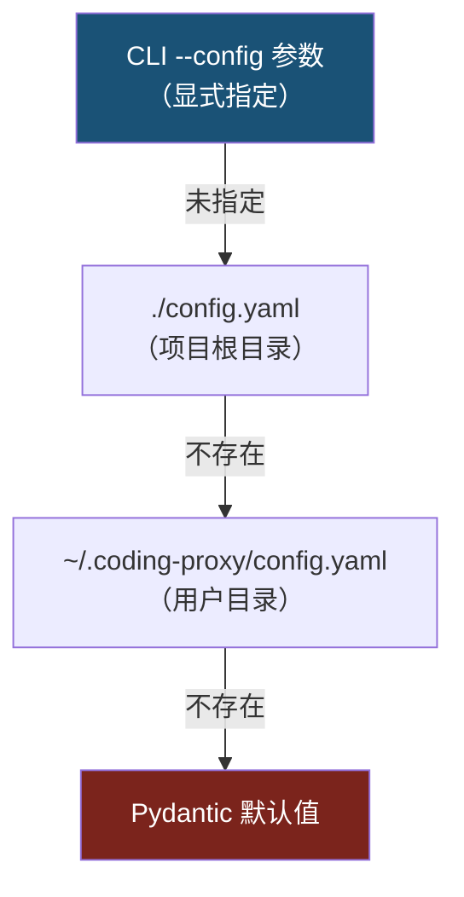

**环境变量展开**：语法 `${VARIABLE_NAME}`，递归处理 dict/list/str，未定义变量保留原文。

### 5.7 logging/ -- 日志模块

#### 5.7.1 usage_log 表结构（[`logging/db.py`](../src/coding/proxy/logging/db.py)）

| 列名                    | 类型       | 说明                                                                    |
| ----------------------- | ---------- | ----------------------------------------------------------------------- |
| `id`                    | INTEGER PK | 自增主键                                                                |
| `ts`                    | TEXT       | 时间戳（ISO 8601 格式，UTC）                                            |
| `vendor`                | TEXT       | 供应商标识（`"anthropic"` / `"copilot"` / `"antigravity"` / `"zhipu"`） |
| `model_requested`       | TEXT       | 客户端请求的模型名称                                                    |
| `model_served`          | TEXT       | 实际使用的模型名称                                                      |
| `input_tokens`          | INTEGER    | 输入 Token 数                                                           |
| `output_tokens`         | INTEGER    | 输出 Token 数                                                           |
| `cache_creation_tokens` | INTEGER    | 缓存创建 Token 数                                                       |
| `cache_read_tokens`     | INTEGER    | 缓存读取 Token 数                                                       |
| `duration_ms`           | INTEGER    | 请求耗时（毫秒）                                                        |
| `success`               | BOOLEAN    | 是否成功                                                                |
| `failover`              | BOOLEAN    | 是否经过故障转移                                                        |
| `request_id`            | TEXT       | 请求 ID                                                                 |

**索引**：`idx_usage_ts`（时间戳）、`idx_usage_vendor`（供应商名）

**Evidence 记录**（Copilot 专用）：`log_evidence()` 方法记录原始用量 JSON 与解析结果的对照，用于诊断 OpenAI -> Anthropic 用量映射准确性。

### 5.8 server/ -- 服务模块

#### 5.8.1 正交分解

| 文件                                                                               | 职责                                                      |
| ---------------------------------------------------------------------------------- | --------------------------------------------------------- |
| [`server/app.py`](../src/coding/proxy/server/app.py)                               | FastAPI 应用工厂 `create_app()` + `lifespan` 生命周期管理 |
| [`server/factory.py`](../src/coding/proxy/server/factory.py)                       | Vendor/Tier 构建工厂 + 凭证解析                           |
| [`server/routes.py`](../src/coding/proxy/server/routes.py)                         | 路由端点按职责分组注册                                    |
| [`server/request_normalizer.py`](../src/coding/proxy/server/request_normalizer.py) | 入站请求标准化（清洗供应商私有块）                        |
| [`server/responses.py`](../src/coding/proxy/server/responses.py)                   | 响应辅助工具（JSON error / stream error 构建）            |

#### 5.8.2 API 端点清单

| 端点                        | 方法     | 分组    | 说明                                         |
| --------------------------- | -------- | ------- | -------------------------------------------- |
| `/v1/messages`              | POST     | core    | 代理 Anthropic Messages API（流式 + 非流式） |
| `/v1/messages/count_tokens` | POST     | core    | Token 计数透传（旁路直通 Anthropic）         |
| `/health`                   | GET      | health  | 健康检查                                     |
| `HEAD /` / `GET /`          | HEAD/GET | health  | 根路径连通性探测（Claude Code 建连前发送）   |
| `/api/status`               | GET      | status  | 各 tier 的 CB/QG/WQG/RL/诊断状态             |
| `/api/reset`                | POST     | admin   | 重置所有 tier 的熔断器和配额守卫             |
| `/api/copilot/diagnostics`  | GET      | copilot | Copilot 认证与交换链路脱敏诊断               |
| `/api/copilot/models`       | GET      | copilot | Copilot 可见模型列表探测                     |
| `/api/reauth/status`        | GET      | reauth  | 运行时重认证状态查询                         |
| `/api/reauth/{provider}`    | POST     | reauth  | 手动触发指定 provider 重认证                 |

---

## 6. 配置系统设计

### 6.1 完整配置字段参考（vendors 列表格式）

**server -- 服务器配置**

| 字段   | 类型 | 默认值        | 说明     |
| ------ | ---- | ------------- | -------- |
| `host` | str  | `"127.0.0.1"` | 监听地址 |
| `port` | int  | `8046`        | 监听端口 |

**database -- 数据库配置**

| 字段                       | 类型 | 默认值                              | 说明                  |
| -------------------------- | ---- | ----------------------------------- | --------------------- |
| `path`                     | str  | `"~/.coding-proxy/usage.db"`        | SQLite 数据库文件路径 |
| `compat_state_path`        | str  | `"~/.coding-proxy/compat_state.db"` | 兼容性会话存储路径    |
| `compat_state_ttl_seconds` | int  | `86400`                             | 兼容性会话 TTL（秒）  |

**logging -- 日志配置**

| 字段    | 类型        | 默认值   | 说明                              |
| ------- | ----------- | -------- | --------------------------------- |
| `level` | str         | `"INFO"` | 日志级别                          |
| `file`  | str \| null | `null`   | 日志文件路径（null 输出到控制台） |

**auth -- 认证配置**

| 字段               | 类型 | 默认值 | 说明                                 |
| ------------------ | ---- | ------ | ------------------------------------ |
| `token_store_path` | str  | `""`   | Token Store 文件路径（空则使用默认） |

**VendorConfig 通用字段**

| 字段         | 类型 | 默认值   | 说明                                                          |
| ------------ | ---- | -------- | ------------------------------------------------------------- |
| `vendor`     | enum | --       | 供应商类型：`anthropic` / `copilot` / `antigravity` / `zhipu` |
| `enabled`    | bool | `true`   | 是否启用                                                      |
| `base_url`   | str  | `""`     | API 基础 URL（留空使用默认值）                                |
| `timeout_ms` | int  | `300000` | 请求超时（毫秒）                                              |

**VendorConfig 弹性字段**

| 字段                 | 类型           | 默认值               | 说明                        |
| -------------------- | -------------- | -------------------- | --------------------------- |
| `circuit_breaker`    | config \| None | `None`               | 熔断器配置（None = 终端层） |
| `retry`              | config         | `RetryConfig()`      | 重试策略配置                |
| `quota_guard`        | config         | `QuotaGuardConfig()` | 日度配额守卫配置            |
| `weekly_quota_guard` | config         | `QuotaGuardConfig()` | 周度配额守卫配置            |

**Copilot 专属字段**

| 字段                       | 类型 | 默认值          | 说明                                               |
| -------------------------- | ---- | --------------- | -------------------------------------------------- |
| `github_token`             | str  | `""`            | GitHub OAuth token / PAT（支持 `${ENV_VAR}`）      |
| `account_type`             | str  | `"individual"`  | 账号类型：`individual` / `business` / `enterprise` |
| `token_url`                | str  | `"https://..."` | Token 交换端点                                     |
| `models_cache_ttl_seconds` | int  | `300`           | 模型列表缓存 TTL                                   |

**Antigravity 专属字段**

| 字段             | 类型 | 默认值                              | 说明                        |
| ---------------- | ---- | ----------------------------------- | --------------------------- |
| `client_id`      | str  | `""`                                | Google OAuth2 Client ID     |
| `client_secret`  | str  | `""`                                | Google OAuth2 Client Secret |
| `refresh_token`  | str  | `""`                                | Google OAuth2 Refresh Token |
| `model_endpoint` | str  | `"models/claude-sonnet-4-20250514"` | Gemini 模型端点路径         |

**Zhipu 专属字段**

| 字段      | 类型 | 默认值 | 说明                              |
| --------- | ---- | ------ | --------------------------------- |
| `api_key` | str  | `""`   | 智谱 API Key（支持 `${ENV_VAR}`） |

> **弹性参数速查**：以下 4 类参数的详细语义参见对应设计模式章节——[§3.2 CircuitBreaker](#32-circuit-breaker熔断器模式)、[§3.7 QuotaGuard](#37-state-machine状态机模式--quotaguard)、[§3.12 Retry](#312-retry-with-full-jitter带完全抖动的重试模式)、[§4.4 故障转移判定](#44-故障转移判定逻辑)。

**CircuitBreakerConfig / QuotaGuardConfig / RetryConfig / FailoverConfig — 弹性参数一览**

| 配置类       | 字段                                                                                            | 类型                              | 默认值                                  |
| ------------ | ----------------------------------------------------------------------------------------------- | --------------------------------- | --------------------------------------- |
| **CB**       | `failure_threshold` / `recovery_timeout_seconds` / `success_threshold` / `max_recovery_seconds` | int / int / int / int             | `3` / `300` / `2` / `3600`              |
| **QG**       | `enabled` / `token_budget` / `window_hours` / `threshold_percent` / `probe_interval_seconds`    | bool / int / float / float / int  | `false` / `0` / `5.0` / `99.0` / `300`  |
| **Retry**    | `max_retries` / `initial_delay_ms` / `max_delay_ms` / `backoff_multiplier` / `jitter`           | int / int / int / float / bool    | `2` / `500` / `5000` / `2.0` / `true`   |
| **Failover** | `status_codes` / `error_types` / `error_message_patterns`                                       | list[int] / list[str] / list[str] | `[429,403,503,500]` / 见 §4.4 / 见 §4.4 |

**ModelMappingRule 字段**

| 字段       | 类型      | 说明                                      |
| ---------- | --------- | ----------------------------------------- |
| `pattern`  | str       | 匹配模式（精确/通配符/正则）              |
| `target`   | str       | 目标模型名称                              |
| `is_regex` | bool      | 是否为正则表达式（默认 `false`）          |
| `vendors`  | list[str] | 规则作用域（留空仅作用于 fallback/zhipu） |

**ModelPricingEntry 字段**

| 字段                        | 类型  | 说明                                                 |
| --------------------------- | ----- | ---------------------------------------------------- |
| `vendor`                    | str   | 供应商名称                                           |
| `model`                     | str   | 实际模型名                                           |
| `input_cost_per_mtok`       | float | 输入 Token 单价（$/百万 token，支持 `$`/`yen` 前缀） |
| `output_cost_per_mtok`      | float | 输出 Token 单价                                      |
| `cache_write_cost_per_mtok` | float | 缓存创建 Token 单价                                  |
| `cache_read_cost_per_mtok`  | float | 缓存读取 Token 单价                                  |

**tiers -- 显式优先级**

| 字段    | 类型                     | 说明                                       |
| ------- | ------------------------ | ------------------------------------------ |
| `tiers` | list[VendorType] \| None | 降级链路优先级（None 时回退 vendors 顺序） |

---

## 7. 可扩展性设计

### 7.1 添加新供应商

1. 在 `vendors/` 下创建新模块，继承 `BaseVendor`
2. 实现必需的抽象方法：
   - `get_name()` -- 返回供应商标识字符串
   - `_prepare_request()` -- 转换请求体和请求头（异步，支持 token 刷新等异步操作）
3. 按需覆写钩子方法：
   - `map_model()` -- 模型名称映射
   - `get_capabilities()` -- 能力声明
   - `check_health()` -- 健康探测
   - `_on_error_status()` -- 错误时标记 token 失效
   - `_get_endpoint()` -- 自定义端点
   - `send_message()` / `send_message_stream()` -- 自定义端点或格式转换
   - `close()` -- 释放额外资源
4. 在 [`config/routing.py`](../src/coding/proxy/config/routing.py) 的 `VendorType` 中添加新类型
5. 在 [`config/routing.py`](../src/coding/proxy/config/routing.py) 的 `VendorConfig` 中添加专属字段
6. 在 [`server/factory.py`](../src/coding/proxy/server/factory.py) 的 `_create_vendor_from_config()` 中添加新分支
7. 在配置文件的 `vendors` 列表中添加新条目

### 7.2 添加新映射规则

在配置文件的 `model_mapping` 节添加规则即可，无需修改代码：

```yaml
model_mapping:
  - pattern: "claude-sonnet-4-6"   # 精确匹配
    target: "glm-5.1"
  - pattern: "claude-haiku-.*"      # 正则匹配
    target: "glm-4.5-air"
    is_regex: true
  - pattern: "claude-*"             # Glob 通配符
    target: "glm-5.1"
```

匹配优先级确保精确匹配不会被通配符覆盖。

### 7.3 自定义故障转移策略

通过配置文件调整 `failover` 节的三个字段即可自定义触发条件：

- 增减 `status_codes` 控制哪些 HTTP 状态码触发切换
- 增减 `error_types` 控制哪些 Anthropic 错误类型触发切换
- 增减 `error_message_patterns` 控制哪些错误消息关键词触发切换

如需更复杂的策略，可覆写子类的 `should_trigger_failover()` 方法。

### 7.4 自定义配额管理策略

通过配置文件分别调整 `quota_guard` / `weekly_quota_guard` 的参数，可为每个供应商独立配置多层级配额管理策略：

```yaml
vendors:
  - vendor: anthropic
    quota_guard:                # 日度配额
      enabled: true
      token_budget: 5000000
      window_hours: 5.0
      threshold_percent: 95.0
    weekly_quota_guard:          # 周度配额
      enabled: true
      token_budget: 20000000
      window_hours: 168.0       # 7 天
      threshold_percent: 90.0
```

---

## 8. convert/ 模块设计

### 8.1 请求转换（Anthropic -> Gemini）

**应用位置**：[`convert/anthropic_to_gemini.py`](../src/coding/proxy/convert/anthropic_to_gemini.py) -- `convert_request()`

**转换映射**：

| Anthropic 字段                    | Gemini 字段                        | 说明                                               |
| --------------------------------- | ---------------------------------- | -------------------------------------------------- |
| `system`（str \| list）           | `systemInstruction.parts[].text`   | 支持字符串和文本块列表两种格式                     |
| `messages[]`                      | `contents[]`                       | 角色映射：`assistant` -> `model`，`user` -> `user` |
| `content`（text）                 | `parts[].text`                     | 文本内容块                                         |
| `content`（image）                | `parts[].inlineData`               | Base64 数据 + MIME 类型                            |
| `content`（tool_use）             | `parts[].functionCall`             | `name` + `input` -> `args`                         |
| `content`（tool_result）          | `parts[].functionResponse`         | `tool_use_id` -> `name`，`content` -> `result`     |
| `max_tokens`                      | `generationConfig.maxOutputTokens` |                                                    |
| `temperature` / `top_p` / `top_k` | `generationConfig.*`               | 参数名驼峰转换                                     |
| `stop_sequences`                  | `generationConfig.stopSequences`   |                                                    |

**不支持的字段**（静默剥离并记录 WARNING）：`tools`、`tool_choice`、`metadata`、`extended_thinking`、`thinking`

### 8.2 响应转换（Gemini -> Anthropic）

**应用位置**：[`convert/gemini_to_anthropic.py`](../src/coding/proxy/convert/gemini_to_anthropic.py) -- `convert_response()` / `extract_usage()`

**finishReason 映射**：

| Gemini                            | Anthropic    |
| --------------------------------- | ------------ |
| `STOP`                            | `end_turn`   |
| `MAX_TOKENS`                      | `max_tokens` |
| `SAFETY` / `RECITATION` / `OTHER` | `end_turn`   |

**Parts 转换**：
- `text` -> `{"type": "text", "text": "..."}`
- `functionCall` -> `{"type": "tool_use", "id": "toolu_...", "name": "...", "input": {...}}`

**Usage 提取**：
- `usageMetadata.promptTokenCount` -> `input_tokens`
- `usageMetadata.candidatesTokenCount` -> `output_tokens`
- 缓存字段填 0（Gemini 不直接暴露缓存信息）

### 8.3 SSE 流适配

**应用位置**：[`convert/gemini_sse_adapter.py`](../src/coding/proxy/convert/gemini_sse_adapter.py) -- `adapt_sse_stream()`

将 Gemini SSE 流重构为 Anthropic 消息生命周期事件序列：


**边界情况处理**：
- 空 parts 后跟有 text 的 chunk -> 延迟发出 `message_start` + `content_block_start`
- 流结束但未收到 `finishReason` -> 补发默认 `message_delta`（`stop_reason: "end_turn"`）+ `message_stop`

### 8.4 OpenAI 格式转换

**应用位置**：
- [`convert/anthropic_to_openai.py`](../src/coding/proxy/convert/anthropic_to_openai.py) -- Anthropic -> OpenAI Chat Completions 请求格式
- [`convert/openai_to_anthropic.py`](../src/coding/proxy/convert/openai_to_anthropic.py) -- OpenAI Chat Completions -> Anthropic 响应格式

专为 CopilotVendor 适配，处理 Anthropic Messages API 与 OpenAI Chat Completions API 之间的双向格式差异（角色映射、工具格式、usage 字段名等）。

---

## 9. 测试策略

### 9.1 单元测试覆盖

| 测试文件                     | 覆盖范围                                                                           |
| ---------------------------- | ---------------------------------------------------------------------------------- |
| `test_circuit_breaker.py`    | 状态转换（CLOSED->OPEN->HALF_OPEN->CLOSED）、恢复超时、指数退避、手动重置          |
| `test_quota_guard.py`        | 配额守卫状态机、预算追踪、探测机制、基线加载                                       |
| `test_model_mapper.py`       | 精确匹配、正则匹配、Glob 匹配、默认回退、空规则集                                  |
| `test_vendor_tier.py`        | VendorTier 可执行判断、成功/失败记录、终端判定、三层门控、Rate Limit deadline      |
| `test_vendors.py`            | 请求头过滤、模型映射、故障转移判断、数据类默认值                                   |
| `test_copilot_vendor.py`     | CopilotTokenManager 交换/缓存/过期/失效、CopilotVendor 请求准备                    |
| `test_antigravity_vendor.py` | GoogleOAuthTokenManager 刷新/缓存/过期/失效、AntigravityVendor 格式转换+token 注入 |
| `test_convert_request.py`    | Anthropic->Gemini 请求转换（文本、多轮、system、图片、工具、参数映射）             |
| `test_convert_response.py`   | Gemini->Anthropic 响应转换（文本、多部件、usage 提取、finishReason 映射）          |
| `test_convert_sse.py`        | Gemini SSE->Anthropic SSE 流适配（单/多 chunk、各 finishReason、边界情况）         |
| `test_convert_openai.py`     | Anthropic<->OpenAI 双向格式转换                                                    |
| `test_router_chain.py`       | N-tier 链式路由（2/3/4-tier 降级、CB/QG 跳过、流式/非流式、连接异常）              |
| `test_executor.py`           | _RouteExecutor 门控逻辑、能力匹配、兼容性决策、语义拒绝、错误分类                  |
| `test_error_classifier.py`   | 请求能力画像提取、语义拒绝判定、错误 payload 解析                                  |
| `test_rate_limit.py`         | Rate limit header 解析、deadline 计算、cap error 检测                              |
| `test_retry.py`              | RetryConfig 参数、delay 计算、可重试异常判定                                       |
| `test_usage_recorder.py`     | UsageRecorder 用量构建、定价日志、evidence 记录                                    |
| `test_session_manager.py`    | RouteSessionManager 会话创建/上下文应用/持久化                                     |
| `test_compat_canonical.py`   | CanonicalRequest 构建、session_key 派生、thinking 提取、消息部分解析               |
| `test_config_loader.py`      | 配置文件搜索优先级、环境变量展开、缺失文件处理、vendors 格式解析                   |
| `test_config_schema.py`      | ProxyConfig 校验、legacy 迁移、tiers 引用校验、vendor 专属字段 warning             |
| `test_token_logger.py`       | 用量记录、窗口查询、按供应商/模型过滤、evidence 记录                               |
| `test_auth_runtime.py`       | RuntimeReauthCoordinator 状态机、幂等触发、锁保护                                  |
| `test_auth_store.py`         | TokenStoreManager 存取、load/save、TTL                                             |
| `test_request_normalizer.py` | 请求标准化：私有块清洗、tool_use_id 重写、fatal_reasons                            |
| `test_pricing.py`            | PricingTable 加载、单价查询（精确+规范化）、费用计算、币种一致性                   |

### 9.2 测试工具

- **pytest** (>=9.0) -- 测试框架
- **pytest-asyncio** (>=1.3) -- 异步测试支持
- **monkeypatch** -- 环境变量和工作目录隔离
- **tmp_path** -- 临时文件测试
- **respx** -- httpx Mock（用于 vendor 集成测试）

---

## 参考文献

<a id="ref1"></a>[1] E. Gamma, R. Helm, R. Johnson, and J. Vlissides, *Design Patterns: Elements of Reusable Object-Oriented Software*, Addison-Wesley, 1994.

<a id="ref2"></a>[2] M. Fowler, "CircuitBreaker," *martinfowler.com*, 2014.

<a id="ref3"></a>[3] M. Nygard, *Release It!: Design and Deploy Production-Ready Software*, 2nd ed., Pragmatic Bookshelf, 2018.

<a id="ref4"></a>[4] AWS Architecture Center, "Retry Pattern," *docs.aws.amazon.com*, 2022.
