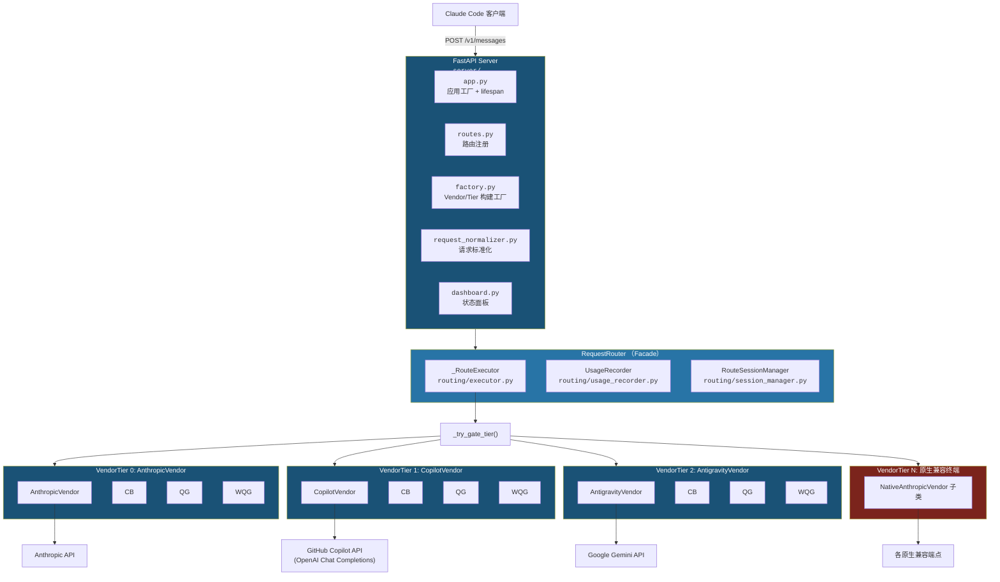
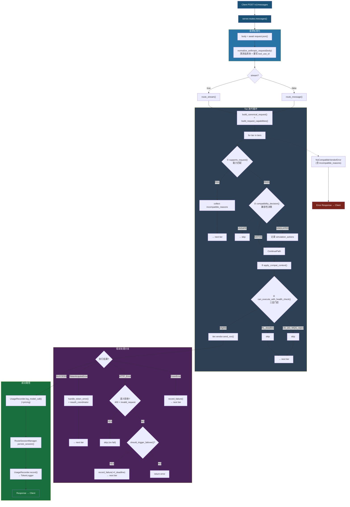

# coding-proxy 架构设计与工程方案

> **路径约定**：本文档中模块路径均相对于 `src/coding/proxy/`，例如 `vendors/base.py` 指 `src/coding/proxy/vendors/base.py`。
>
> **版本**：v3 — 正交分解架构：枢纽文档 + 专题子文档（[`arch/`](./arch/)）。
>
> **专题子文档索引**：[设计模式](./arch/design-patterns.md) · [供应商模块](./arch/vendors.md) · [路由模块](./arch/routing.md) · [配置参考](./arch/config-reference.md) · [格式转换](./arch/convert.md) · [测试策略](./arch/testing.md)

[TOC]

---

## 1. 项目概述

### 1.1 项目动机与背景

Claude Code 作为日常 AI 编程助手，其底层依赖 Anthropic Messages API (`/v1/messages`)。在实际使用过程中，以下场景时有发生：

- **限流 (Rate Limiting)**：高频请求触发 `429 rate_limit_error`，导致短时间内无法继续使用
- **配额耗尽 (Usage Cap)**：月度/日度配额用尽后返回 `403` 错误，含 "usage cap" 等提示
- **服务过载 (Overloaded)**：Anthropic 服务端高峰期返回 `503 overloaded_error`
- **网络波动**：国际链路不稳定导致连接超时
- **语义拒绝 (Semantic Rejection)**：请求包含供应商不支持的特性（如特定工具调用模式），返回 `400 invalid_request_error`

与此同时，多个 Anthropic 兼容或可转换的 API 通道为构建多后端容灾体系提供了可能：

- **GitHub Copilot**：提供 Anthropic 兼容（实际为 OpenAI Chat Completions 协议）的 Claude API 端点，通过 GitHub OAuth token / PAT 完成 token 交换
- **Google Antigravity Claude**：通过 Google Gemini/Vertex AI 端点提供 Claude 模型访问，需 Anthropic ↔ Gemini 双向格式转换
- **智谱 (Zhipu)** / **MiniMax** / **Kimi** / **豆包 (Doubao)** / **小米 (Xiaomi)** / **阿里 (Alibaba)**：提供原生 Anthropic 兼容端点，仅需模型映射 + API Key 替换

**coding-proxy 的核心诉求**：当任一后端不可用时，自动、无缝地沿 N-tier 层级链降级到下一个可用后端，对 Claude Code 客户端完全透明，用户无需手动干预。

### 1.2 设计目标

| 目标                | 说明                                                                         |
| ------------------- | ---------------------------------------------------------------------------- |
| **透明代理**        | 对 Claude Code 完全透明，客户端无需修改任何协议或配置（仅需指定代理地址）    |
| **N-tier 链式降级** | 支持 N 个后端层级按优先级链式降级，每个层级独立配置弹性设施                  |
| **能力感知路由**    | 基于请求能力画像与供应商能力声明的正交匹配，自动跳过不兼容层级               |
| **配额管理**        | 基于滑动窗口的 Token 预算追踪（日度 + 周度双窗口），主动避免触发上游配额限制 |
| **可观测性**        | Token 用量持久化追踪、各层级熔断器/配额守卫状态实时查询、定价日志输出        |
| **运行时重认证**    | OAuth 凭证过期时后台触发浏览器登录流程，热更新凭证无需重启服务               |
| **可扩展性**        | 易于添加新供应商实现、新模型映射规则、新故障转移策略                         |
| **轻量部署**        | 单进程运行，仅依赖 SQLite（无外部数据库/消息队列），适合本地开发环境         |

### 1.3 技术选型

| 技术             | 选型理由                                                        |
| ---------------- | --------------------------------------------------------------- |
| **Python 3.12+** | 原生 async/await 成熟、类型提示完善、生态丰富                   |
| **FastAPI**      | 原生异步、`StreamingResponse` 支持 SSE、自动 OpenAPI 文档       |
| **httpx**        | 同时支持同步/异步、流式请求、完整的 HTTP 客户端功能             |
| **Pydantic v2**  | 配置校验与类型安全、性能显著优于 v1；配置模型已正交拆分至子模块 |
| **aiosqlite**    | 异步 SQLite 访问、WAL 模式支持并发读写                          |
| **Typer + Rich** | 现代化 CLI 体验、类型安全的参数声明、美观的终端输出             |
| **UV**           | 极速包管理器、lockfile 确保可复现构建                           |

---

## 2. 系统架构总览

### 2.1 架构分层图



**术语表**：

| 缩写     | 全称                                | 来源                                                                                                                            |
| -------- | ----------------------------------- | ------------------------------------------------------------------------------------------------------------------------------- |
| **CB**   | CircuitBreaker（熔断器）            | [`routing/circuit_breaker.py`](../src/coding/proxy/routing/circuit_breaker.py)                                                  |
| **QG**   | QuotaGuard（配额守卫—日度）         | [`routing/quota_guard.py`](../src/coding/proxy/routing/quota_guard.py)                                                          |
| **WQG**  | WeeklyQuotaGuard（周度配额守卫）    | [`routing/quota_guard.py`](../src/coding/proxy/routing/quota_guard.py)（同一类，不同实例）                                      |
| **RL**   | Rate Limit Deadline（速率限制截止） | [`routing/tier.py`](../src/coding/proxy/routing/tier.py) + [`routing/rate_limit.py`](../src/coding/proxy/routing/rate_limit.py) |
| **Tier** | VendorTier（供应商层级）            | [`routing/tier.py`](../src/coding/proxy/routing/tier.py)                                                                        |

### 2.2 供应商分类体系

系统支持 9 种供应商类型（`VendorType`），按适配复杂度分为三组：

| 分类                    | 基类                    | 适配行为                        | 供应商                                        |
| ----------------------- | ----------------------- | ------------------------------- | --------------------------------------------- |
| **直接 Anthropic**      | `BaseVendor`            | 零适配，直接透传                | Anthropic                                     |
| **协议转换**            | `BaseVendor` + Mixin    | 双向格式转换 + Token 管理       | Copilot（OpenAI）、Antigravity（Gemini）      |
| **原生 Anthropic 兼容** | `NativeAnthropicVendor` | 薄透传：模型映射 + API Key 替换 | Zhipu、MiniMax、Kimi、Doubao、Xiaomi、Alibaba |

> **供应商模块完整文档**：参见 [供应商模块（vendors/）](./arch/vendors.md)

### 2.3 模块职责一览

| 模块          | 路径                                           | 职责                                                                                                                                                  | 专题文档                               |
| ------------- | ---------------------------------------------- | ----------------------------------------------------------------------------------------------------------------------------------------------------- | -------------------------------------- |
| **vendors**   | [`vendors/`](../src/coding/proxy/vendors/)     | **供应商适配器（主架构）**：`BaseVendor` 抽象基类 + `NativeAnthropicVendor` + 9 个具体实现                                                            | [供应商模块](./arch/vendors.md)        |
| **routing**   | [`routing/`](../src/coding/proxy/routing/)     | N-tier 链式路由核心（正交分解为 executor/tier/CB/QG/retry/rate_limit 等 12 个子模块）                                                                 | [路由模块](./arch/routing.md)          |
| **compat**    | [`compat/`](../src/coding/proxy/compat/)       | 兼容性抽象系统：`CanonicalRequest` / `CompatibilityDecision` / `session_store`                                                                        |                                        |
| **auth**      | [`auth/`](../src/coding/proxy/auth/)           | 认证系统：OAuth providers（GitHub Device Flow / Google OAuth2）/ runtime reauth / token store                                                         |                                        |
| **model**     | [`model/`](../src/coding/proxy/model/)         | 数据模型正交分解：vendor / compat / constants / pricing / token / auth                                                                                |                                        |
| **config**    | [`config/`](../src/coding/proxy/config/)       | Pydantic v2 配置模型（正交拆分为 server/vendors/resiliency/routing/auth_schema）+ YAML 加载器                                                         | [配置参考](./arch/config-reference.md) |
| **convert**   | [`convert/`](../src/coding/proxy/convert/)     | API 格式转换（Anthropic ↔ Gemini ↔ OpenAI 三向转换，含 SSE 流适配）                                                                                   | [格式转换](./arch/convert.md)          |
| **logging**   | [`logging/`](../src/coding/proxy/logging/)     | Token 用量 SQLite 持久化（[`db.py`](../src/coding/proxy/logging/db.py)）、统计查询（[`stats.py`](../src/coding/proxy/logging/stats.py)）、Rich 格式化 |                                        |
| **server**    | [`server/`](../src/coding/proxy/server/)       | FastAPI 应用工厂与生命周期管理（app/factory/routes/normalizer/responses/dashboard）                                                                   |                                        |
| **streaming** | [`streaming/`](../src/coding/proxy/streaming/) | Anthropic 兼容流式处理（[`anthropic_compat.py`](../src/coding/proxy/streaming/anthropic_compat.py)）                                                  |                                        |
| **cli**       | [`cli/`](../src/coding/proxy/cli/)             | Typer 命令行入口（start/status/usage/reset/auth）+ Banner 显示                                                                                        |                                        |
| **pricing**   | [`pricing.py`](../src/coding/pricing.py)       | 定价表（`PricingTable`）：按 (vendor, model) 查询单价并计算费用                                                                                       |                                        |

---

## 3. 请求生命周期

### 3.1 完整请求流程



### 3.2 流式请求处理

流式请求使用 `StreamingResponse` + 异步生成器 `_stream_proxy()`：

1. `RequestRouter.route_stream()` 委托给 `_RouteExecutor.execute_stream()`
2. 每个 SSE chunk 通过 `parse_usage_from_chunk()` ([`routing/usage_parser.py`](../src/coding/proxy/routing/usage_parser.py)) 提取 Token 用量：
   - `message_start` 事件：提取 `input_tokens`、`cache_creation_input_tokens`、`cache_read_input_tokens`、`request_id`
   - `message_delta` 事件：提取 `output_tokens`
3. chunk 原样透传给客户端
4. 流结束后：
   - `UsageRecorder.build_usage_info(usage)` 构建结构化用量信息
   - 检查缺失信号并 WARNING 日志
   - `tier.record_success(input_tokens + output_tokens)` — 通知 CB 成功 + QG/WQG 记录用量 + 清除 RL deadline
   - `UsageRecorder.log_model_call()` — 输出含定价信息的 Access Log
   - `RouteSessionManager.persist_session()` — 持久化兼容性会话状态
   - `UsageRecorder.record()` — 记录完整用量到 TokenLogger（含 evidence_records）

**故障转移时**：清空已收集的 usage 数据，从下一个 tier 重新开始流式传输。

**最终层异常处理**（`_stream_proxy` 生成器内）：

| 异常类型                                  | SSE 错误事件                              |
| ----------------------------------------- | ----------------------------------------- |
| `NoCompatibleVendorError`                 | `error` event + `invalid_request_error`   |
| `TokenAcquireError`                       | `error` event + `authentication_error`    |
| `TimeoutException/ConnectError/ReadError` | `error` event + `api_error`               |
| `HTTPStatusError`                         | `error` event + 提取的 error type/message |

### 3.3 非流式请求处理

非流式请求直接调用 `send_message()` 获取完整 `VendorResponse`：

1. 主后端返回成功（`status_code < 400`）-> 定价日志 + 会话持久化 + 用量记录 -> 返回
2. 主后端返回错误 -> 分支处理：
   - **语义拒绝**（400 + `invalid_request_error` 或特定消息模式）-> **不记录 failure**，直接尝试下一 tier
   - **可故障转移**（`should_trigger_failover()` 为 True）-> 解析 rate limit headers -> `record_failure(is_cap_error, retry_after_seconds, rate_limit_deadline)` -> 下一 tier
   - **不可转移的错误** -> 记录用量 -> 返回原始响应
3. 捕获 `TokenAcquireError` -> `handle_token_error()` + 触发 reauth -> 下一 tier（非最后一层）
4. 捕获 `TimeoutException/ConnectError/ReadError` -> `record_failure()` -> 下一 tier

**VendorResponse 关键字段**：

| 字段               | 类型             | 说明                                          |
| ------------------ | ---------------- | --------------------------------------------- |
| `model_served`     | `str \| None`    | 后端实际使用的模型名（可能经 map_model 转换） |
| `response_headers` | `dict[str, str]` | 原始响应头（用于 rate limit 解析）            |

### 3.4 故障转移判定逻辑

<a id="fault-overhead"></a>

故障转移的判定在 `BaseVendor.should_trigger_failover()` 中实现，依据三层条件（可通过配置文件自定义）：

| 层级        | 条件                                       | 默认值                                                                             |
| ----------- | ------------------------------------------ | ---------------------------------------------------------------------------------- |
| HTTP 状态码 | `status_code in failover.status_codes`     | `[429, 403, 503, 500, 529]`                                                        |
| 错误类型    | `error.type in failover.error_types`       | `["rate_limit_error", "overloaded_error", "api_error"]`                            |
| 错误消息    | `pattern in error.message`（不区分大小写） | `["quota", "limit exceeded", "usage cap", "capacity", "internal network failure"]` |

**特殊规则**：对于 429 和 503 状态码，即使无法解析响应体（body），也会强制触发故障转移。

**语义拒绝独立路径**：`is_semantic_rejection()` 检测 400 状态码下的 `invalid_request_error` 类型或特定消息模式（如 `should match pattern`、`validation`、`tool_use_id`、`server_tool_use`），此类错误**不记录 failure** 且**不触发故障转移计数**，直接跳至下一 tier。

**终端供应商行为**：无 `circuit_breaker` 配置的供应商（终端层），`should_trigger_failover()` 始终返回 `False`。

### 3.5 生命周期管理

通过 `lifespan` 异步上下文管理器管理应用生命周期（[`server/app.py`](../src/coding/proxy/server/app.py)）：

**启动 (Startup)**：

1. `TokenLogger.init()` — 创建 SQLite 数据库表和索引
2. `CompatSessionStore.init()` — 初始化兼容性会话存储
3. `PricingTable(config.pricing)` — 加载模型定价表并注入 Router
4. 为每个启用了 QuotaGuard 的 tier 加载基线：
   - `token_logger.query_window_total(qg.window_hours, vendor=tier.name)` -> `quota_guard.load_baseline(total)`
   - 同理处理 `weekly_quota_guard`

**关闭 (Shutdown)**：

1. `router.close()` — 关闭所有 vendor 的 HTTP 客户端（含 TokenManager 客户端）
2. `compat_session_store.close()` — 关闭会话存储连接
3. `token_logger.close()` — 关闭数据库连接

---

## 4. 模块概览

### 4.1 compat/ — 兼容性抽象

供应商无关的语义抽象，跨请求保持供应商适配状态：

- **CanonicalRequest**（[`compat/canonical.py`](../src/coding/proxy/compat/canonical.py)）：从原始请求体提取供应商无关的语义结构（session_key / model / messages / thinking / tool_names 等）
- **CompatibilityDecision**（[`model/compat.py`](../src/coding/proxy/model/compat.py)）：三态决策（NATIVE / SIMULATED / UNSAFE），指导路由层跳过或适配
- **CompatSessionStore**（[`compat/session_store.py`](../src/coding/proxy/compat/session_store.py)）：兼容性会话持久化存储，基于 SQLite KV，支持 TTL 自动过期

### 4.2 model/ — 数据模型

数据模型正交分解，遵循单一职责原则：

| 子模块        | 文件                                                           | 核心类型                                                                                                                      |
| ------------- | -------------------------------------------------------------- | ----------------------------------------------------------------------------------------------------------------------------- |
| **vendor**    | [`model/vendor.py`](../src/coding/proxy/model/vendor.py)       | `UsageInfo`, `VendorResponse`, `NoCompatibleVendorError`, `RequestCapabilities`, `VendorCapabilities`, `CapabilityLossReason` |
| **compat**    | [`model/compat.py`](../src/coding/proxy/model/compat.py)       | `CanonicalRequest`, `CompatibilityDecision`, `CompatibilityProfile`, `CompatibilityStatus`, `CompatibilityTrace`              |
| **constants** | [`model/constants.py`](../src/coding/proxy/model/constants.py) | `PROXY_SKIP_HEADERS`, `RESPONSE_SANITIZE_SKIP_HEADERS` 等常量                                                                 |
| **pricing**   | [`model/pricing.py`](../src/coding/proxy/model/pricing.py)     | `ModelPricing`, `CostValue`, `Currency`                                                                                       |
| **token**     | [`model/token.py`](../src/coding/proxy/model/token.py)         | Token 相关模型                                                                                                                |
| **auth**      | [`model/auth.py`](../src/coding/proxy/model/auth.py)           | 认证相关模型                                                                                                                  |

### 4.3 auth/ — 认证模块

| 组件                         | 文件                                                                  | 职责                                                           |
| ---------------------------- | --------------------------------------------------------------------- | -------------------------------------------------------------- |
| **GitHubDeviceFlowProvider** | [`providers/github.py`](../src/coding/proxy/auth/providers/github.py) | GitHub Device Authorization Grant                              |
| **GoogleOAuthProvider**      | [`providers/google.py`](../src/coding/proxy/auth/providers/google.py) | OAuth 2.0 Authorization Code + Refresh Token                   |
| **RuntimeReauthCoordinator** | [`runtime.py`](../src/coding/proxy/auth/runtime.py)                   | 运行时 OAuth 重认证协调（IDLE → PENDING → COMPLETED / FAILED） |
| **TokenStoreManager**        | [`store.py`](../src/coding/proxy/auth/store.py)                       | Token 持久化（JSON 文件），按 provider 分区存储                |

### 4.4 logging/ — 日志模块

| 组件            | 文件                                               | 职责                                       |
| --------------- | -------------------------------------------------- | ------------------------------------------ |
| **TokenLogger** | [`db.py`](../src/coding/proxy/logging/db.py)       | SQLite 用量持久化、窗口查询、evidence 记录 |
| **统计工具**    | [`stats.py`](../src/coding/proxy/logging/stats.py) | 统计查询与 Rich 格式化展示                 |

**usage_log 表结构**：

| 列名                    | 类型       | 说明         |
| ----------------------- | ---------- | ------------ |
| `id`                    | INTEGER PK | 自增主键     |
| `ts`                    | TEXT       | ISO 8601 UTC |
| `vendor`                | TEXT       | 供应商标识   |
| `model_requested`       | TEXT       | 请求模型名   |
| `model_served`          | TEXT       | 实际模型名   |
| `input_tokens`          | INTEGER    | 输入 Token   |
| `output_tokens`         | INTEGER    | 输出 Token   |
| `cache_creation_tokens` | INTEGER    | 缓存创建     |
| `cache_read_tokens`     | INTEGER    | 缓存读取     |
| `duration_ms`           | INTEGER    | 耗时（ms）   |
| `success`               | BOOLEAN    | 是否成功     |
| `failover`              | BOOLEAN    | 是否故障转移 |
| `request_id`            | TEXT       | 请求 ID      |

### 4.5 server/ — 服务模块

| 文件                                                                        | 职责                                                      |
| --------------------------------------------------------------------------- | --------------------------------------------------------- |
| [`app.py`](../src/coding/proxy/server/app.py)                               | FastAPI 应用工厂 `create_app()` + `lifespan` 生命周期管理 |
| [`factory.py`](../src/coding/proxy/server/factory.py)                       | Vendor/Tier 构建工厂 + 凭证解析                           |
| [`routes.py`](../src/coding/proxy/server/routes.py)                         | 路由端点按职责分组注册                                    |
| [`request_normalizer.py`](../src/coding/proxy/server/request_normalizer.py) | 入站请求标准化（清洗供应商私有块）                        |
| [`responses.py`](../src/coding/proxy/server/responses.py)                   | 响应辅助工具（JSON error / stream error 构建）            |
| [`dashboard.py`](../src/coding/proxy/server/dashboard.py)                   | 状态面板（Web Dashboard）                                 |

**API 端点清单**：

| 端点                        | 方法     | 分组    | 说明                                         |
| --------------------------- | -------- | ------- | -------------------------------------------- |
| `/v1/messages`              | POST     | core    | 代理 Anthropic Messages API（流式 + 非流式） |
| `/v1/messages/count_tokens` | POST     | core    | Token 计数透传（旁路直通 Anthropic）         |
| `/health`                   | GET      | health  | 健康检查                                     |
| `HEAD /` / `GET /`          | HEAD/GET | health  | 根路径连通性探测                             |
| `/api/status`               | GET      | status  | 各 tier 的 CB/QG/WQG/RL/诊断状态             |
| `/api/reset`                | POST     | admin   | 重置所有 tier 的熔断器和配额守卫             |
| `/api/copilot/diagnostics`  | GET      | copilot | Copilot 认证与交换链路脱敏诊断               |
| `/api/copilot/models`       | GET      | copilot | Copilot 可见模型列表探测                     |
| `/api/reauth/status`        | GET      | reauth  | 运行时重认证状态查询                         |
| `/api/reauth/{provider}`    | POST     | reauth  | 手动触发指定 provider 重认证                 |

### 4.6 streaming/ — 流式处理

[`streaming/anthropic_compat.py`](../src/coding/proxy/streaming/anthropic_compat.py) 提供 Anthropic 兼容的流式处理层，负责 SSE 事件的重构与适配。

---

## 5. 可扩展性设计

### 5.1 添加新供应商

根据供应商端点协议，有两条路径：

#### 路径 A：原生 Anthropic 兼容供应商（推荐，适用于端点已支持 Anthropic Messages API 的场景）

1. 在 `vendors/` 下创建新模块，继承 [`NativeAnthropicVendor`](../src/coding/proxy/vendors/native_anthropic.py)
2. 设置 `_vendor_name` 和 `_display_name` 类属性
3. 在 [`config/routing.py`](../src/coding/proxy/config/routing.py) 的 `VendorType` 中添加新类型
4. 在 [`config/vendors.py`](../src/coding/proxy/config/vendors.py) 中添加专属 Config（或复用 `api_key` 字段）
5. 在 [`server/factory.py`](../src/coding/proxy/server/factory.py) 的工厂函数中添加新分支
6. 在配置文件的 `vendors` 列表中添加新条目

#### 路径 B：自定义协议供应商（适用于需要格式转换的场景）

1. 在 `vendors/` 下创建新模块，继承 [`BaseVendor`](../src/coding/proxy/vendors/base.py)
2. 实现必需的抽象方法：`get_name()` 和 `_prepare_request()`
3. 按需覆写钩子方法：`map_model()`、`get_capabilities()`、`check_health()`、`_on_error_status()` 等
4. 同路径 A 的步骤 3-6

### 5.2 添加新映射规则

在配置文件的 `model_mapping` 节添加规则即可，无需修改代码：

```yaml
model_mapping:
  - pattern: "claude-sonnet-4-6"   # 精确匹配
    target: "glm-5.1"
  - pattern: "claude-haiku-.*"      # 正则匹配
    target: "glm-4.5-air"
    is_regex: true
  - pattern: "claude-*"             # Glob 通配符
    target: "glm-5.1"
```

匹配优先级确保精确匹配不会被通配符覆盖。

### 5.3 自定义故障转移策略

通过配置文件调整 `failover` 节的三个字段即可自定义触发条件。参见 [配置参考 -- FailoverConfig](./arch/config-reference.md#elastic-params)。

### 5.4 自定义配额管理策略

通过配置文件分别调整 `quota_guard` / `weekly_quota_guard` 的参数，可为每个供应商独立配置多层级配额管理策略。参见 [配置参考 -- QuotaGuardConfig](./arch/config-reference.md#elastic-params)。

---

## 6. 文档索引

| 文档                                      | 内容                                                                            |
| ----------------------------------------- | ------------------------------------------------------------------------------- |
| [设计模式详解](./arch/design-patterns.md) | 13 种设计模式（Template Method / Circuit Breaker / State Machine 等）与工程模式 |
| [供应商模块](./arch/vendors.md)           | 供应商分类体系、9 个具体供应商 + 2 个抽象基类、数据类型                         |
| [路由模块](./arch/routing.md)             | 12 个路由子模块详解（VendorTier / Executor / CB / QG / Retry 等）               |
| [配置参考](./arch/config-reference.md)    | 完整配置字段参考、弹性参数规范来源（SSOT）                                      |
| [格式转换](./arch/convert.md)             | Anthropic ↔ Gemini ↔ OpenAI 三向格式转换详解                                    |
| [测试策略](./arch/testing.md)             | 48 个测试文件按子系统分组的覆盖范围与工具链                                     |

---

## 参考文献

<a id="ref1"></a>[1] E. Gamma, R. Helm, R. Johnson, and J. Vlissides, *Design Patterns: Elements of Reusable Object-Oriented Software*, Addison-Wesley, 1994.

<a id="ref2"></a>[2] M. Fowler, "CircuitBreaker," *martinfowler.com*, 2014.

<a id="ref3"></a>[3] M. Nygard, *Release It!: Design and Deploy Production-Ready Software*, 2nd ed., Pragmatic Bookshelf, 2018.

<a id="ref4"></a>[4] AWS Architecture Center, "Retry Pattern," *docs.aws.amazon.com*, 2022.
