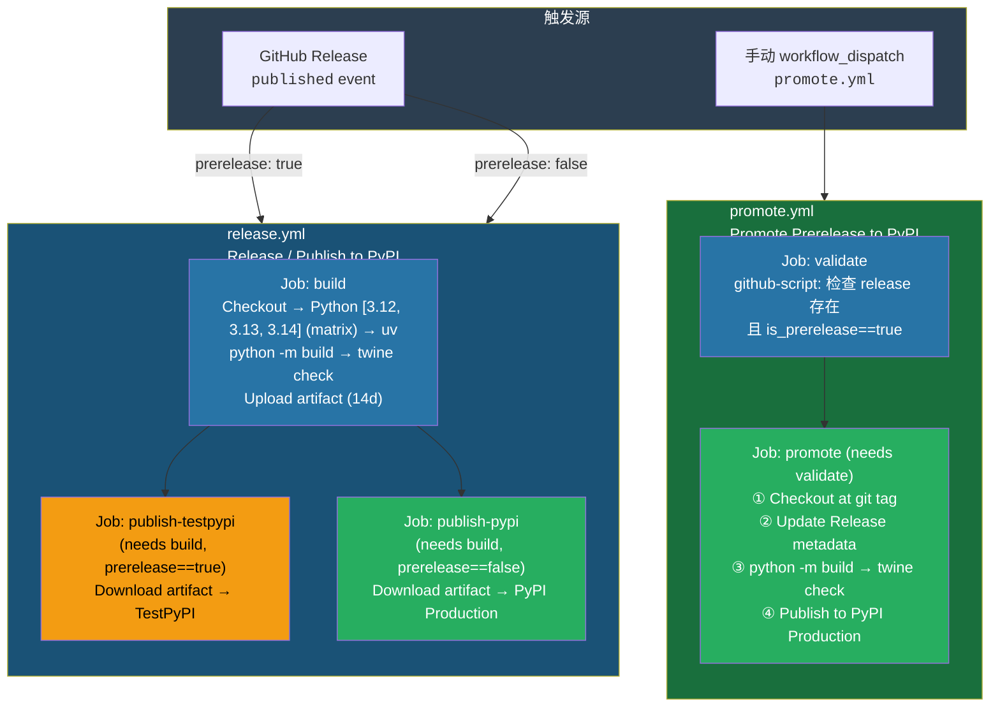
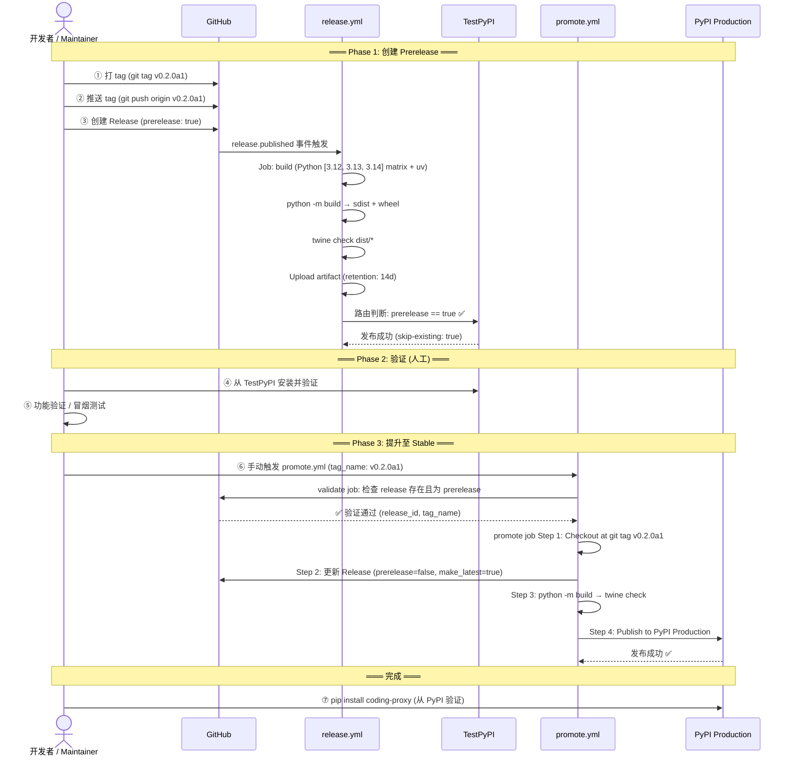
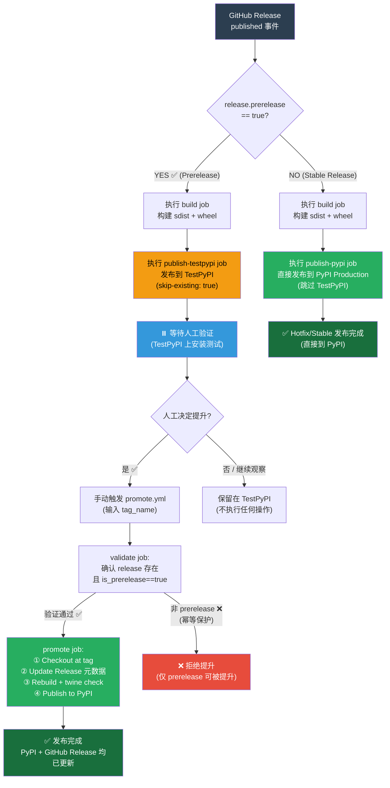
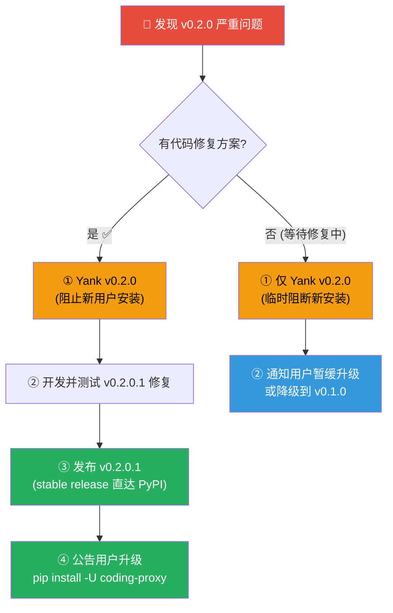
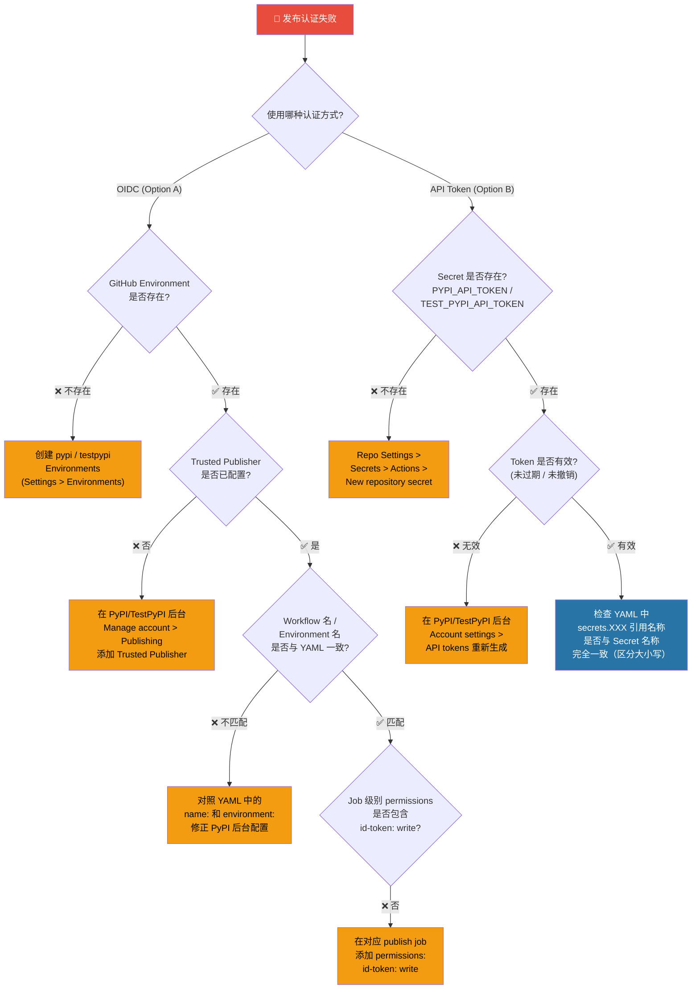

# coding-proxy CI/CD 发布运维手册

> **路径约定**：本文档中工作流文件路径均相对于项目根目录，例如 `.github/workflows/release.yml` 指 `.github/workflows/release.yml`。
>
> **版本**：v1 — 反映当前 `release.yml` + `promote.yml` 双流水线实际实现。

<details>
<summary><strong>📑 目录（点击展开）</strong></summary>

- [coding-proxy CI/CD 发布运维手册](#coding-proxy-cicd-发布运维手册)
  - [1. 概述](#1-概述)
    - [1.1 文档定位与目标读者](#11-文档定位与目标读者)
    - [1.2 架构设计理念](#12-架构设计理念)
  - [2. 前置条件](#2-前置条件)
    - [2.1 权限要求](#21-权限要求)
    - [2.2 认证方案](#22-认证方案)
      - [Option A：OIDC Trusted Publishing（推荐）](#option-aoidc-trusted-publishing推荐)
      - [Option B：API Token Fallback（备选）](#option-bapi-token-fallback备选)
      - [方案对比](#方案对比)
    - [2.3 工具链版本锁定](#23-工具链版本锁定)
    - [2.4 GitHub Environments 配置详情](#24-github-environments-配置详情)
  - [3. 标准发布流程](#3-标准发布流程)
    - [3.1 流程总览](#31-流程总览)
    - [3.2 详细步骤](#32-详细步骤)
      - [Phase 1：创建 Prerelease Release](#phase-1创建-prerelease-release)
      - [Phase 2：TestPyPI 验证](#phase-2testpypi-验证)
      - [Phase 3：提升至 PyPI Production](#phase-3提升至-pypi-production)
    - [3.3 路由决策逻辑](#33-路由决策逻辑)
  - [4. 提升流程详解](#4-提升流程详解)
    - [4.1 promote.yml 工作流架构](#41-promoteyml-工作流架构)
      - [Job 1：validate（验证门控）](#job-1validate验证门控)
      - [Job 2：promote（执行提升）](#job-2promote执行提升)
    - [4.2 并发控制策略](#42-并发控制策略)
    - [4.3 权限最小化原则](#43-权限最小化原则)
  - [5. 热修复 / 直接稳定发布](#5-热修复--直接稳定发布)
    - [5.1 使用场景](#51-使用场景)
    - [5.2 操作步骤](#52-操作步骤)
    - [5.3 与标准流程对比](#53-与标准流程对比)
  - [6. 回滚程序](#6-回滚程序)
    - [6.1 PyPI 发布不可逆约束](#61-pypi-发布不可逆约束)
    - [6.2 回滚策略选项](#62-回滚策略选项)
    - [6.3 Yank 操作步骤](#63-yank-操作步骤)
    - [6.4 修复版完整回滚流程](#64-修复版完整回滚流程)
  - [7. 故障排查](#7-故障排查)
    - [7.1 常见问题速查表](#71-常见问题速查表)
    - [7.2 认证问题诊断树](#72-认证问题诊断树)
    - [7.3 Artifact 下载与本地复现](#73-artifact-下载与本地复现)
    - [7.4 构建环境一致性保证](#74-构建环境一致性保证)
  - [8. 工作流文件参考](#8-工作流文件参考)
    - [8.1 release.yml 结构索引](#81-releaseyml-结构索引)
    - [8.2 promote.yml 结构索引](#82-promoteyml-结构索引)
    - [8.3 关键配置参数速查](#83-关键配置参数速查)
  - [附录 A：术语对照表](#附录-a术语对照表)
  - [附录 B：版本号规范](#附录-b版本号规范)
    - [B.1 Semantic Versioning with Prerelease（PEP 440）](#b1-semantic-versioning-with-prereleasepep-440)
    - [B.2 当前版本与历史](#b2-当前版本与历史)
    - [B.3 版本号更新 Checklist](#b3-版本号更新-checklist)
  - [附录 C：外部参考文献](#附录-c外部参考文献)

</details>

---

## 1. 概述

### 1.1 文档定位与目标读者

本文档系统性地记录 coding-proxy 项目从代码提交到 PyPI 上线的**完整构建发布流水线**，涵盖环境初始化、标准发布、热修复、回滚及异常处理等全生命周期操作。

| 角色                    | 关注章节                                | 核心诉求                                  |
| ----------------------- | --------------------------------------- | ----------------------------------------- |
| **开发者 (Developer)**  | §2 前置条件、§3 标准发布流程            | 如何正确创建 Release 触发自动化构建与发布 |
| **维护者 (Maintainer)** | §4 提升流程、§5 热修复流程、§6 回滚程序 | 完整的发布生命周期管理与异常处置          |
| **Release Manager**     | 全文 + §7 故障排查                      | 端到端发布治理、审批门控与异常恢复        |

### 1.2 架构设计理念

本项目 CI/CD 流水线基于以下核心设计原则构建：

| 原则                                                              | 说明                                                                                                                                                   | 业界依据                                                             |
| ----------------------------------------------------------------- | ------------------------------------------------------------------------------------------------------------------------------------------------------ | -------------------------------------------------------------------- |
| **Build-Publish Separation（构建-发布分离）**                     | 构建 Job 以最低权限运行（仅 `contents: read`），产物通过 Artifact 传递给发布 Job；发布 Job 在隔离 Environment 中以提升权限执行                         | PyPA 安全最佳实践<sup>[[1]](#ref1)</sup>                             |
| **Prerelease-Stable Promotion Gate（预发布-稳定提升门控）**       | 新版本先以 Prerelease 形式发布至 TestPyPI，经人工验证后手动提升至 PyPI Production；灵感源自 GitFlow Release Branch 模式在 GitHub Releases 场景下的适配 | —                                                                    |
| **Deterministic Rebuild from Git Tag（基于 Tag 的确定性重建）**   | `promote.yml` 从精确的 git tag 检出源码进行构建，确保提升时产出的分发包与原始 Prerelease 完全一致、可复现                                              | 可复现构建(Reproducible Builds) 理念                                 |
| **OIDC Trusted Publishing as Default（OIDC 受信发布为默认方案）** | 优先使用 GitHub OIDC ↔ PyPI Trusted Publisher 的零密钥认证方式，避免长期存储 API Token                                                                 | PyPA & GitHub 安全推荐<sup>[[2]](#ref2)</sup><sup>[[4]](#ref4)</sup> |



**图 1-1：双工作流 Pipeline 架构全景图**

---

## 2. 前置条件

### 2.1 权限要求

参与发布流程各环节所需的最小权限集合：

| 操作                                         | 所需权限                              | 说明                                  |
| -------------------------------------------- | ------------------------------------- | ------------------------------------- |
| 创建 GitHub Release（打 tag + 写 Release）   | `contents: write`                     | 推送 tag 并创建 Release 记录          |
| 触发 `promote.yml`（手动 workflow_dispatch） | `workflow: write` 或 Maintainer+ 角色 | 通过 Actions 页面或 `gh` CLI 手动触发 |
| 配置 GitHub Environments                     | Admin / Owner                         | 在 Settings > Environments 中创建环境 |
| 配置 Trusted Publishers                      | PyPI / TestPyPI Owner 或 Maintainer   | 在 PyPI 后台管理面板中绑定发布策略    |
| 审批 pypi Environment                        | 被指定为 Required Reviewer            | 当 Environment 设置了保护规则时       |

### 2.2 认证方案

本项目支持两种认证方式，**二选一即可**：

#### Option A：OIDC Trusted Publishing（推荐）

基于 OpenID Connect 协议的零密钥认证——GitHub 在每次运行时向 PyPI 签发短期令牌，无需在仓库中存储任何持久化密钥。

**配置步骤：**

1. **创建 GitHub Environment：`testpypi`**

   进入仓库 Settings > Environments > New environment：
   - Name: `testpypi`
   - Environment URL（可选）: `https://test.pypi.org/p/coding-proxy`
   - Protection Rules：可按需设置 Required reviewers（内部测试阶段可跳过）
   - 无需添加 Secrets

2. **创建 GitHub Environment：`pypi`**

   同上步骤创建：
   - Name: `pypi`
   - Environment URL（可选）: `https://pypi.org/p/coding-proxy`
   - Protection Rules：**强烈建议**设置 Required reviewers（作为生产发布的最终人工审批门控）

3. **在 TestPyPI 配置 Trusted Publisher**

   登录 [TestPyPI 管理面板](https://test.pypi.org/manage/account/publishing/) > Add a new publisher：
   - GitHub repository: `ThreeFish-AI/coding-proxy`（替换为实际组织/用户名）
   - Workflow name: `release.yml`
   - Environment name: `testpypi`

4. **在 PyPI 配置 Trusted Publisher**

   登录 [PyPI 管理面板](https://pypi.org/manage/account/publishing/) > Add a new publisher：

   需要添加 **两条** publisher 规则（对应两个可能触发 PyPI 发布的工作流）：

   | Workflow name | Environment name | 来源                    |
   | ------------- | ---------------- | ----------------------- |
   | `release.yml` | `pypi`           | Stable Release 直达路径 |
   | `promote.yml` | `pypi`           | Prerelease 提升路径     |

#### Option B：API Token Fallback（备选）

适用于个人项目快速起步或 OIDC 不可用的场景。

| Secret 名称           | 用途                     | 获取位置                                                                              |
| --------------------- | ------------------------ | ------------------------------------------------------------------------------------- |
| `TEST_PYPI_API_TOKEN` | TestPyPI 发布认证        | [TestPyPI Account Settings > API tokens](https://test.pypi.org/manage/account/token/) |
| `PYPI_API_TOKEN`      | PyPI Production 发布认证 | [PyPI Account Settings > API tokens](https://pypi.org/manage/account/token/)          |

**存储方式**：进入仓库 Settings > Secrets and variables > Actions > New repository secret，将上述 Token 分别存入。

#### 方案对比

| 维度       | Option A (OIDC)                                | Option B (API Token)               |
| ---------- | ---------------------------------------------- | ---------------------------------- |
| 安全性     | 高（短期 token，无持久化密钥）                 | 中（长期有效 token，泄露风险较高） |
| 配置复杂度 | 中（需配置 Environments + Trusted Publishers） | 低（仅需设置 2 个 secrets）        |
| 审批门控   | 原生支持（Environment protection rules）       | 需额外创建 Environment 才支持      |
| 密钥轮换   | 自动（每次发布自动生成新 token）               | 手动（需定期重新生成）             |
| 推荐场景   | 生产环境 / 团队协作                            | 个人项目 / 快速原型验证            |

> ⚠️ **注意**：若选择 Option B 且未创建 GitHub Environments，需从工作流 YAML 中移除对应的 `environment:` 区块，否则运行将因找不到 Environment 而失败。

### 2.3 工具链版本锁定

CI 流水线中使用的工具及其版本均与项目实际配置严格对齐：

| 工具           | 版本 / 引用                         | 来源 (Action)                            | 与项目配置的对齐关系                                                       |
| -------------- | ----------------------------------- | ---------------------------------------- | -------------------------------------------------------------------------- |
| Python         | `["3.12", "3.13", "3.14"]` (matrix) | `actions/setup-python@v5`                | 对齐 [`pyproject.toml`](../../pyproject.toml) 中 `requires-python = ">=3.12"` |
| uv             | latest (v4)                         | `astral-sh/setup-uv@v4`                  | 项目强制包管理器（见 AGENTS.md 包管理规范）                                |
| build          | latest                              | `uv pip install --system build`          | PEP 517 构建前端，后端为 hatchling                                         |
| twine          | latest                              | `uv pip install --system twine`          | 包元数据校验与上传工具                                                     |
| Publish Action | `release/v1`                        | `pypa/gh-action-pypi-publish@release/v1` | PyPA 官方发布 Action<sup>[[3]](#ref3)</sup>                                |
| Checkout       | v4                                  | `actions/checkout@v4`                    | 代码检出（`persist-credentials: false` 最小化凭据暴露）                    |
| GitHub Script  | v7                                  | `actions/github-script@v7`               | 用于 promote.yml 中的 Release 元数据查询与更新                             |

### 2.4 GitHub Environments 配置详情

| Environment 名称 | 关联 Workflow / Job                                          | 保护规则建议                                                       |
| ---------------- | ------------------------------------------------------------ | ------------------------------------------------------------------ |
| `testpypi`       | `release.yml` > `publish-testpypi`                           | 可选设置 Required reviewers（预发布阶段可宽松）                    |
| `pypi`           | `release.yml` > `publish-pypi`<br/>`promote.yml` > `promote` | **强烈建议**设置 Required reviewers ≥ 1 人（生产发布最后一道防线） |

---

## 3. 标准发布流程

标准发布流程遵循 **Prerelease → Validate → Promote** 三阶段模型，确保每个正式版本都经过 TestPyPI 验证后再进入 PyPI Production。

### 3.1 流程总览



**图 3-1：标准发布三阶段时序图**

### 3.2 详细步骤

#### Phase 1：创建 Prerelease Release

此阶段的目标是触发 `release.yml` 自动化流水线，将构建产物发布到 TestPyPI。

```bash
# ─── Step 0: 准备工作（如有版本变更）───
# 编辑 pyproject.toml 更新版本号
# version = "0.1.0" → version = "0.2.0a1"
# 同时更新 CHANGELOG.md 添加新版本条目

# ─── Step 1: 提交版本变更 ───
git add pyproject.toml CHANGELOG.md
git commit -m "chore: bump version to 0.2.0a1"

# ─── Step 2: 创建并推送 git tag ───
git tag v0.2.0a1
git push origin v0.2.0a1

# ─── Step 3: 创建 Prerelease Release（触发 release.yml）───
gh release create v0.2.0a1 \
  --title "v0.2.0a1 (Alpha)" \
  --notes "## 变更内容\n\n参见 CHANGELOG.md" \
  --prerelease
```

**预期结果**（Step 3 执行后自动发生）：

| 事件                                          | 说明                                               |
| --------------------------------------------- | -------------------------------------------------- |
| `release.yml` 被 `release.published` 事件触发 | GitHub 自动派发工作流运行                          |
| `build` Job 完成                              | 产出 `dist/` Artifact（sdist + wheel），保留 14 天 |
| `publish-testpypi` Job 执行                   | 因 `prerelease==true` 条件满足，发布至 TestPyPI    |
| `publish-pypi` Job **跳过**                   | 因 `prerelease==true` 不满足其 `if` 条件           |
| 包可访问                                      | https://test.pypi.org/project/coding-proxy/        |

#### Phase 2：TestPyPI 验证

人工在本地安装 TestPyPI 上的 prerelease 包，执行冒烟测试和功能验证。

```bash
# ─── Step 4: 从 TestPyPI 安装 prerelease 进行验证 ───
uv pip install \
  --index-url https://test.pypi.org/simple/ \
  --extra-index-url https://pypi.org/simple/ \
  coding-proxy==0.2.0a1

# ─── Step 5: 运行冒烟测试 ───
coding-proxy --version          # 验证版本号输出
coding-proxy start --port 8090  # 验证服务能正常启动
curl http://127.0.0.1:8090/health  # 验证健康检查端点
```

**验证 Checklist：**

| 检查项         | 命令 / 方法                     | 期望结果               |
| -------------- | ------------------------------- | ---------------------- |
| 版本号正确     | `coding-proxy --version`        | 输出含 `0.2.0a1`       |
| 服务启动无异常 | `coding-proxy start`            | Uvicorn 正常监听端口   |
| 健康检查通过   | `GET /health`                   | 返回 `{"status":"ok"}` |
| 包元数据合法   | CI 中 `twine check dist/*` 输出 | `PASSED`               |
| 依赖解析成功   | `uv pip install` 无报错         | 所有依赖正确安装       |

> 💡 **提示**：若 Phase 2 验证发现问题，**不要执行 Phase 3**。应回退到代码修复 → 重新打 tag（递增 prerelease 号码，如 `v0.2.0a2`）→ 重新走 Phase 1。

#### Phase 3：提升至 PyPI Production

验证通过后，手动触发 `promote.yml` 将已验证的 prerelease 提升为 stable release 并发布到 PyPI。

**方式 A：GitHub Web UI**

1. 进入仓库 **Actions** 标签页
2. 左侧选择 **"Promote Prerelease to PyPI"** 工作流
3. 点击 **"Run workflow"** 按钮
4. 输入 `tag_name`：`v0.2.0a1`
5. 点击 **"Run workflow"**
6. 等待 `validate` Job 完成 → 若 `pypi` Environment 设置了审批规则，前往 **Notifications** 审批 → `promote` Job 完成

**方式 B：GitHub CLI**

```bash
# ─── Step 6: 触发 promote workflow ───
gh workflow run promote.yml \
  -f tag_name=v0.2.0a1

# 监控运行状态（阻塞等待完成）
gh run watch --exit-code

# ─── Step 7: 验证 PyPI 发布结果 ───
uv pip install coding-proxy==0.2.0a1
coding-proxy --version
```

**预期结果**（Step 6/7 执行后）：

| 事件                                      | 说明                                                  |
| ----------------------------------------- | ----------------------------------------------------- |
| GitHub Release 更新                       | `prerelease: false`, `make_latest: true`              |
| PyPI Production 上架                      | https://pypi.org/project/coding-proxy/ 可检索到新版本 |
| `pip install coding-proxy` 默认安装最新版 | 因 `make_latest: true`                                |

### 3.3 路由决策逻辑

`release.yml` 的核心路由机制根据 GitHub Release 的 `prerelease` 标志决定发布目标：



**图 3-2：路由决策逻辑流**

关键决策点说明：

- **`prerelease == true`**：走 TestPyPI 预发布通道，必须经人工验证 + promote 才能到达 PyPI
- **`prerelease == false`**：直达 PyPI Production（热修复路径），跳过 TestPyPI 验证环节
- **promote 幂等保护**：若 target release 已是 stable（`prerelease == false`），`validate` Job 会主动 `setFailed` 拒绝执行，防止重复提升

---

## 4. 提升流程详解

本节深入剖析 `promote.yml` 的内部工作机制，帮助维护者理解每一步的安全保障措施。

### 4.1 promote.yml 工作流架构

[`promote.yml`](../../.github/workflows/promote.yml) 由两个 Job 组成，形成 **Validate → Promote** 的串行管线：

#### Job 1：validate（验证门控）

| 属性            | 值                         | 说明                                        |
| --------------- | -------------------------- | ------------------------------------------- |
| name            | Validate prerelease status |                                             |
| runs-on         | `ubuntu-latest`            |                                             |
| timeout-minutes | `5`                        | 快速失败，不占用过多资源                    |
| tool            | `actions/github-script@v7` | 使用 GitHub REST API v3 查询 Release 元数据 |

**脚本逻辑**（对应 YAML 第 59–86 行）：

1. 从 `workflow_dispatch` 输入读取 `tag_name`
2. 调用 `github.rest.releases.getReleaseByTag({owner, repo, tag})` 查询 Release
3. 检查 `release.data.prerelease`：
   - 若为 `false` → 调用 `core.setFailed()` 终止流程，输出明确错误信息
   - 若为 `true` → 通过 `core.setOutput()` 向下游 Job 传递 `release_id` 和 `tag_name`

> 🔒 **安全保障**：这是一个**幂等性守卫 (Idempotency Guard)**——尝试提升一个已经是 stable 的 release 会立即失败并给出清晰错误提示，而非静默执行危险操作。

#### Job 2：promote（执行提升）

| 步骤             | Action                                                                                   | 目的                                                              |
| ---------------- | ---------------------------------------------------------------------------------------- | ----------------------------------------------------------------- |
| ① Checkout       | `actions/checkout@v4` with `ref: ${{ needs.validate.outputs.tag_name }}`                 | 从**精确的 git tag** 检出源码，确保确定性重建                     |
| ② Update Release | `actions/github-script@v7`                                                               | 将 GitHub Release 更新为 `prerelease: false`, `make_latest: true` |
| ③ Build          | Python [3.12, 3.13, 3.14] (matrix) + uv + build deps → `python -m build` → `twine check` | 复现与 `release.yml` 完全一致的构建过程                           |
| ④ Publish        | `pypa/gh-action-pypi-publish@release/v1`                                                 | 发布到 PyPI Production                                            |

**为什么从 git tag 重建？**

提升时从精确的 git tag（而非当前分支 HEAD）检出代码进行构建，确保：
- 产物与最初 Prerelease 时完全一致（可复现性）
- 排除 tag 之后可能引入的代码变更干扰
- 符合可复现构建 (Reproducible Builds) 行业最佳实践

### 4.2 并发控制策略

两个工作流采用差异化的并发控制策略，反映各自的使用场景特征：

| Workflow      | Concurrency Group                          | cancel-in-progress | 设计意图                                                            |
| ------------- | ------------------------------------------ | ------------------ | ------------------------------------------------------------------- |
| `release.yml` | `${{ github.workflow }}-${{ github.ref }}` | `true`             | 同一 ref 的重复发布自动取消旧的运行（最新构建优先）                 |
| `promote.yml` | `promote-${{ inputs.tag_name }}`           | `false`            | 同一 tag 不允许并发提升，但已有运行不会被静默取消（问题可见性优先） |

**设计理由**：

- **release.yml 取消旧运行**：同一版本的重复发布场景下，最新的构建才是有意义的，旧运行的结果会被覆盖
- **promote.yml 保留旧运行**：对同一 tag 的并发提升通常意味着异常情况（如误操作），应当让所有运行都可见以便排查，而非静默取消掩盖问题

### 4.3 权限最小化原则

流水线采用**逐级权限升级**模型，每个组件仅持有完成其职责所需的最小权限集合：

| 作用域             | 权限级别                              | 涉及 Job              | 持有理由                                 |
| ------------------ | ------------------------------------- | --------------------- | ---------------------------------------- |
| Workflow 根级别    | `contents: read`                      | 全部 Job（默认继承）  | 默认最小权限基线                         |
| `build` Job        | 继承根级别 (`contents: read`)         | 仅 `build`            | 只需读代码 + 上传 Artifact               |
| `publish-testpypi` | `id-token: write` + `contents: read`  | 仅 `publish-testpypi` | OIDC 令牌生成 + 下载 Artifact            |
| `publish-pypi`     | `id-token: write` + `contents: read`  | 仅 `publish-pypi`     | OIDC 令牌生成 + 下载 Artifact            |
| `promote.validate` | 继承根级别 (`contents: read`)         | 仅 `validate`         | 仅通过 github-script 读取 Release 元数据 |
| `promote.promote`  | `contents: write` + `id-token: write` | 仅 `promote`          | 需更新 Release 元数据 + 发布到 PyPI      |

---

## 5. 热修复 / 直接稳定发布

### 5.1 使用场景

当遇到以下情形时，可绕过标准的 Prerelease → Promote 三阶段流程，直接发布稳定版本到 PyPI：

| 场景              | 示例                         | 说明                           |
| ----------------- | ---------------------------- | ------------------------------ |
| **紧急 Bug 修复** | 生产环境 Critical 级别的缺陷 | 用户已受影响，需要最快速度触达 |
| **安全补丁**      | CVE 级别的安全漏洞修复       | 暴露窗口期应尽可能短           |
| **回归修复**      | 当前稳定版本引入的严重回归   | 需立即替换有问题的版本         |

### 5.2 操作步骤

热修复的核心区别在于创建 Release 时**不标记 `prerelease`**，使 `release.yml` 的路由逻辑将其导向 `publish-pypi` Job（直达 PyPI Production）。

```bash
# ─── Step 1: 创建 hotfix 版本的 stable tag（无 prerelease 后缀）───
git tag v0.1.1
git push origin v0.1.1

# ─── Step 2: 创建 Stable Release（不加 --prerelease）───
gh release create v0.1.1 \
  --title "v0.1.1 (Hotfix)" \
  --notes "## 修复内容\n\n- 修复 XXX 导致的 YYY 问题 (#123)"
  # 注意：此处故意不传 --prerelease 标志
```

**路由行为**：由于 `prerelease == false`，`release.yml` 的条件路由使 `publish-testpypi` Job 被跳过（`if: github.event.release.prerelease == true` 不满足），仅执行 `publish-pypi` Job 直接发布到 PyPI Production。

### 5.3 与标准流程对比

| 维度           | 标准流程 (Prerelease → Promote) | 热修复流程 (Direct Stable)         |
| -------------- | ------------------------------- | ---------------------------------- |
| TestPyPI 发布  | ✅ 是                            | ❌ 否                               |
| 人工验证环节   | ✅ 有（Phase 2 冒烟测试）        | ❌ 无                               |
| 发布端到端延迟 | 较长（含验证 + 审批时间）       | 最短（自动化直达 PyPI）            |
| 适用场景       | 功能版本、大版本迭代            | 紧急修复、安全补丁                 |
| 风险等级       | 低（有 TestPyPI 验证缓冲）      | 较高（无预发布验证，直达生产）     |
| 可中断性       | 高（可在 Phase 2 拒绝提升）     | 低（一旦创建 Release 即触发发布）  |
| 回滚难度       | 低（问题版本停留在 TestPyPI）   | 高（问题版本已在 PyPI Production） |

> ⚠️ **警告**：热修复路径省略了 TestPyPI 验证环节，请务必在本地充分测试后再创建 Release。一旦发布到 PyPI，该版本号即不可删除或覆盖（参见 §6.1）。

---

## 6. 回滚程序

### 6.1 PyPI 发布不可逆约束

> 🔴 **核心约束**：PyPI **不支持删除或覆写**已发布的版本。一旦某个版本号出现在 PyPI 上，它将永久存在。

这是 PyPI 平台的设计决定，旨在保障已安装用户的可复现性——任何人随时可以 `pip install package==x.y.z` 获取到完全相同的文件。

因此，回滚不能以"撤回发布"的方式实现，只能采用以下替代策略。

### 6.2 回滚策略选项

| 策略                       | 操作                                     | 适用场景                     | 局限性                                            |
| -------------------------- | ---------------------------------------- | ---------------------------- | ------------------------------------------------- |
| **A. Yank 版本**           | 在 PyPI 标记该版本为 yanked              | 发现严重问题需阻止新用户安装 | 已安装的用户不受影响；不能 un-yank 后替换为新内容 |
| **B. 发布新版本修复**      | 正常发布修复版本（如 v0.2.0 → v0.2.0.1） | 有代码修复方案可用           | 用户需主动 `pip install -U` 升级                  |
| **C. 删除 GitHub Release** | 在 GitHub 上删除 Release 记录            | Release notes 有误需修正     | **不影响** PyPI 上的包（两者独立存储）            |

### 6.3 Yank 操作步骤

Yank 是 PyPI 提供的版本标记机制——被 yanked 的版本不再被 `pip install package`（不带版本号）默认安装，但仍可通过显式指定版本号获取。

**方式一：Twine CLI**

```bash
pip install twine
twine yank coding-proxy 0.2.0a1 -r pypi

# 如需取消 yank（谨慎操作，仅在确认安全时执行）
twine unyank coding-proxy 0.2.0a1 -r pypi
```

**方式二：PyPI Web UI**

1. 登录 [PyPI 项目页面](https://pypi.org/project/coding-proxy/)
2. 进入目标版本页面（如 `https://pypi.org/project/coding-proxy/0.2.0a1/`）
3. 点击 **"Yank version"** 按钮
4. 填写原因说明并确认

**Yank 效果范围：**

| 操作                                | Yank 前          | Yank 后              |
| ----------------------------------- | ---------------- | -------------------- |
| `pip install coding-proxy`          | 可能安装到此版本 | **不会**安装到此版本 |
| `pip install coding-proxy==0.2.0a1` | 正常安装         | 仍可正常安装         |
| 已安装用户的运行环境                | 正常使用         | **不受影响**         |

### 6.4 修复版完整回滚流程

当发现已发布版本存在严重问题时，推荐的完整回滚路径如下：



**图 6-1：回滚决策流程**

---

## 7. 故障排查

### 7.1 常见问题速查表

| 问题现象                        | 可能原因                                               | 排查步骤                                              | 解决方案                                                  |
| ------------------------------- | ------------------------------------------------------ | ----------------------------------------------------- | --------------------------------------------------------- |
| `release.yml` 未触发            | Release 创建时未触发 `published` 事件（如 Draft 状态） | 检查 Actions 页面是否有该 workflow run                | 确保 Release 为非 Draft 状态；或重新发布                  |
| `build` Job 失败                | `twine check` 报错（包元数据不合规）                   | 查看 build Job 日志中的 twine 输出                    | 修复 [`pyproject.toml`](../../pyproject.toml) 中的元数据字段 |
| publish 失败 (HTTP 400)         | 包名或版本号冲突（目标仓库已有同版本）                 | 查看 verbose 日志中的响应体（已启用 `verbose: true`） | 检查 TestPyPI/PyPI 是否已有同版本；使用递增版本号         |
| publish 失败 (HTTP 403)         | 认证失败（Token 无效或缺失）                           | 检查 Job 日志中的认证错误详情                         | 验证 Secret 配置或 Trusted Publisher 设置（参见 §7.2）    |
| `promote.yml` validate 失败     | Target release 不是 prerelease（已是 stable）          | 查看 validate Job 错误信息                            | 确认输入的 `tag_name` 对应的是 prerelease release         |
| promote 卡在环境审批            | `pypi` Environment 设置了 Required reviewers           | 检查 GitHub Notifications                             | Maintainer 进入 Actions 页面审批                          |
| OIDC 认证失败                   | Trusted Publisher 未配置或配置不匹配                   | 检查 Job 日志中的 OIDC 错误详情                       | 对照 §2.2 Option A 逐步核对配置                           |
| TestPyPI skip-existing 静默跳过 | 同版本已存在于 TestPyPI（重复发布）                    | 检查 publish-testpypi 日志中的 skip 提示              | **正常行为**（幂等安全，不会报错）                        |

### 7.2 认证问题诊断树



**图 7-1：认证问题诊断决策树**

### 7.3 Artifact 下载与本地复现

当 `build` Job 成功但 `publish` Job 失败时，可下载构建产物进行本地调试或手动发布：

```bash
# ─── 从 GitHub Actions 下载 build artifact ───
# 1. 进入仓库 Actions 页面 → 点击对应 workflow run
# 2. 点击 build Job → 右侧 Artifacts 区域 → 下载 dist.zip
# 3. 解压到本地

unzip dist.zip -d dist-local
cd dist-local

# ─── 本地验证包元数据 ───
twine check *

# ─── 本地安装测试 ───
uv pip install *.whl
coding-proxy --version

# ─── 手动发布到 TestPyPI（调试用途）───
twine upload --repository-url https://test.pypi.org/legacy/ * \
  -u __token__ -p $TEST_PYPI_API_TOKEN
```

### 7.4 构建环境一致性保证

CI 流水线中的工具版本选择并非随意，每一项都与项目配置严格对应：

| CI 配置                                          | 项目配置                                                              | 对齐关系                                                                    |
| ------------------------------------------------ | --------------------------------------------------------------------- | --------------------------------------------------------------------------- |
| `python-version: "${{ matrix.python-version }}"` | `requires-python = ">=3.12"` in [`pyproject.toml`](../../pyproject.toml) | CI 构建环境必须满足项目的最低 Python 版本要求（matrix: 3.12 / 3.13 / 3.14） |
| `hatchling.build` (build-backend)                | `[build-system] requires = ["hatchling"]`                             | 构建后端声明必须一致                                                        |
| `uv pip install --system`                        | AGENTS.md 强制使用 `uv`                                               | GitHub Actions Runner 默认无激活的 virtualenv，需 `--system` 标志           |
| `retention-days: 14`                             | —                                                                     | Artifact 保留两周，覆盖正常的验证窗口期（通常 1-3 天）                      |
| `attestations: false` (TestPyPI)                 | —                                                                     | TestPyPI 平台不支持 PyPA attestations 功能，必须显式禁用否则报错            |
| `verbose: true` (TestPyPI)                       | —                                                                     | 启用详细日志以便在 HTTP 400 错误时查看服务端响应体                          |

---

## 8. 工作流文件参考

### 8.1 release.yml 结构索引

[`.github/workflows/release.yml`](../../.github/workflows/release.yml) 文件结构一览：

| 行范围  | 区块                    | 内容摘要                                                                                             |
| ------- | ----------------------- | ---------------------------------------------------------------------------------------------------- |
| 1–37    | Header 注释             | 架构说明、前置条件、参考文献                                                                         |
| 39      | `name`                  | `"Release / Publish to PyPI"`                                                                        |
| 41–43   | `on:`                   | `release: types: [published]`                                                                        |
| 45–46   | `permissions`           | 根级别 `contents: read`                                                                              |
| 48–50   | `concurrency`           | 按 workflow+ref 分组，cancel-in-progress: true                                                       |
| 52–91   | `jobs.build`            | 构建作业：checkout → Python [3.12, 3.13, 3.14] (matrix) → uv → build → twine check → upload artifact |
| 93–123  | `jobs.publish-testpypi` | TestPyPI 发布（条件：`prerelease == true`）                                                          |
| 125–152 | `jobs.publish-pypi`     | PyPI Production 发布（条件：`prerelease == false`）                                                  |

### 8.2 promote.yml 结构索引

[`.github/workflows/promote.yml`](../../.github/workflows/promote.yml) 文件结构一览：

| 行范围 | 区块            | 内容摘要                                                       |
| ------ | --------------- | -------------------------------------------------------------- |
| 1–30   | Header 注释     | 用途说明、流程描述、安全保障、前置条件                         |
| 32     | `name`          | `"Promote Prerelease to PyPI"`                                 |
| 34–40  | `on:`           | `workflow_dispatch` + `tag_name` 输入参数                      |
| 42–43  | `permissions`   | 根级别 `contents: read`                                        |
| 45–47  | `concurrency`   | 按 `promote-{tag}` 分组，cancel-in-progress: false             |
| 49–87  | `jobs.validate` | 验证作业：github-script 检查 release 存在且为 prerelease       |
| 89–163 | `jobs.promote`  | 提升作业：checkout at tag → update release → rebuild → publish |

### 8.3 关键配置参数速查

| 参数                                | `release.yml`                  | `promote.yml`                  | 说明                                                        |
| ----------------------------------- | ------------------------------ | ------------------------------ | ----------------------------------------------------------- |
| `runs-on`                           | `ubuntu-latest`                | `ubuntu-latest`                | GitHub-hosted runner                                        |
| `python-version`                    | `${{ matrix.python-version }}` | `${{ matrix.python-version }}` | 必须与 `requires-python` 一致（matrix: 3.12 / 3.13 / 3.14） |
| `timeout-minutes` (build)           | `10`                           | N/A                            | 构建超时上限                                                |
| `timeout-minutes` (publish/promote) | `10`                           | `15`                           | 发布超时（promote 含重建步骤，预留更长）                    |
| `retention-days`                    | `14`                           | N/A                            | Artifact 保留天数                                           |
| `skip-existing`                     | `true` (testpypi job)          | N/A                            | TestPyPI 幂等安全（重复发布不报错）                         |
| `attestations`                      | `false` (testpypi job)         | N/A                            | TestPyPI 不支持，必须显式禁用                               |
| `verbose`                           | `true` (testpypi job)          | N/A                            | 启用详细日志便于排查 400 错误                               |

---

## 附录 A：术语对照表

| 术语                     | 英文                         | 说明                                                                           |
| ------------------------ | ---------------------------- | ------------------------------------------------------------------------------ |
| **构建-发布分离**        | Build-Publish Separation     | PyPA 安全最佳实践：构建和发布在不同 Job 中执行，构建 Job 使用最低权限运行      |
| **OIDC 受信发布**        | OIDC Trusted Publishing      | 基于 OpenID Connect 的零密钥认证方式，GitHub 签发短期令牌给 PyPI               |
| **受信发布者**           | Trusted Publisher            | PyPI 后台配置的发布策略，绑定 GitHub 仓库 + Workflow 名 + Environment 名三元组 |
| **预发布**               | Prerelease                   | 标记为 `prerelease: true` 的 GitHub Release，通常为 alpha/beta/rc 版本         |
| **提升**                 | Promotion                    | 将已验证的 prerelease 提升为 stable release 并发布到 PyPI Production           |
| **确定性重建**           | Deterministic Rebuild        | 从精确的 git tag 检出代码进行构建，确保产物可复现                              |
| **Yank**                 | Yank                         | PyPI 提供的版本标记机制，使指定版本不再被 `pip install` 默认安装               |
| **并发组**               | Concurrency Group            | GitHub Actions 的并发控制机制，防止同一资源的重复或冲突执行                    |
| **Environment 保护规则** | Environment Protection Rules | GitHub Environments 的审批门控机制，可要求指定人员审批后才允许部署             |
| **Artifact**             | Artifact                     | GitHub Actions 的构建产物存储机制，用于跨 Job 传递文件                         |

---

## 附录 B：版本号规范

### B.1 Semantic Versioning with Prerelease（PEP 440）

本项目遵循 [PEP 440](https://peps.python.org/pep-0440/) 版本标识规范：

| 类型                          | 格式示例    | Tag 示例       | 发布目标                  |
| ----------------------------- | ----------- | -------------- | ------------------------- |
| Alpha（内部测试）             | `X.YaN`     | `v0.2.0a1`     | TestPyPI                  |
| Beta（公开测试）              | `X.YbN`     | `v0.2.0b1`     | TestPyPI                  |
| Release Candidate（候选版本） | `X.YrcN`    | `v0.2.0rc1`    | TestPyPI                  |
| Stable（稳定版本）            | `X.Y.Z`     | `v0.2.0`       | PyPI Production           |
| Post-release（发布后修补）    | `X.Y.postN` | `v0.1.0.post1` | PyPI Production（热修复） |
| Dev version（开发版本）       | `X.Y.devN`  | 不打 tag       | 仅本地 / CI 测试，不发布  |

### B.2 当前版本与历史

| 版本    | 类型   | PyPI | TestPyPI | 备注     |
| ------- | ------ | ---- | -------- | -------- |
| `0.1.0` | Stable | ✅    | —        | 初始版本 |

### B.3 版本号更新 Checklist

发布新版本前的标准化操作序列：

```bash
# ① 编辑 pyproject.toml 更新版本号
#    version = "0.1.0" → version = "0.2.0a1"

# ② 更新 CHANGELOG.md（添加新版本条目与变更说明）

# ③ 提交版本变更（此提交不触发任何 CI 发布流程）
git add pyproject.toml CHANGELOG.md
git commit -m "chore: bump version to 0.2.0a1"

# ④ 打 tag 并推送（tag 推送本身不触发 release.yml）
git tag v0.2.0a1
git push origin v0.2.0a1

# ⑤ 创建 GitHub Release（此步骤触发 release.yml）
gh release create v0.2.0a1 \
  --title "v0.2.0a1 (Alpha)" \
  --notes "## 参见 CHANGELOG.md" \
  --prerelease
```

---

## 附录 C：外部参考文献

<a id="ref1"></a>[1] Python Packaging Authority, "Publishing package distribution releases using GitHub Actions CI/CD workflows," *packaging.python.org*, 2024. [Online]. Available: https://packaging.python.org/guides/publishing-package-distribution-releases-using-github-actions-ci-cd-workflows/

<a id="ref2"></a>[2] PyPA, "Trusted Publishers using a publisher," *docs.pypi.org*, 2024. [Online]. Available: https://docs.pypi.org/trusted-publishers/using-a-publisher/

<a id="ref3"></a>[3] PyPA, "github-action-pypi-publish," *GitHub*, 2024. [Online]. Available: https://github.com/pypa/gh-action-pypi-publish

<a id="ref4"></a>[4] GitHub, "About OpenID Connect," *docs.github.com*, 2024. [Online]. Available: https://docs.github.com/en/actions/security-for-github-actions/security-hardening-your-deployments/about-openid-connect

<a id="ref5"></a>[5] Python Software Foundation, "PEP 440 — Version Identification and Dependency Specification for Python Packages," *python.org*, 2013. [Online]. Available: https://peps.python.org/pep-0440/
