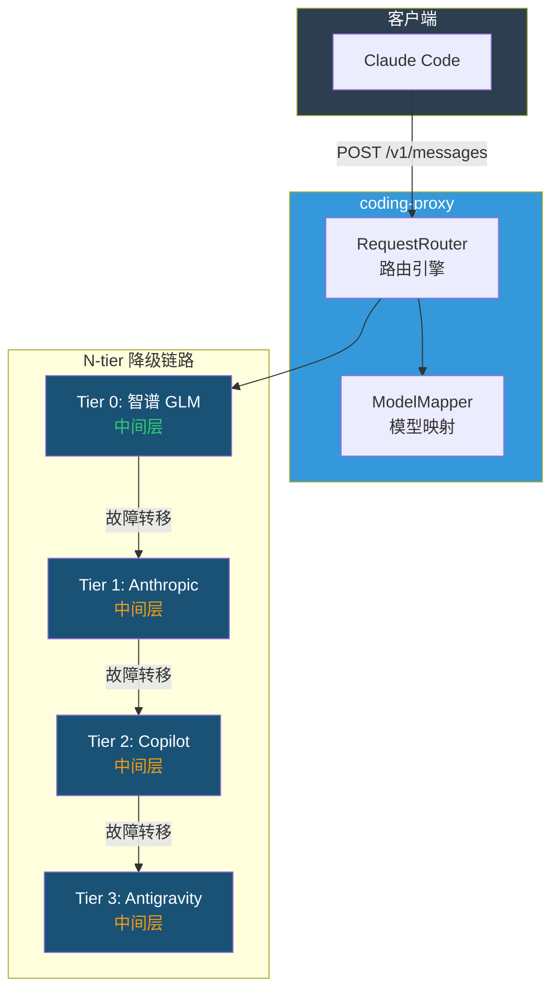

# coding-proxy 用户指引

<details>
<summary><strong>📑 目录（点击展开）</strong></summary>

- [coding-proxy 用户指引](#coding-proxy-用户指引)
  - [1. 简介](#1-简介)
    - [1.1 什么是 coding-proxy](#11-什么是-coding-proxy)
    - [1.2 工作原理](#12-工作原理)
    - [1.3 请求生命周期](#13-请求生命周期)
  - [2. 文档导航](#2-文档导航)
  - [3. 快速上手入门](#3-快速上手入门)
  - [4. 配置概览](#4-配置概览)
    - [4.1 配置文件位置与加载优先级](#41-配置文件位置与加载优先级)
    - [4.2 vendors — 供应商列表](#42-vendors--供应商列表)
    - [4.3 tiers — 降级链路优先级](#43-tiers--降级链路优先级)
    - [4.4 环境变量引用](#44-环境变量引用)
    - [4.5 auth — OAuth 登录配置](#45-auth--oauth-登录配置)
    - [4.6 server / database / logging](#46-server--database--logging)
    - [4.7 native_api — 原生 API 透传](#47-native_api--原生-api-透传)
  - [5. 日常操作速查](#5-日常操作速查)
  - [附录：术语对照表](#附录术语对照表)

</details>

## 1. 简介

### 1.1 什么是 coding-proxy

coding-proxy 是一个面向 Claude Code 的多**供应商(vendor)**智能代理服务。它在 Claude Code 和 API 供应商之间充当透明代理，具备以下核心能力：

- **N-tier 自动故障转移(failover)**：支持多层供应商链式降级（默认活跃链路：智谱 → Anthropic → Copilot；Antigravity 默认禁用），恢复后自动切回
- **9 种供应商支持**：Anthropic Claude、GitHub Copilot、Google Antigravity、智谱 GLM、MiniMax、阿里 Qwen、小米 MiMo、Kimi、豆包 Doubao
- **模型名称映射**：自动将 Claude 模型名转换为各供应商对应的实际模型名
- **格式双向转换**：自动转换 Anthropic ↔ Gemini 格式，支持非 Anthropic 兼容供应商
- **Token 用量追踪与定价统计**：记录每次请求的 Token 消耗、供应商选择、响应时间等指标；支持按 (vendor, model) 配置四维定价（$ / ¥）
- **弹性设施保护**：每层供应商独立配备熔断器(Circuit Breaker)、滑动窗口配额守卫(Quota Guard)（支持日级与周级双窗口）、Rate Limit 精确截止控制
- **OAuth 认证管理**：内置 GitHub Device Flow 与 Google OAuth 登录流程，支持运行时重认证与凭证自动刷新
- **Web 可视化看板**：内置 Dashboard 提供流量、用量、故障转移等指标的实时监控

### 1.2 工作原理



正常情况下，coding-proxy 将请求透传到 **Tier 0（默认为智谱 GLM）**。当检测到限流、配额耗尽或服务过载等错误时，按优先级链自动降级到下一层供应商。每层独立配备熔断器和配额守卫——**未配置 `circuit_breaker` 的 vendor 自动成为终端层**，始终接受请求且不触发进一步故障转移。供应商恢复后，代理会自动尝试切回更高优先级的层级。整个过程对用户透明。

> `tiers` 链路可通过配置自定义，不限于上图所示的 4 层。详见 [供应商配置 — tiers](./guide/vendors.md#4-tiers--降级链路优先级)。

### 1.3 请求生命周期

每个请求经过 **规范化 → 遍历 Tier 链 → 能力门控 → 三层恢复门控（Rate Limit / 熔断器 / 配额守卫）→ 发送请求 → 错误分类** 的完整链路。

> 详细的请求生命周期流程图参见 [架构文档 — 请求路由](./arch/routing.md)。

---

## 2. 文档导航

| 文档                                          | 说明                                                            |
| --------------------------------------------- | --------------------------------------------------------------- |
| **[快速开始](./guide/quickstart.md)**         | 环境要求、安装、最小配置、启动服务、Claude Code 集成            |
| **[供应商配置](./guide/vendors.md)**          | 全部 9 种供应商配置详情、模型映射、定价                         |
| **[CLI 命令参考](./guide/cli-reference.md)**  | start / status / usage / reset / auth 全部命令                  |
| **[HTTP API 端点](./guide/api-reference.md)** | /v1/messages、health、status、reset、copilot、reauth、dashboard |
| **[Dashboard 看板](./guide/dashboard.md)**    | Web 可视化看板功能与操作                                        |
| **[监控·运维·排查](./guide/monitoring.md)**   | 日志、用量统计、性能调优、常见场景、故障排查                    |
| [配置字段参考](./arch/config-reference.md)    | 所有配置参数的完整字段定义（Single Source of Truth）            |
| [架构设计文档](./arch/design-patterns.md)     | 设计模式、熔断器状态机、配额守卫等架构细节                      |
| [供应商模块文档](./arch/vendors.md)           | Vendor 类层次结构与实现细节                                     |
| [请求路由文档](./arch/routing.md)             | 路由引擎工作原理                                                |

---

## 3. 快速上手入门

> 详细步骤参见 [快速开始](./guide/quickstart.md)。

```bash
# 1. 安装
uv sync

# 2. 配置（仅需设置 API Key）
export ZHIPU_API_KEY="your-api-key-here"
cp config.default.yaml config.yaml

# 3. 启动
coding-proxy start

# 4. 配置 Claude Code
export ANTHROPIC_BASE_URL=http://127.0.0.1:3392

# 5. 验证
curl http://127.0.0.1:3392/health
```

---

## 4. 配置概览

### 4.1 配置文件位置与加载优先级

加载器先按以下顺序查找用户配置文件（找到第一个即停止）：

1. `--config` 参数指定的路径（最高优先级）
2. `./config.yaml`（项目根目录）
3. `~/.coding-proxy/config.yaml`（用户主目录）

找到用户配置后，以内置 `config.default.yaml` 为基础模板进行**深度合并**，用户配置覆盖模板默认值。未找到用户配置文件时，直接使用模板默认值。

### 4.2 vendors — 供应商列表

`vendors` 以列表形式定义所有供应商及其弹性设施。支持 9 种供应商类型：

| 类型          | 类别                | 默认状态         |
| ------------- | ------------------- | ---------------- |
| `anthropic`   | 直连 Anthropic      | 启用             |
| `copilot`     | 协议转换（GitHub）  | 启用（需 OAuth） |
| `antigravity` | 协议转换（Google）  | 禁用             |
| `zhipu`       | 原生 Anthropic 兼容 | 启用（Tier 0）   |
| `minimax`     | 原生 Anthropic 兼容 | 禁用             |
| `alibaba`     | 原生 Anthropic 兼容 | 禁用             |
| `xiaomi`      | 原生 Anthropic 兼容 | 禁用             |
| `kimi`        | 原生 Anthropic 兼容 | 禁用             |
| `doubao`      | 原生 Anthropic 兼容 | 禁用             |

> 各供应商的专属字段、弹性配置和模型映射详见 [供应商配置](./guide/vendors.md)。所有字段的完整定义参见 [配置字段参考](./arch/config-reference.md)。

### 4.3 tiers — 降级链路优先级

可选字段，显式指定故障转移时的供应商尝试顺序。默认值：

```yaml
tiers: ["zhipu", "anthropic", "copilot", "antigravity"]
```

> 详见 [供应商配置 — tiers](./guide/vendors.md#4-tiers--降级链路优先级)。

### 4.4 环境变量引用

配置文件中可使用 `${VARIABLE_NAME}` 语法引用环境变量：

```yaml
- vendor: zhipu
  api_key: "${ZHIPU_API_KEY}"
```

启动时自动替换。如果环境变量未设置，保留原始文本。

### 4.5 auth — OAuth 登录配置

```yaml
auth:
  token_store_path: "~/.coding-proxy/tokens.json"
  # github_client_id: "..."    # 可选，默认使用公开 ID
  # google_client_id: ""        # 可选，默认使用公开凭据
  # google_client_secret: ""
```

> 完整字段定义参见 [配置字段参考 — AuthConfig](./arch/config-reference.md#34-authconfig)。

### 4.6 server / database / logging

```yaml
server:
  host: "127.0.0.1"    # 设为 "0.0.0.0" 接受外部连接
  port: 3392

database:
  path: "~/.coding-proxy/usage.db"

logging:
  level: "INFO"          # DEBUG / INFO / WARNING / ERROR
  # file: "coding-proxy.log"  # 输出到文件
  # max_bytes: 5242880        # 单文件 5 MB
  # backup_count: 5           # 保留 5 个备份
```

> 完整字段定义参见 [配置字段参考](./arch/config-reference.md#3-服务器配置)。

### 4.7 native_api — 原生 API 透传

`coding-proxy` 在 Claude Code 主链路 (`/v1/messages`) 之外，额外暴露 `/api/{openai,gemini,anthropic}/**` catch-all 透传通道，供直接调用 OpenAI / Gemini / Anthropic 官方 API 的客户端复用 proxy（认证头 `Authorization` / `x-api-key` / `?key=` 全部由客户端透传，proxy 不保管凭据）。

```yaml
native_api:
  openai:
    enabled: true                          # 默认开箱即用
    base_url: "https://api.openai.com"     # 或填入自选第三方代理
    timeout_ms: 300000
    connect_timeout_ms: 15000
  gemini:
    enabled: true
    base_url: "https://generativelanguage.googleapis.com"
  anthropic:
    enabled: true
    base_url: "https://api.anthropic.com"
```

**上游 `base_url` 三级优先级**（env > yaml > 内置默认）由 `NativeApiConfig._apply_env_overrides` `@model_validator(mode="after")` 统一注入，空串/纯空白视作未设置：

| 变量名 | 方向（谁 → 谁） | 典型值 | 备注 |
| --- | --- | --- | --- |
| `ANTHROPIC_BASE_URL` | client → proxy | `http://127.0.0.1:3392` | Claude Code 等客户端指向本 proxy |
| `NATIVE_OPENAI_BASE_URL` | proxy → upstream | `https://api.openai.com` 或自选代理 | 覆写 OpenAI 上游 |
| `NATIVE_GEMINI_BASE_URL` | proxy → upstream | `https://generativelanguage.googleapis.com` 或自选代理 | 覆写 Gemini 上游 |
| `NATIVE_ANTHROPIC_BASE_URL` | proxy → upstream | `https://api.anthropic.com` 或自选代理 | 覆写原生 Anthropic 上游 |

> `ANTHROPIC_BASE_URL` 与 `NATIVE_ANTHROPIC_BASE_URL` **方向正交**：前者是**客户端指向 proxy**（client → proxy），后者是 **proxy 指向上游**（proxy → upstream）。`NATIVE_` 前缀用于彻底切分两者语义。

**客户端用法示例**：

```bash
# 1. 将 OpenAI SDK base_url 指向本 proxy
export OPENAI_BASE_URL="http://127.0.0.1:3392/api/openai/v1"

# 2. 或直接 curl
curl http://127.0.0.1:3392/api/openai/v1/chat/completions \
  -H "Authorization: Bearer $OPENAI_API_KEY" \
  -d '{"model":"gpt-4o","messages":[{"role":"user","content":"ping"}]}'
```

如需禁用某家 provider，将对应 `enabled` 改为 `false` 即可。完整字段定义参见 [配置字段参考 — NativeApiConfig](./arch/config-reference.md#10-native_api--原生-api-透传配置)。

---

## 5. 日常操作速查

| 操作        | 命令                                         |
| ----------- | -------------------------------------------- |
| 启动代理    | `coding-proxy start`                         |
| 查看状态    | `coding-proxy status`                        |
| 查看用量    | `coding-proxy usage`                         |
| 查看本周    | `coding-proxy usage -w 1`                    |
| 查看本月    | `coding-proxy usage -m 1`                    |
| 重置熔断器  | `coding-proxy reset`                         |
| 提升供应商  | `coding-proxy reset -v anthropic`            |
| GitHub 登录 | `coding-proxy auth login -p github`          |
| 重认证      | `coding-proxy auth reauth github`            |
| 查看凭证    | `coding-proxy auth status`                   |
| Dashboard   | 浏览器访问 `http://127.0.0.1:3392/dashboard` |

> 完整命令选项参见 [CLI 命令参考](./guide/cli-reference.md)。

---

## 附录：术语对照表

| 术语                                                   | 说明                                                                 |
| ------------------------------------------------------ | -------------------------------------------------------------------- |
| **Vendor（供应商）**                                   | API 后端提供方，即 `vendors` 列表中的一个条目                        |
| **Tier（层级）**                                       | 一个 Vendor + 其关联弹性设施的路由单元                               |
| **Terminal Tier（终端层）**                            | 未配置 `circuit_breaker` 的 Vendor，始终接受请求，不触发向下故障转移 |
| **故障转移（Failover）**                               | 当前供应商不可用时自动切换到下一优先级供应商                         |
| **熔断器（Circuit Breaker）**                          | 连续失败达到阈值后暂时切断对该供应商的请求                           |
| **配额守卫（Quota Guard）**                            | 基于滑动窗口的 Token 用量预算管理，超限时跳过该供应商                |
| **Rate Limit**                                         | 基于上游响应头的精确速率限制控制                                     |
| **模型映射（Model Mapping）**                          | 将 Claude 模型名自动转换为各供应商实际模型名                         |
| **原生 Anthropic 兼容（Native Anthropic Compatible）** | 提供 Anthropic 兼容端点的供应商，仅需 `api_key` + `base_url`         |
