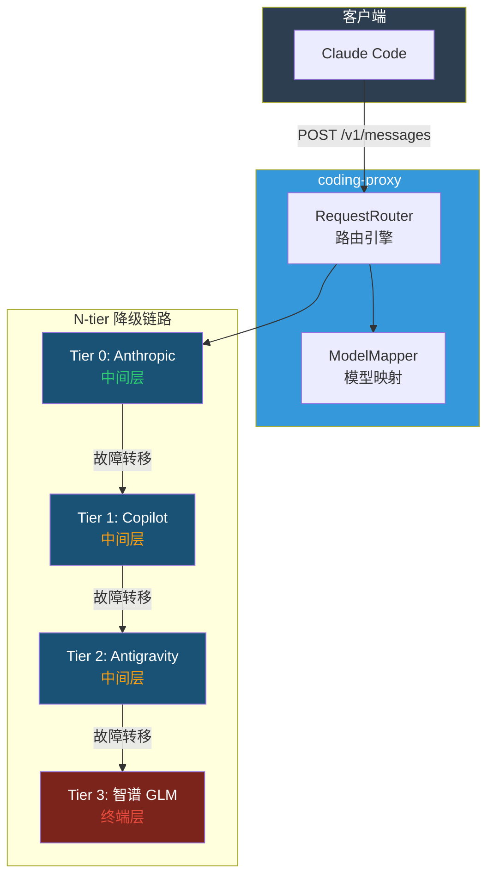
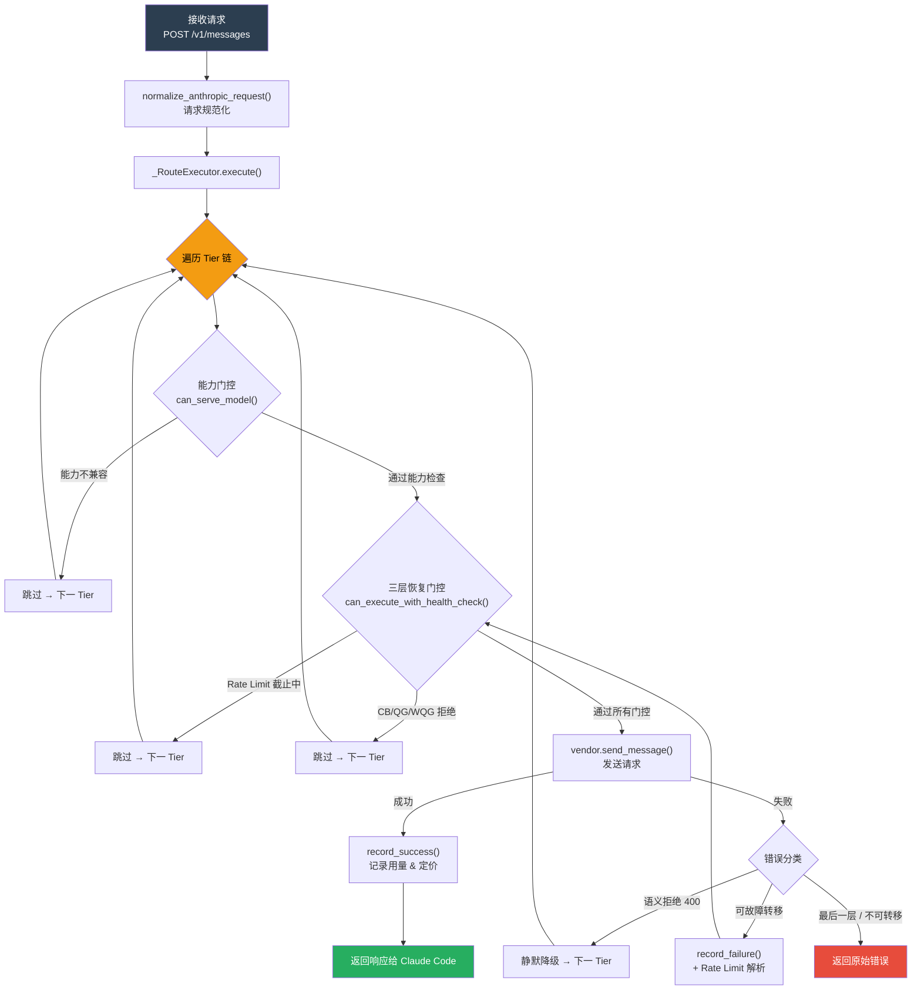
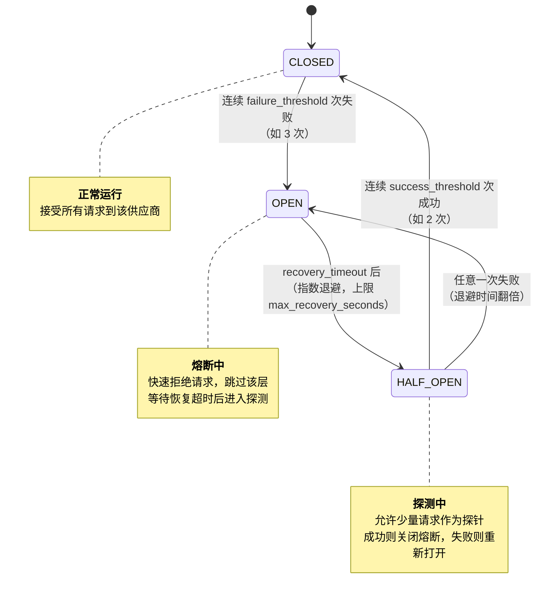
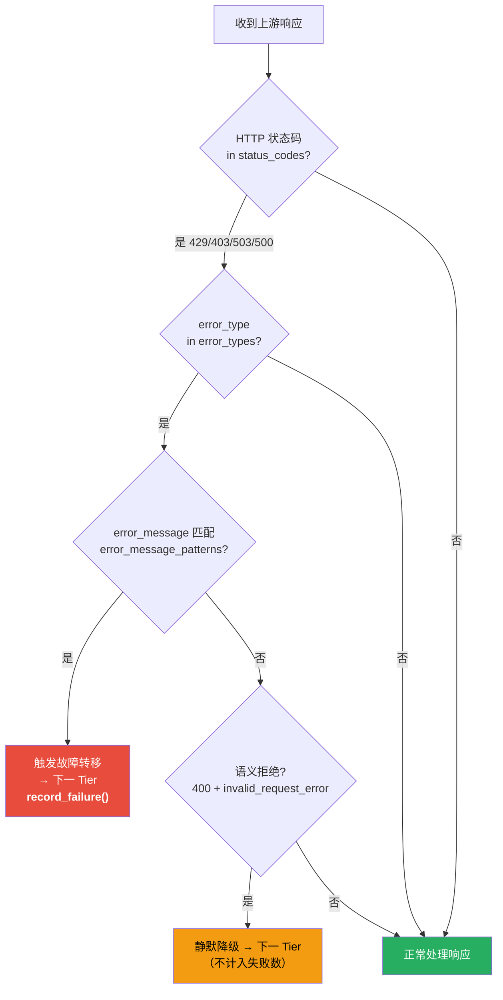

# coding-proxy 用户操作指引

<details>
<summary><strong>📑 目录（点击展开）</strong></summary>

- [1. 简介](#1-简介)
  - [1.1 什么是 coding-proxy](#11-什么是-coding-proxy)
  - [1.2 工作原理](#12-工作原理)
  - [1.3 请求生命周期](#13-请求生命周期)
- [2. 快速开始](#2-快速开始)
  - [2.1 环境要求](#21-环境要求)
  - [2.2 安装](#22-安装)
  - [2.3 最小配置](#23-最小配置)
  - [2.4 启动服务](#24-启动服务)
  - [2.5 验证服务](#25-验证服务)
  - [2.6 配置 Claude Code](#26-配置-claude-code)
- [3. 配置详解](#3-配置详解)
  - [3.1 配置文件位置与加载优先级](#31-配置文件位置与加载优先级)
  - [3.2 vendors — 供应商定义](#32-vendors-供应商定义)
  - [3.3 tiers — 降级链路优先级](#33-tiers-降级链路优先级)
  - [3.4 failover — 故障转移触发条件](#34-failover-故障转移触发条件)
  - [3.5 model_mapping — 模型映射规则](#35-model_mapping-模型映射规则)
  - [3.6 pricing — 模型定价](#36-pricing-模型定价)
  - [3.7 auth — OAuth 登录配置](#37-auth-oauth-登录配置)
  - [3.8 server / database / logging](#38-server-database-logging-基础设施配置)
  - [3.9 环境变量引用](#39-环境变量引用)
  - [3.10 旧 flat 格式兼容说明（已废弃）](#310-旧-flat-格式兼容说明已废弃)
- [4. CLI 命令参考](#4-cli-命令参考)
- [5. HTTP API 端点](#5-http-api-端点)
- [6. Claude Code 集成指南](#6-claude-code-集成指南)
- [7. 监控与运维](#7-监控与运维)
- [8. 常见使用场景](#8-常见使用场景)
- [9. 故障排查](#9-故障排查)
- [附录 A：术语对照表](#附录-a术语对照表)
- [附录 B：完整配置参考](#附录-b完整配置参考)

</details>

## 1. 简介

### 1.1 什么是 coding-proxy

coding-proxy 是一个面向 Claude Code 的多**供应商(vendor)**智能代理服务。它在 Claude Code 和 API 供应商之间充当透明代理，具备以下核心能力：

- **N-tier 自动故障转移(failover)**：支持多层供应商链式降级（Anthropic → Copilot → Antigravity → 智谱 GLM），恢复后自动切回
- **模型名称映射**：自动将 Claude 模型名转换为各供应商对应的实际模型名
- **格式双向转换**：自动转换 Anthropic ↔ Gemini 格式，支持非 Anthropic 兼容供应商
- **Token 用量追踪与定价统计**：记录每次请求的 Token 消耗（含缓存 Token）、供应商选择、响应时间等指标；支持按 (vendor, model) 配置四维定价（$ / ¥）
- **弹性设施保护**：每层供应商独立配备熔断器(Circuit Breaker)、滑动窗口配额守卫(Quota Guard)（支持小时级与周级双窗口）、Rate Limit 精确截止控制
- **OAuth 认证管理**：内置 GitHub Device Flow 与 Google OAuth 登录流程，支持运行时重认证与凭证自动刷新

### 1.2 工作原理



正常情况下，coding-proxy 将请求透传到 **Tier 0（Anthropic API）**。当检测到限流、配额耗尽或服务过载等错误时，按优先级链自动降级到下一层供应商。每层独立配备熔断器和配额守卫——**未配置 `circuit_breaker` 的 vendor 自动成为终端层**（如智谱 GLM），始终接受请求且不触发进一步故障转移。供应商恢复后，代理会自动尝试切回更高优先级的层级。整个过程对用户透明，无需手动干预。

### 1.3 请求生命周期



每个请求经过 **规范化 → 遍历 Tier 链 → 能力门控 → 三层恢复门控（Rate Limit / 熔断器 / 配额守卫）→ 发送请求 → 错误分类** 的完整链路。三层恢复门控确保在供应商不稳定时快速跳过，避免无效等待；错误分类决定是触发故障转移、静默降级还是直接返回错误给客户端。

---

## 2. 快速开始

### 2.1 环境要求

- **Python** >= 3.13
- **UV** 包管理器（推荐）或 pip
- **智谱 API Key**：从 [open.bigmodel.cn](https://open.bigmodel.cn) 获取
- **Claude Code** 已安装并可用

### 2.2 安装

```bash
# 方式一：使用 UV（推荐）
uv sync

# 方式二：使用 pip
pip install -e .
```

安装完成后，`coding-proxy` 命令即可使用。

### 2.3 最小配置

```bash
# 复制配置模板到项目根目录（模板已内置完整默认值，仅需覆盖密钥）
cp config.example.yaml config.yaml
```

设置智谱 API Key（二选一）：

**方式一：环境变量（推荐）**

```bash
export ZHIPU_API_KEY="your-api-key-here"
```

配置文件中使用 `${ZHIPU_API_KEY}` 引用，代理启动时自动替换。

**方式二：直接写入配置文件**

编辑 `config.yaml`，在 `vendors` 列表中找到 `vendor: zhipu` 条目，将 `api_key` 设为实际的 API Key：

```yaml
vendors:
  # ... 其他供应商 ...
  - vendor: zhipu
    api_key: "your-api-key-here"
```

> **安全提示**：`config.yaml` 已在 `.gitignore` 中，不会被提交到版本库。推荐使用环境变量方式避免密钥泄露。
>
> **安全最佳实践**：
> - **API Key 存储**：优先使用 `${ENV_VAR}` 环境变量引用，避免将明文密钥写入配置文件
> - **OAuth Token 保护**：`~/.coding-proxy/tokens.json` 存储 OAuth 凭证，建议设置文件权限 `chmod 600` 限制访问
> - **网络暴露**：若设置 `server.host: "0.0.0.0"` 接受外部连接，确保在可信网络环境中运行或配合防火墙使用
> - **密钥透传**：代理不存储 `ANTHROPIC_API_KEY`，仅透传至上游 API；建议定期轮换密钥

### 2.4 启动服务

```bash
# 使用默认配置启动
coding-proxy start

# 指定端口
coding-proxy start --port 8080

# 指定配置文件
coding-proxy start --config /path/to/config.yaml

# 自定义监听地址和端口
coding-proxy start --host 0.0.0.0 --port 8046
```

启动成功后会看到类似输出：

```bash
INFO:     Started server process [75773]
INFO:     Waiting for application startup.
INFO:     Application startup complete.
INFO:     Uvicorn running on http://127.0.0.1:8046 (Press CTRL+C to quit)
```

> **注意**：若启用了 Copilot 或 Antigravity 供应商但未配置凭证，启动时会自动触发 OAuth 浏览器登录流程（参见 [§4.5](#45-coding-proxy-auth-login)）。

### 2.5 验证服务

```bash
# 健康检查
curl http://127.0.0.1:8046/health
# 期望返回: {"status":"ok"}

# 查看代理状态
coding-proxy status
```

### 2.6 配置 Claude Code

将 Claude Code 的 API 端点指向 coding-proxy：

```bash
export ANTHROPIC_BASE_URL=http://127.0.0.1:8046
```

设置后，Claude Code 发出的所有 API 请求将经过 coding-proxy 代理。

---

## 3. 配置详解

### 3.1 配置文件位置与加载优先级

配置文件按以下优先级加载（找到第一个即停止）：

1. `--config` 参数指定的路径（最高优先级）
2. `./config.yaml`（项目根目录）
3. `~/.coding-proxy/config.yaml`（用户主目录）
4. 内置默认值（无需配置文件也可启动）

加载器会以 `config.example.yaml` 为基础模板进行深度合并，用户配置中的字段覆盖模板默认值。

### 3.2 vendors — 供应商定义

`vendors` 是配置的核心部分，以列表形式定义所有供应商及其弹性设施。每个 vendor 通过 `vendor` 字段指定类型：`anthropic` | `copilot` | `antigravity` | `zhipu`。

**优先级规则**：
- 若配置了 [`tiers`](#33-tiers--降级链路优先级)，以其指定的顺序为准
- 否则 `vendors` 列表顺序即为优先级（index 越小越优先）
- 无 `circuit_breaker` 的 vendor 自动成为终端层（不再向下故障转移）

#### 完整配置示例

```yaml
# === 供应商定义（vendors 列表） ===
vendors:
  # Vendor 0: Anthropic Claude（最高优先级）
  - vendor: anthropic
    base_url: "https://api.anthropic.com"
    timeout_ms: 300000          # 5 分钟
    circuit_breaker:            # 有此字段 = 中间层（参与故障转移）
      failure_threshold: 3
      recovery_timeout_seconds: 300
      success_threshold: 2
    quota_guard:                # 小时级滑动窗口配额守卫
      enabled: true
      token_budget: 45000000
      window_hours: 5.0
      threshold_percent: 99.0
      probe_interval_seconds: 300
    weekly_quota_guard:         # 周级滑动窗口配额守卫
      enabled: true
      token_budget: 250000000
      window_hours: 168.0       # 7 天滑动窗口
      threshold_percent: 99.0
      probe_interval_seconds: 1800

  # Vendor 1: GitHub Copilot（中间层，默认禁用）
  - vendor: copilot
    enabled: false              # 启用需 OAuth 登录或手动配置 github_token
    github_token: "${GITHUB_TOKEN}"
    account_type: "individual"   # individual / business / enterprise
    token_url: "https://api.github.com/copilot_internal/v2/token"
    base_url: ""                 # 留空时按 account_type 自动解析
    timeout_ms: 300000
    models_cache_ttl_seconds: 300  # 模型列表缓存 TTL（秒）
    circuit_breaker:
      failure_threshold: 3
      recovery_timeout_seconds: 300
      success_threshold: 2
    quota_guard:
      enabled: false
      token_budget: 0
      window_hours: 24.0
      threshold_percent: 95.0
      probe_interval_seconds: 300

  # Vendor 2: Google Antigravity（中间层，默认禁用）
  - vendor: antigravity
    enabled: false              # 启用需配置 OAuth 凭据
    client_id: "${GOOG_CLIENT_ID}"
    client_secret: "${GOOG_CLIENT_SECRET}"
    refresh_token: "${GOOG_REFRESH_TOKEN}"
    base_url: "https://generativelanguage.googleapis.com/v1beta"
    model_endpoint: "models/claude-sonnet-4-20250514"
    timeout_ms: 300000
    circuit_breaker:
      failure_threshold: 3
      recovery_timeout_seconds: 300
      success_threshold: 2
    quota_guard:
      enabled: false
      token_budget: 0
      window_hours: 24.0
      threshold_percent: 95.0
      probe_interval_seconds: 300

  # Vendor 3: 智谱 GLM（终端兜底，无 circuit_breaker）
  - vendor: zhipu
    base_url: "https://open.bigmodel.cn/api/anthropic"
    api_key: "${ZHIPU_API_KEY}"
    timeout_ms: 3000000          # 50 分钟
    # 不配置 circuit_breaker → 自动成为终端层，不触发向下故障转移
```

#### 3.2.1 通用字段（所有供应商共用）

| 字段 | 类型 | 默认值 | 说明 |
|------|------|--------|------|
| `vendor` | string | — | 供应商类型标识：`anthropic` / `copilot` / `antigravity` / `zhipu` |
| `enabled` | bool | `true` | 是否启用此供应商 |
| `base_url` | string | `""` | 后端 API 基础 URL；留空时使用各供应商默认值 |
| `timeout_ms` | int | `300000` | 请求超时时间（毫秒），适用于所有供应商 |

#### 3.2.2 anthropic — Anthropic 供应商

| 字段 | 类型 | 默认值 | 说明 |
|------|------|--------|------|
| （无专属字段） | — | — | 使用通用字段即可连接 Anthropic API |

#### 3.2.3 copilot — GitHub Copilot 供应商

| 字段 | 类型 | 默认值 | 说明 |
|------|------|--------|------|
| `github_token` | string | `""` | GitHub OAuth token / PAT，支持 `${ENV_VAR}` |
| `account_type` | string | `"individual"` | 账号类型：`individual` / `business` / `enterprise` |
| `token_url` | string | `"https://api.github.com/copilot_internal/v2/token"` | Token 交换端点 |
| `base_url` | string | `""` | 留空时按 `account_type` 自动解析；企业网络场景可显式覆盖 |
| `models_cache_ttl_seconds` | int | `300` | 模型列表缓存 TTL（秒） |

> **说明**：浏览器显示 `Congratulations, you're all set!` 仅表示 GitHub Device Flow 完成，不代表当前会话已经成功交换 Copilot chat token，也不代表 Claude Opus 4.6 已对该账号开放。可通过 [`GET /api/copilot/diagnostics`](#57-get-apicopilotdiagnostics) 与 [`GET /api/copilot/models`](#58-get-apicopilotmodels) 做按需排查。

#### 3.2.4 antigravity — Google Antigravity 供应商

| 字段 | 类型 | 默认值 | 说明 |
|------|------|--------|------|
| `client_id` | string | `""` | Google OAuth2 Client ID，支持 `${ENV_VAR}` |
| `client_secret` | string | `""` | Google OAuth2 Client Secret，支持 `${ENV_VAR}` |
| `refresh_token` | string | `""` | Google OAuth2 Refresh Token，支持 `${ENV_VAR}` |
| `base_url` | string | `"https://generativelanguage.googleapis.com/v1beta"` | Gemini API 基础地址 |
| `model_endpoint` | string | `"models/claude-sonnet-4-20250514"` | 模型端点路径（仅作为未命中映射时的默认模型） |
| `safety_settings` | dict or null | `null` | Gemini API 安全设置键值对（如 `{"HARASSMENT": "block_none"}`）；留空使用 Google 默认策略 |

> **Antigravity 说明**：Antigravity 供应商通过 Google Generative Language API 调用 Claude / Gemini 模型。代理自动处理 Anthropic ↔ Gemini 格式的双向转换，并对 `thinking`、通用 `tools`、搜索类工具与 `metadata` 做兼容适配；无法安全透传的字段会记录到 diagnostics。

#### 3.2.5 zhipu — 智谱 GLM 供应商（终端层）

| 字段 | 类型 | 默认值 | 说明 |
|------|------|--------|------|
| `api_key` | string | `""` | 智谱 API Key，支持 `${ENV_VAR}` 引用 |

> **终端层特性**：zhipu 作为终端兜底供应商，不配置 `circuit_breaker`，因此不参与熔断机制，始终接受请求。当所有上游中间层均不可用时，请求直接路由到此层。

#### 3.2.6 circuit_breaker — 熔断器

| 字段 | 类型 | 默认值 | 说明 |
|------|------|--------|------|
| `failure_threshold` | int | `3` | 连续失败多少次后触发熔断（切换到下一供应商） |
| `recovery_timeout_seconds` | int | `300` | 熔断后等待多久尝试恢复（秒） |
| `success_threshold` | int | `2` | 恢复测试阶段需要连续成功多少次才关闭熔断 |
| `max_recovery_seconds` | int | `3600` | 指数退避的最大等待时间（秒） |

**指数退避机制**：如果恢复测试失败，等待时间会翻倍（300s → 600s → 1200s → ...），直到达到 `max_recovery_seconds` 上限。



#### 3.2.7 quota_guard — 滑动窗口配额守卫（小时级）

| 字段 | 类型 | 默认值 | 说明 |
|------|------|--------|------|
| `enabled` | bool | `false` | 是否启用配额守卫 |
| `token_budget` | int | `0` | 滑动窗口内的 Token 预算上限 |
| `window_hours` | float | `5.0` | 滑动窗口大小（小时） |
| `threshold_percent` | float | `99.0` | 触发 QUOTA_EXCEEDED 的用量百分比阈值 |
| `probe_interval_seconds` | int | `300` | QUOTA_EXCEEDED 状态下允许探测请求的间隔（秒） |

**配额状态说明**：

| 状态 | 含义 |
|------|------|
| `within_quota` | 用量在预算内，正常使用该层供应商 |
| `quota_exceeded` | 用量超限或检测到 cap 错误，跳过该层降到下一层 |

**工作机制**：
- 启动时从数据库加载窗口内的历史用量基线
- 窗口用量达到 `token_budget × threshold_percent%` 时自动触发 QUOTA_EXCEEDED
- 检测到上游 cap 错误（429/403 + "usage cap"/"quota" 等关键词）时立即触发 QUOTA_EXCEEDED
- QUOTA_EXCEEDED 状态下每隔 `probe_interval_seconds` 秒允许一次探测请求，成功则恢复

#### 3.2.8 weekly_quota_guard — 周级配额守卫

字段结构与 [quota_guard](#327-quota_guard--滑动窗口配额守卫小时级) 完全相同，用于独立管理更长周期的 Token 预算。

典型配置（7 天滑动窗口）：

```yaml
weekly_quota_guard:
  enabled: true
  token_budget: 250000000       # 一周 token 预算（根据订阅计划调整）
  window_hours: 168.0           # 7 天 = 168 小时
  threshold_percent: 99.0
  probe_interval_seconds: 1800  # 每 30 分钟探测一次
```

> **与 hour-level quota_guard 的关系**：两者独立运行、独立判定。任一守卫进入 EXCEEDED 状态均会导致该层被跳过。适用于同时管理小时级突发限制与周级总量上限的场景。

#### 3.2.9 retry — 传输层重试策略

| 字段 | 类型 | 默认值 | 说明 |
|------|------|--------|------|
| `max_retries` | int | `2` | 最大重试次数 |
| `initial_delay_ms` | int | `500` | 首次重试延迟（毫秒） |
| `max_delay_ms` | int | `5000` | 最大重试延迟（毫秒） |
| `backoff_multiplier` | float | `2.0` | 退避倍率（每次重试延迟乘以此值） |
| `jitter` | bool | `true` | 是否添加随机抖动（避免惊群效应） |

### 3.3 tiers — 降级链路优先级

可选字段，显式指定故障转移时的供应商尝试顺序。

```yaml
tiers: ["anthropic", "copilot", "antigravity", "zhipu"]
```

**规则**：
- 未配置时回退到 `vendors` 列表原始顺序
- 引用的 vendor 名称必须在上方 `vendors` 中定义且 `enabled=true`
- 可用于在不改变 `vendors` 定义顺序的情况下灵活调整降级策略

**示例**：

| 场景 | 配置 | 效果 |
|------|------|------|
| 完整四层链路 | `["anthropic", "copilot", "antigravity", "zhipu"]` | 默认行为等效 |
| 跳过中间层 | `["anthropic", "zhipu"]` | 仅保留首尾两级 |
| 反转优先级 | `["zhipu", "anthropic"]` | 智谱首选，Anthropic 作为后备 |

### 3.4 failover — 故障转移触发条件

| 字段 | 类型 | 默认值 | 说明 |
|------|------|--------|------|
| `status_codes` | list[int] | `[429, 403, 503, 500]` | 触发故障转移的 HTTP 状态码 |
| `error_types` | list[str] | `["rate_limit_error", "overloaded_error", "api_error"]` | 触发故障转移的 Anthropic 错误类型 |
| `error_message_patterns` | list[str] | `["quota", "limit exceeded", "usage cap", "capacity"]` | 触发故障转移的错误消息关键词（不区分大小写） |



### 3.5 model_mapping — 模型映射规则

每条规则包含：

| 字段 | 类型 | 说明 |
|------|------|------|
| `pattern` | string | 匹配模式 |
| `vendors` | list[str] | 规则作用的供应商范围，支持 `antigravity`、`copilot`、`zhipu`；留空时为兼容旧配置，仅作用于 `zhipu` |
| `target` | string | 目标模型名称 |
| `is_regex` | bool | 是否为正则表达式（默认 `false`） |

**匹配优先级**：同一供应商内精确匹配 > 正则匹配（按规则顺序） > 供应商默认值

**典型配置**（基于 `config.example.yaml`）：

```yaml
model_mapping:
  # GitHub Copilot 可用模型（通过 /api/copilot/models 诊断获取）
  - pattern: "claude-sonnet-.*"
    vendors: ["copilot"]
    target: "claude-sonnet-4.6"
    is_regex: true
  - pattern: "claude-opus-.*"
    vendors: ["copilot"]
    target: "claude-opus-4.6"
    is_regex: true
  - pattern: "claude-haiku-.*"
    vendors: ["copilot"]
    target: "claude-haiku-4.5"
    is_regex: true
  # Google Antigravity 模型映射
  - pattern: "claude-sonnet-.*"
    vendors: ["antigravity"]
    target: "claude-sonnet-4-6-thinking"
    is_regex: true
  - pattern: "claude-opus-.*"
    vendors: ["antigravity"]
    target: "claude-opus-4-6-thinking"
    is_regex: true
  # 智谱 GLM 映射（官方原生 Anthropic 兼容端点）
  - pattern: "claude-sonnet-.*"
    vendors: ["zhipu"]
    target: "glm-5v-turbo"
    is_regex: true
  - pattern: "claude-opus-.*"
    vendors: ["zhipu"]
    target: "glm-5v-turbo"
    is_regex: true
  - pattern: "claude-haiku-.*"
    vendors: ["zhipu"]
    target: "glm-4.5-air"
    is_regex: true
```

> **兼容规则**：未设置 `vendors` 的历史规则默认只作用于 `zhipu`，避免旧的 `glm-*` 映射误套到 Antigravity 或 Copilot。

#### 内置默认映射

若未配置任何 `model_mapping` 规则，系统使用以下内置默认映射（作用于 zhipu 供应商）：

| pattern | target | 说明 |
|---------|--------|------|
| `claude-sonnet-.*` | `glm-5.1` | Sonnet 系列默认映射 |
| `claude-opus-.*` | `glm-5.1` | Opus 系列默认映射 |
| `claude-haiku-.*` | `glm-4.5-air` | Haiku 系列默认映射 |
| `claude-.*` | `glm-5.1` | 兜底通配规则 |

> 这些默认规则仅在用户未显式配置 `model_mapping` 时生效。一旦配置了自定义规则，默认规则被完全覆盖。

### 3.6 pricing — 模型定价

按 `(vendor, model)` 配置四维定价，用于 `usage` 命令的费用统计展示。

```yaml
pricing:
  # ── Anthropic Claude（USD）──
  - vendor: anthropic
    model: claude-sonnet-4-6
    input_cost_per_mtok: $3.0        # 每百万输入 Token 价格
    output_cost_per_mtok: $15.0       # 每百万输出 Token 价格
    cache_write_cost_per_mtok: $3.75  # 每百万缓存创建 Token 价格
    cache_read_cost_per_mtok: $0.30   # 每百万缓存读取 Token 价格
  # ── 智谱 GLM（CNY / ¥）──
  - vendor: zhipu
    model: glm-5v-turbo
    input_cost_per_mtok: ¥5.00
    output_cost_per_mtok: ¥22.00
    cache_read_cost_per_mtok: ¥1.20
```

**字段说明**：

| 字段 | 类型 | 说明 |
|------|------|------|
| `vendor` | string | 供应商名称（对应 usage 统计表的"供应商"列） |
| `model` | string | 实际模型名（对应 usage 统计表的"实际模型"列） |
| `input_cost_per_mtok` | price | 输入 Token 单价（支持 `$` 前缀 USD / `¥` 前缀 CNY） |
| `output_cost_per_mtok` | price | 输出 Token 单价 |
| `cache_write_cost_per_mtok` | price | 缓存创建 Token 单价 |
| `cache_read_cost_per_mtok` | price | 缓存读取 Token 单价 |

> **币种规则**：同一模型的所有价格必须使用相同币种（$ 或 ¥）。不带前缀的纯数字默认视为 USD。未配置定价的模型在 `usage` 统计中 Cost 列显示 `-`。

### 3.7 auth — OAuth 登录配置

```yaml
auth:
  token_store_path: "~/.coding-proxy/tokens.json"
  # github_client_id: "Iv1.b507a08c87ecfe98"   # 可选，默认使用 Copilot VS Code 扩展公开 ID
  # google_client_id: ""                          # 可选，默认使用 Antigravity Enterprise 公开凭据
  # google_client_secret: ""
```

| 字段 | 类型 | 默认值 | 说明 |
|------|------|--------|------|
| `token_store_path` | string | `"~/.coding-proxy/tokens.json"` | OAuth 凭证存储路径，支持 `~` 展开 |
| `github_client_id` | string | — | GitHub Device Flow Client ID（可选，有默认值） |
| `google_client_id` | string | — | Google OAuth2 Client ID（可选，有默认值） |
| `google_client_secret` | string | — | Google OAuth2 Client Secret（可选，有默认值） |

### 3.8 server / database / logging — 基础设施配置

#### server — 服务器

| 字段 | 类型 | 默认值 | 说明 |
|------|------|--------|------|
| `host` | string | `"127.0.0.1"` | 监听地址。设为 `"0.0.0.0"` 可接受外部连接 |
| `port` | int | `8046` | 监听端口 |

#### database — 数据库

| 字段 | 类型 | 默认值 | 说明 |
|------|------|--------|------|
| `path` | string | `"~/.coding-proxy/usage.db"` | SQLite 数据库文件路径，支持 `~` 展开 |
| `compat_state_path` | string | `"~/.coding-proxy/compat.db"` | 兼容性会话状态数据库路径（内部使用，通常无需修改） |
| `compat_state_ttl_seconds` | int | `86400` | 兼容性状态 TTL（秒）（内部使用） |

#### logging — 日志

| 字段 | 类型 | 默认值 | 说明 |
|------|------|--------|------|
| `level` | string | `"INFO"` | 日志级别（DEBUG / INFO / WARNING / ERROR） |
| `file` | string or null | `null` | 日志文件路径，`null` 表示输出到控制台 |

### 3.9 环境变量引用

配置文件中可使用 `${VARIABLE_NAME}` 语法引用环境变量：

```yaml
# vendors 列表中引用
- vendor: zhipu
  api_key: "${ZHIPU_API_KEY}"

# auth 节中引用
auth:
  # ...
```

启动时，`${ZHIPU_API_KEY}` 会被替换为环境变量 `ZHIPU_API_KEY` 的值。如果环境变量未设置，保留原始文本 `${ZHIPU_API_KEY}`。

### 3.10 旧 flat 格式兼容说明（已废弃）

以下字段为 **legacy flat 格式**（已废弃，保留仅用于向后兼容迁移）：

`primary`, `copilot`, `antigravity`, `fallback`, `circuit_breaker`, `copilot_circuit_breaker`, `antigravity_circuit_breaker`, `quota_guard`, `copilot_quota_guard`, `antigravity_quota_guard`

如果配置文件中使用上述旧格式字段（而非 `vendors` 列表），系统会在启动时**自动迁移**至 vendors 格式并输出日志提示：

```
检测到旧 flat 格式配置字段，已自动迁移至 vendors 列表格式。建议迁移至 config.example.yaml 中的 vendors 新格式。
```

**建议**：尽快迁移至 `config.example.yaml` 中的 vendors 新格式，以获得最完整的配置能力（如 `weekly_quota_guard`、`retry`、`pricing` 等新功能仅在 vendors 格式中可用）。

> **迁移时间线**：旧 flat 格式自动迁移代码将在后续版本中移除。建议在新部署中直接使用 vendors 格式，避免依赖迁移逻辑。

---

## 4. CLI 命令参考

### 4.1 coding-proxy start

启动代理服务。

```bash
coding-proxy start [OPTIONS]
```

| 参数 | 缩写 | 说明 |
|------|------|------|
| `--config` | `-c` | 配置文件路径 |
| `--port` | `-p` | 监听端口（覆盖配置文件） |
| `--host` | `-h` | 监听地址（覆盖配置文件） |

**示例**：

```bash
# 默认配置启动
coding-proxy start

# 自定义端口和配置
coding-proxy start -p 9000 -c ~/my-config.yaml
```

### 4.2 coding-proxy status

查看当前代理状态和各供应商层级信息。

```bash
coding-proxy status [OPTIONS]
```

| 参数 | 缩写 | 说明 |
|------|------|------|
| `--port` | `-p` | 代理服务端口（默认 8046） |

**输出示例**：

```
anthropic
  熔断器: closed  失败=0
  配额: within_quota  27.8% (12500000/45000000)

copilot
  熔断器: closed  失败=0

zhipu
```

每个 tier 独立展示名称、熔断器状态和配额守卫状态。终端层（如 zhipu）无熔断器和配额守卫，仅显示名称。

**熔断器状态说明**：

| 状态 | 含义 |
|------|------|
| `closed` | 正常运行，使用该层供应商 |
| `open` | 熔断中，跳过该层降级到下一层 |
| `half_open` | 恢复测试中，尝试使用该层供应商 |

### 4.3 coding-proxy usage

查看 Token 使用统计与费用估算。

```bash
coding-proxy usage [OPTIONS]
```

| 参数 | 缩写 | 说明 |
|------|------|------|
| `--days` | `-d` | 统计天数（默认 7） |
| `--backend` | `-b` | 过滤供应商（`anthropic`、`copilot`、`antigravity`、`zhipu`） |
| `--model` | `-m` | 过滤请求模型（如 `claude-sonnet-4-*`） |
| `--db` | — | 数据库文件路径 |

**示例**：

```bash
# 查看最近 7 天统计
coding-proxy usage

# 查看最近 30 天 Anthropic 供应商统计
coding-proxy usage -d 30 -b anthropic

# 按请求模型过滤
coding-proxy usage -m claude-sonnet-4-20250514
```

**输出字段说明**：

| 字段 | 说明 |
|------|------|
| 日期 | 统计日期 |
| 供应商 | `anthropic`、`copilot`、`antigravity`、`zhipu` |
| 请求模型 | 客户端请求的原始模型名称 |
| 实际模型 | 供应商实际使用的模型名称（经映射后可能与请求模型不同） |
| 请求数 | 当日总请求数 |
| 输入 Token | 当日总输入 Token 数 |
| 输出 Token | 当日总输出 Token 数 |
| 缓存创建 Token | 当日缓存创建 Token 数 |
| 缓存读取 Token | 当日缓存读取 Token 数 |
| 总 Token | 当日总 Token 数（输入 + 输出 + 缓存创建 + 缓存读取） |
| Cost | 基于 [`pricing`](#36-pricing--模型定价) 配置计算的费用；未配置定价的模型显示 `-` |
| 平均耗时(ms) | 当日请求平均响应时间（毫秒） |

### 4.4 coding-proxy reset

手动重置所有层级的熔断器和配额守卫（恢复使用最高优先级供应商）。

```bash
coding-proxy reset [OPTIONS]
```

| 参数 | 缩写 | 说明 |
|------|------|------|
| `--port` | `-p` | 代理服务端口（默认 8046） |

**使用场景**：确认上游 API 已恢复正常后，手动强制切回最高优先级供应商，无需等待自动恢复超时。重置范围包括：所有层级的熔断器状态（→ CLOSED）、配额守卫状态（→ WITHIN_QUOTA）、周级配额守卫状态（→ WITHIN_QUOTA）、Rate Limit 截止时间（→ 清除）。

### 4.5 coding-proxy auth login

执行 OAuth 浏览器登录，获取供应商访问凭证。

```bash
coding-proxy auth login [OPTIONS]
```

| 参数 | 缩写 | 说明 |
|------|------|------|
| `--provider` | `-p` | 指定 provider（`github` / `google`）；省略则依次登录两者 |

**工作流程**：
1. 根据参数启动对应 Provider 的 OAuth Device Flow（GitHub）或 OAuth 授权流程（Google）
2. 浏览器打开授权页面，用户完成登录授权
3. 获取到的凭证自动保存至 [`auth.token_store_path`](#37-auth--oauth-登录配置) 指定的存储文件

**示例**：

```bash
# 仅登录 GitHub（Copilot）
coding-proxy auth login -p github

# 仅登录 Google（Antigravity）
coding-proxy auth login -p google

# 依次登录两者
coding-proxy auth login
```

> **自动登录**：执行 `coding-proxy start` 时，若启用的供应商缺少有效凭证，会自动触发此登录流程（无需手动执行 `auth login`）。

### 4.6 coding-proxy auth status

查看已登录的 OAuth 凭证状态。

```bash
coding-proxy auth status
```

**输出示例**：

```
github: 有效  有 refresh_token
google: 已过期  无 refresh_token
```

### 4.7 coding-proxy auth reauth

触发运行中代理的 OAuth 重认证。

```bash
coding-proxy auth reauth PROVIDER [OPTIONS]
```

| 参数 | 缩写 | 说明 |
|------|------|------|
| `PROVIDER` | — | provider 名称（必填）：`github` / `google` |
| `--port` | `-p` | 代理服务端口（默认 8046） |

**示例**：

```bash
# 触发 GitHub 重认证
coding-proxy auth reauth github

# 指定端口
coding-proxy auth reauth google -p 9090
```

> 此命令通过 [`POST /api/reauth/{provider}`](#510-post-apireauthprovider) 向运行中的代理发送重认证请求，无需重启服务。

### 4.8 coding-proxy auth logout

清除已存储的 OAuth 凭证。

```bash
coding-proxy auth logout [OPTIONS]
```

| 参数 | 缩写 | 说明 |
|------|------|------|
| `--provider` | `-p` | 指定 provider；省略则登出所有 provider |

---

## 5. HTTP API 端点

### 5.1 HEAD / 和 GET /

根路径连通性探针。Claude Code 在建立连接前发送 `HEAD /` 作为健康检查（health probe），代理返回 HTTP 200 空响应。`GET /` 行为相同。

```bash
curl -I http://127.0.0.1:8046/
# HTTP/1.1 200 OK
```

> **背景**：Claude Code 在连接到 `ANTHROPIC_BASE_URL` 时，会先发送 `HEAD /` 探测端点可达性。如果代理未处理此路径，会返回 404，导致连接检查失败。

### 5.2 POST /v1/messages

代理 Anthropic Messages API，支持流式和非流式请求。

```bash
curl -X POST http://127.0.0.1:8046/v1/messages \
  -H "Content-Type: application/json" \
  -H "Authorization: Bearer $ANTHROPIC_API_KEY" \
  -H "anthropic-version: 2023-06-01" \
  -d '{"model":"claude-sonnet-4-*","max_tokens":1024,"messages":[{"role":"user","content":"Hello"}]}'
```

> **注**：示例中使用 `claude-sonnet-4-*` 通配形式表示模型系列。具体版本号以 [Anthropic 官方文档](https://docs.anthropic.com/en/docs/about-claude/models) 为准。

### 5.3 POST /v1/messages/count_tokens

Token 计数 API 透传。旁路直通 Anthropic 供应商，不经过路由链。仅当 Anthropic 主供应商启用时可用。

```bash
curl -X POST http://127.0.0.1:8046/v1/messages/count_tokens \
  -H "Content-Type: application/json" \
  -H "anthropic-version: 2023-06-01" \
  -d '{"model":"claude-sonnet-4-*","messages":[{"role":"user","content":"Hello"}]}'
```

> **限制**：此端点直接透传到 Anthropic API，不经过故障转移链。如果 Anthropic 主供应商未启用，返回 404；如果上游不可达，返回 502。

### 5.4 GET /health

健康检查。

```bash
curl http://127.0.0.1:8046/health
# {"status":"ok"}
```

### 5.5 GET /api/status

查询所有层级的熔断器、配额守卫、周级配额守卫、Rate Limit 及诊断信息。

```bash
curl http://127.0.0.1:8046/api/status
```

**返回示例**：

```json
{
  "tiers": [
    {
      "name": "anthropic",
      "circuit_breaker": {
        "state": "closed",
        "failure_count": 0,
        "success_count": 0,
        "current_recovery_seconds": 300,
        "last_failure_time": null
      },
      "quota_guard": {
        "state": "within_quota",
        "window_usage_tokens": 12500000,
        "budget_tokens": 45000000,
        "usage_percent": 27.8,
        "threshold_percent": 99.0
      },
      "weekly_quota_guard": {
        "state": "within_quota",
        "window_usage_tokens": 85000000,
        "budget_tokens": 250000000,
        "usage_percent": 34.0,
        "threshold_percent": 99.0
      },
      "rate_limit": {
        "is_rate_limited": false,
        "remaining_seconds": 0
      },
      "diagnostics": {}
    },
    {
      "name": "zhipu"
    }
  ]
}
```

> 每个 tier 对象包含 `name` 字段。`circuit_breaker`、`quota_guard`、`weekly_quota_guard`、`rate_limit` 仅在该层配置了对应组件时出现。`diagnostics` 为供应商提供的附加诊断信息（如 Copilot 认证链路状态）。终端层（如 zhipu）通常仅含 `name`。

### 5.6 POST /api/reset

手动重置所有层级的弹性设施。

```bash
curl -X POST http://127.0.0.1:8046/api/reset
# {"status":"ok"}
```

**重置范围**：circuit_breaker（→ CLOSED）、quota_guard（→ WITHIN_QUOTA）、weekly_quota_guard（→ WITHIN_QUOTA）、rate_limit deadline（→ 清除）。等同于 CLI 命令 [`coding-proxy reset`](#44-coding-proxy-reset)。

### 5.7 GET /api/copilot/diagnostics

返回 Copilot 认证与交换链路的脱敏诊断信息。

```bash
curl http://127.0.0.1:8046/api/copilot/diagnostics
```

**返回示例**：

```json
{
  "has_token": true,
  "token_source": "oauth_device_flow",
  "last_exchange_status": "ok",
  "last_exchange_time": "2025-01-15T10:30:00Z",
  "models_cached": true
}
```

> 若 Copilot 供应商未启用，返回 404。可用于排查 Device Flow 完成但 token exchange 失败的场景。

### 5.8 GET /api/copilot/models

按需探测当前 Copilot 会话可见的模型列表。

```bash
curl http://127.0.0.1:8046/api/copilot/models
```

**返回示例**：

```json
{
  "probe_status": "ok",
  "models": [
    "claude-opus-4.6",
    "Claude Sonnet 4.6",
    "claude-sonnet-4.6",
    "claude-haiku-4.5"
  ],
  "probed_at": "2025-01-15T10:30:00Z"
}
```

> 需要有效的 Copilot 凭证；凭证无效时返回 503。返回的模型列表可用于更新 [`model_mapping`](#35-model_mapping--模型映射规则) 中的 `target` 值。

### 5.9 GET /api/reauth/status

查询运行时重认证状态。

```bash
curl http://127.0.0.1:8046/api/reauth/status
```

**返回示例**：

```json
{
  "providers": {
    "github": { "status": "idle", "last_triggered": null },
    "google": { "status": "in_progress", "last_triggered": "2025-01-15T10:30:00Z" }
  }
}
```

### 5.10 POST /api/reauth/{provider}

手动触发指定 provider 的运行时重认证。

```bash
curl -X POST http://127.0.0.1:8046/api/reauth/github
# HTTP/1.1 202 Accepted
# {"status":"reauth requested"}
```

| 参数 | 说明 |
|------|------|
| `{provider}` | provider 名称：`github` / `google` |

> 返回 202 Accepted 表示重认证请求已接收，用户需在浏览器中完成授权流程。若代理未启用对应供应商的重认证协调器，返回 404。

---

## 6. Claude Code 集成指南

### 6.1 配置 Claude Code 使用代理

启动 coding-proxy 后，设置环境变量让 Claude Code 通过代理发送请求：

```bash
export ANTHROPIC_BASE_URL=http://127.0.0.1:8046
```

Claude Code 使用的 OAuth token 会被代理透传到 Anthropic API，无需额外配置认证信息。

### 6.2 验证集成

1. 确保 coding-proxy 正在运行：`coding-proxy status`
2. 使用 Claude Code 发送一条消息
3. 查看 coding-proxy 的终端日志，确认请求经过代理
4. 使用 `coding-proxy usage` 查看是否有新的用量记录

### 6.3 日常使用流程

1. **启动代理**：`coding-proxy start`（可使用 `nohup` 或 `tmux` 后台运行）
2. **OAuth 认证**（如启用 Copilot/Antigravity）：启动时自动检查凭证，缺失则触发浏览器登录；也可通过 [`auth login`](#45-coding-proxy-auth-login) 手动登录
3. **正常使用 Claude Code**：代理在后台透明工作
4. **定期查看用量**：`coding-proxy usage` 了解 Token 消耗、费用估算和供应商分布
5. **按需手动干预**：`coding-proxy reset` 在确认主供应商恢复后强制切回
6. **运行时重认证**：凭证过期时通过 [`auth reauth`](#47-coding-proxy-auth-reauth) 无需重启即可刷新

---

## 7. 监控与运维

### 7.1 日志查看

代理服务日志默认输出到控制台，包含以下关键事件：

| 事件 | 日志级别 | 示例 |
|------|---------|------|
| 熔断器状态转换 | INFO/WARNING | `Circuit breaker: CLOSED → OPEN (3 consecutive failures)` |
| 故障转移触发 | WARNING | `Primary error 429, failing over` |
| 恢复成功 | INFO | `Circuit breaker: HALF_OPEN → CLOSED (recovered)` |
| 连接错误 | WARNING | `Primary connection error: ConnectTimeout` |
| Rate Limit 生效 | INFO | `Tier anthropic: rate limit deadline active, 30.0s remaining, blocking` |
| 自动登录 | INFO | `Copilot 层缺少有效凭证，启动 GitHub OAuth 登录...` |

可通过配置调整日志级别：

```yaml
logging:
  level: "DEBUG"    # 查看详细的模型映射和路由决策
  file: "/var/log/coding-proxy.log"  # 输出到文件
```

### 7.2 用量统计

详细用法参见 [§4.3 coding-proxy usage](#43-coding-proxy-usage)。以下为常用查询快捷参考：

```bash
# 查看最近 7 天统计（默认）
coding-proxy usage

# 查看最近 30 天，仅 Anthropic 供应商
coding-proxy usage -d 30 -b anthropic

# 查看最近 30 天，仅智谱供应商
coding-proxy usage -d 30 -b zhipu

# 按模型过滤
coding-proxy usage -m claude-sonnet-4-*
```

### 7.3 健康检查

```bash
# 基础检查
curl http://127.0.0.1:8046/health

# 详细状态（所有层级的熔断器、配额守卫、Rate Limit、诊断信息）
curl http://127.0.0.1:8046/api/status
```

> 各端点的详细说明和响应格式参见 [第 5 章 HTTP API 端点](#5-http-api-端点)。

### 7.4 数据库维护

用量数据库位于 `~/.coding-proxy/usage.db`（可通过配置修改）。

- 数据库采用 SQLite WAL 模式，支持读写并发
- 当前版本不自动清理历史数据
- 如需清理，可直接删除数据库文件（重启后自动重建）

### 7.5 性能调优参考

以下参数调整建议基于典型使用场景，实际值应根据订阅计划和网络环境调校：

| 参数 | 默认值 | 稳定优先 | 敏感快速 | 说明 |
|------|--------|---------|---------|------|
| `timeout_ms` | 300000 | `300000` | `120000` | 长对话场景建议保持 5 分钟；短查询可缩短至 2 分钟 |
| `failure_threshold` | 3 | `5` | `2` | 网络稳定环境可降低以更快触发降级；波动大则提高避免误触发 |
| `recovery_timeout_seconds` | 300 | `600` | `120` | 给主供应商更多恢复时间 vs 更快尝试恢复 |
| `token_budget` | 45000000 | 按订阅计划设定 | — | 建议设为订阅额度的 95%~99%，留余量给手动操作 |
| `window_hours` (quota_guard) | 5.0 | `8.0` | `3.0` | 滑动窗口大小：长窗口更平滑，短窗口更灵敏 |
| `max_retries` | 2 | `3` | `1` | 网络不稳定时增加重试；低延迟要求时减少重试 |
| `initial_delay_ms` | 500 | `1000` | `200` | 首次重试延迟：网络延迟高时增大 |

**SQLite WAL 注意事项**：
- WAL 模式支持读写并发，适合单进程部署
- 数据库文件会随时间增长（当前版本不自动清理），建议定期监控磁盘占用
- `compat.db` 为内部兼容性状态库，通常远小于 `usage.db`

---

## 8. 常见使用场景

### 8.1 上游 API 限流自动降级

**现象**：Claude Code 响应变慢或提示 "rate limited"

**代理行为**：
1. 检测到上游供应商返回 `429 rate_limit_error`
2. 解析响应头中的 `retry-after`，设置 Rate Limit 精确截止时间
3. 熔断器记录失败，达到阈值后切换到 OPEN 状态
4. 后续请求按优先级链自动降级到下一可用供应商
5. 等待恢复超时后自动尝试切回更高优先级的供应商

**用户操作**：无需干预，代理自动处理。可通过 [`GET /api/status`](#55-get-apistatus) 中的 `rate_limit` 字段查看当前限速状态。

### 8.2 配额耗尽后自动降级

**现象**：上游供应商返回 `403` 错误，消息含 "usage cap" 或 "quota"

**代理行为**：
1. 识别错误消息中的关键词（"quota"、"usage cap"）
2. 小时级配额守卫和/或周级配额守卫同时标记该层为 QUOTA_EXCEEDED
3. 后续请求自动路由到下一可用层级
4. Claude Code 继续正常工作

**用户操作**：无需干预。可通过 `coding-proxy usage` 查看各供应商的请求分布和 Cost 估算。

### 8.3 手动恢复使用主供应商

**场景**：确认上游 API 已恢复，希望立即切回而不等待自动恢复。

```bash
# 重置所有层级的熔断器和配额守卫
coding-proxy reset

# 确认状态
coding-proxy status
```

### 8.4 禁用特定供应商层级

如果希望跳过某个供应商层级，可在 `vendors` 列表中设置 `enabled: false`：

```yaml
vendors:
  - vendor: copilot
    enabled: false    # 禁用 Copilot 供应商

  - vendor: antigravity
    enabled: false    # 禁用 Antigravity 供应商
```

禁用后，该层级将从路由链中移除，请求不会尝试路由到该供应商。也可通过 [`tiers`](#33-tiers--降级链路优先级) 从降级链中排除特定供应商。

### 8.5 运行时 OAuth 重认证

**场景**：Copilot 或 Antigravity 凭证在代理运行期间过期，需要刷新而无需重启服务。

```bash
# 方法一：CLI 命令
coding-proxy auth reauth github

# 方法二：直接调用 API
curl -X POST http://127.0.0.1:8046/api/reauth/github
```

重认证请求发出后（HTTP 202），用户需在浏览器中完成授权。完成后代理自动使用新凭证，无需重启。

> **查看进度**：通过 [`GET /api/reauth/status`](#59-get-apireauthstatus) 查询当前重认证状态。

---

## 9. 故障排查

### 9.1 代理服务无法启动

**端口占用**：

```bash
lsof -i :8046
# 如有进程占用，先停止或更换端口
coding-proxy start --port 8080
```

**配置文件语法错误**：

检查 YAML 格式是否正确（缩进、冒号后的空格等）。常见错误：

```yaml
# 错误：冒号后缺少空格
port:8046

# 正确
port: 8046
```

**Python 版本不满足**：

```bash
python --version
# 需要 Python >= 3.13
```

### 9.2 Claude Code 无法连接代理

1. 确认代理服务正在运行：

```bash
coding-proxy status
# 如果提示 "代理服务未运行"，先启动服务
```

2. 确认环境变量设置正确：

```bash
echo $ANTHROPIC_BASE_URL
# 应输出: http://127.0.0.1:8046
```

3. 确认代理端口与环境变量一致

### 9.3 频繁触发故障转移

如果发现频繁在各层供应商之间切换：

1. 检查上游 API 状态（是否正在经历服务波动）
2. 查看 [`GET /api/status`](#55-get-apistatus) 中的 `rate_limit` 信息，确认是否受 Rate Limit 截止影响
3. 适当调高 `failure_threshold`（如从 3 改为 5）
4. 适当调高 `recovery_timeout_seconds`（给主供应商更多恢复时间）
5. 查看日志确认触发原因（状态码、错误类型、错误消息）

### 9.4 智谱供应商返回错误

1. **API Key 错误**：确认 `ZHIPU_API_KEY` 环境变量已正确设置
2. **模型不存在**：检查 [`model_mapping`](#35-model_mapping--模型映射规则) 规则，确认目标模型名称有效
3. **网络问题**：确认可以访问 `open.bigmodel.cn`

### 9.5 Token 用量不记录

1. 确认数据库路径目录可写：

```bash
ls -la ~/.coding-proxy/
```

2. 如果目录不存在，代理会在启动时自动创建
3. 流式请求的用量提取依赖 SSE 事件格式，如果供应商返回非标准格式可能无法正确解析

### 9.6 count_tokens 请求失败

**返回 404**：Anthropic 主供应商未启用。`count_tokens` 端点仅在 Anthropic 供应商启用时可用，请确认配置中存在 `vendor: anthropic` 且 `enabled: true`。

**返回 502**：Anthropic API 不可达。检查网络连通性和 Anthropic API 状态。此端点直接透传到 Anthropic，不经过故障转移链。

### 9.7 Copilot 认证问题

**现象**：GitHub Device Flow 显示 "Congratulations, you're all set!" 但请求仍失败。

**排查步骤**：

1. 查看 Copilot 诊断信息：

```bash
curl http://127.0.0.1:8046/api/copilot/diagnostics
```

2. 确认 token exchange 是否成功（`last_exchange_status` 字段）
3. 探查当前可见模型列表：

```bash
curl http://127.0.0.1:8046/api/copilot/models
```

4. 如果凭证已过期，执行重认证：

```bash
coding-proxy auth reauth github
```

---

## 附录 A：术语对照表

| 术语 | 说明 |
|------|------|
| **Vendor（供应商）** | API 后端提供方，即 `vendors` 列表中的一个条目 |
| **Tier（层级）** | 一个 Vendor + 其关联弹性设施（熔断器/配额守卫等）的路由单元 |
| **Terminal Tier（终端层）** | 未配置 `circuit_breaker` 的 Vendor，始终接受请求，不触发向下故障转移 |
| **主供应商 / Tier 0** | 降级链中最高优先级的供应商（默认为 Anthropic） |
| **故障转移（Failover）** | 当前供应商不可用时自动切换到下一优先级供应商的过程 |
| **熔断器（Circuit Breaker）** | 连续失败达到阈值后暂时切断对某供应商的请求，避免雪崩 |
| **配额守卫（Quota Guard）** | 基于滑动窗口的 Token 用量预算管理，超限时跳过该供应商 |
| **Rate Limit** | 基于上游响应头的精确速率限制控制，三层恢复门控（Deadline → Health Check → Cautious Probe） |

---

## 附录 B：完整配置参考

> **说明**：本附录为 [`config.example.yaml`](../config.example.yaml) 的精简摘要。完整注释版（含每行注释说明）请直接参阅项目根目录下的 `config.example.yaml`，它是唯一权威配置模板。
>
> 以下省略的字段在代码中均有合理默认值（参见各配置表格中的「默认值」列），无需显式配置即可生效。

```yaml
server:
  host: "127.0.0.1"
  port: 8046

vendors:
  - vendor: anthropic                    # 主供应商（中间层）
    base_url: "https://api.anthropic.com"
    timeout_ms: 300000
    circuit_breaker:                     # 中间层标识（有此字段 = 参与故障转移）
      failure_threshold: 3
      recovery_timeout_seconds: 300
      success_threshold: 2
      # max_recovery_seconds: 3600       # 可选，默认 3600（指数退避上限）
    quota_guard:
      enabled: true
      token_budget: 45000000
      window_hours: 5.0
      threshold_percent: 99.0
      probe_interval_seconds: 300
    weekly_quota_guard:                   # 可选：周级预算
      enabled: true
      token_budget: 250000000
      window_hours: 168.0               # 7 天滑动窗口
      threshold_percent: 99.0
      probe_interval_seconds: 1800
      # retry:                           # 可选，传输层重试（有默认值）

  - vendor: copilot                      # 中间层（默认禁用）
    enabled: false
    github_token: "${GITHUB_TOKEN}"
    account_type: "individual"
    # circuit_breaker / quota_guard 结构同 anthropic

  - vendor: antigravity                  # 中间层（默认禁用）
    enabled: false
    client_id: "${GOOG_CLIENT_ID}"
    client_secret: "${GOOG_CLIENT_SECRET}"
    refresh_token: "${GOOG_REFRESH_TOKEN}"
    base_url: "https://generativelanguage.googleapis.com/v1beta"
    model_endpoint: "models/claude-sonnet-4-20250514"
    # safety_settings: {}                # 可选，Gemini API 安全设置
    # circuit_breaker / quota_guard 结构同 anthropic

  - vendor: zhipu                        # 终端层（无 circuit_breaker）
    base_url: "https://open.bigmodel.cn/api/anthropic"
    api_key: "${ZHIPU_API_KEY}"
    timeout_ms: 3000000

# tiers: ["anthropic", "copilot", "antigravity", "zhipu"]   # 可选，降级链路优先级

failover:
  status_codes: [429, 403, 503, 500]
  error_types: ["rate_limit_error", "overloaded_error", "api_error"]
  error_message_patterns: ["quota", "usage cap"]
  # 注：FailoverConfig 代码默认值额外包含 "limit exceeded" 和 "capacity"

model_mapping:
  # 完整列表参见 config.example.yaml 及 §3.5
  - pattern: "claude-sonnet-.*"
    vendors: ["copilot"]
    target: "claude-sonnet-4.6"
    is_regex: true
  # ... 更多映射规则（按供应商分组） ...

pricing:                                 # 可选：费用统计（四维定价 $/¥）
  # 完整列表参见 config.example.yaml（~20 条，覆盖全部供应商与模型）
  - vendor: anthropic
    model: claude-sonnet-4-6
    input_cost_per_mtok: $3.0
    output_cost_per_mtok: $15.0
    cache_write_cost_per_mtok: $3.75
    cache_read_cost_per_mtok: $0.30

auth:                                    # OAuth 配置
  token_store_path: "~/.coding-proxy/tokens.json"

database:
  path: "~/.coding-proxy/usage.db"
  # compat_state_path: ~/.coding-proxy/compat.db     # 内部使用
  # compat_state_ttl_seconds: 86400                   # 内部使用

logging:
  level: "INFO"
  # file: null                                      # null=控制台输出
```
