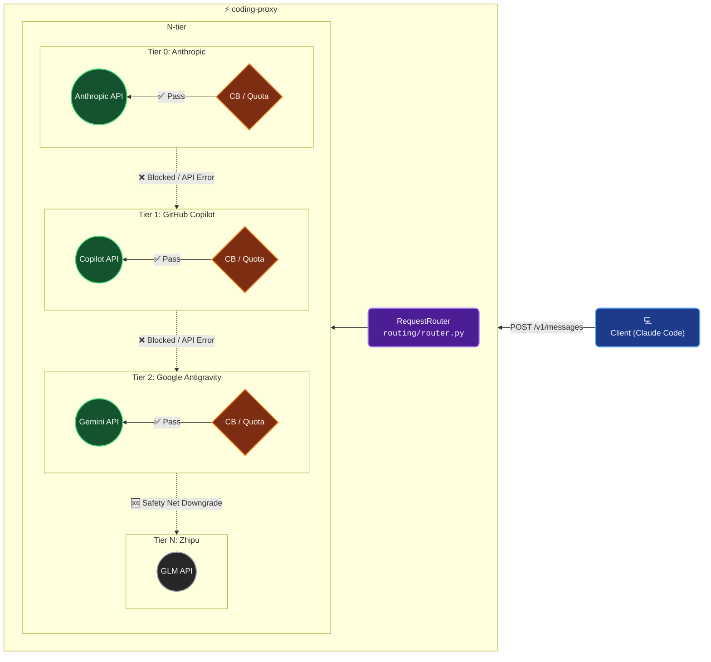

[English](../../README.md) | [简体中文](./README.md)

<div align="center">

# ⚡ coding-proxy

**面向 Claude Code 的多供应商高可用透明智能代理**

[](https://www.python.org/)
[](#)
[](https://github.com/astral-sh/uv)
[](#)

</div>

---

## 💡 为什么需要 coding-proxy？

当我们在使用 **Claude Code** 或其他依赖 Anthropic Messages API 的 AI 编程助手时，沉浸式的编程心流常常被以下问题无情打断：

- 🛑 **限流 (Rate Limiting)**：高频调用触发 `429 rate_limit_error`，被迫发呆等待。
- 💸 **配额耗尽 (Usage Cap)**：激烈的代码生成导致单日/当月额度耗尽，直接返回 `403` 错误。
- 🌋 **服务过载 (Overloaded)**：Anthropic 官方服务器高峰期宕机，甩回无情的 `503 overloaded_error`。

**coding-proxy** 便是为终结这些痛点而生。它作为一个**纯透明**的中间代理层，能让你的 Claude Code 具备毫秒级的”N-tier 链式降级容灾”能力。当主供应商不可用时，它能在**无需人工干预**、**无感知**的情况下，瞬间将请求平滑切换至下一个可用的智能后备方案（如 GitHub Copilot、Google Antigravity 乃至智谱 GLM）。

---

## 🌟 核心特性 (Core Features)

- **⛓️ N-tier 链式故障转移 (Failover)**：自主降序序列，支持 Claude 官方 Plans，以及 GitHub Copilot、智谱、MiniMax、阿里千问、小米、Kimi、豆包等的 Coding Plan。
- **🛡️ 智能弹性与容灾守卫**：每个供应商节点独立配备 **熔断器 (Circuit Breaker)** 与 **配额守卫 (Quota Guard)**，防雪崩、主动避险。
- **👻 透明无感代理机制**：对客户端 **100% 透明**！无需修改任何代码，仅需一行配置覆盖 `ANTHROPIC_BASE_URL` 即可接入。
- **🔄 跨模型与全格式转换**：原生支持 Anthropic ←→ Gemini 的请求与流式响应（SSE）双向转换，并支持自动/自助映射模型名称（如 `claude-*` 至 `glm-*`）。
- **📊 极致可观测性 (Observability)**：内置基于 `SQLite WAL` 的本地监控追踪，CLI 提供一键输出详细的 Token 用量统计面板（`coding-proxy usage`）。
- **⚡ 超轻量单机部署**：全异步架构 (`FastAPI` + `httpx`)，无需依赖 Redis、消息队列等外部组件，对开发者机器无额外负担。

---

## 🚀 快速上手 (Quick Start)

### 1. 环境准备

确保您的计算机上已安装 **Python 3.12+** 以及包管理神器 **`uv`**（强烈推荐，人生苦短，远离缓慢的包管理工具）。

### 2. 闪电安装

```bash
uv add coding-proxy
```

### 3. 点火启动

```bash
## （可选）推荐启用智谱 GLM，使用环境变量防御性地注入密钥
# export ZHIPU_API_KEY="your-api-key-here"

# 使用默认配置启动 coding-proxy
# 默认配置地址：~/.coding-proxy/config.yaml，
uv run coding-proxy start

## 参数 `-c` 可以指定自定义配置文件路径
# uv run coding-proxy start -c ./coding-proxy.yaml

# INFO:     Started server process [1403]
# INFO:     Waiting for application startup.
# ...
# INFO:     coding-proxy started: host=127.0.0.1 port=8046
# INFO:     Application startup complete.
# INFO:     Uvicorn running on http://127.0.0.1:8046 (Press CTRL+C to quit)
```

### 4. 一键接入 Claude Code

打开一个新的终端标签页，启动 Claude Code 前将流量指向 coding-proxy：

```bash
export ANTHROPIC_BASE_URL=http://127.0.0.1:8046

# 享受如丝般顺滑、永不断连的编程心流：
claude
```

---

## 🛠️ CLI 控制台指南

`coding-proxy` 附带了强大的 CLI 工具套件，帮助您全面掌控代理状态。

| 指令     | 说明                                                                              | 示例用法                                      |
| :------- | :-------------------------------------------------------------------------------- | :-------------------------------------------- |
| `start`  | **启动代理服务器**。支持自定义端口与配置路径。                                    | `coding-proxy start -p 8080 -c ~/config.yaml` |
| `status` | **查看代理健康状态**。展示各层级熔断器（OPEN/CLOSED）与配额状态。                 | `coding-proxy status`                         |
| `usage`  | **Token 统计看板**。按天/供应商/模型维度追踪每一次的 Token 消耗、故障转移及耗时。 | `coding-proxy usage -d 7 -v anthropic`        |
| `reset`  | **强制一键重置**。人工确认主供应商恢复可用后，立刻初始化所有熔断器和配额状态。    | `coding-proxy reset`                          |

---

## 📐 架构全景图

当请求到达时，`RequestRouter` 会顺着 N-tier 树形层级，结合熔断与计算配额，决定发往哪一具体通道：



*详细架构设计与机制，请深入阅读 [framework.md](../framework.md)*

---

## 📚 详细文档地图

为了保障长期的项目可维护性，我们提供了循证工程级别 (Evidence-Based) 的详尽文档：

- 📖 **[用户操作指引 (User Guide)](../user-guide.md)** — 从安装、最小配置要求，到每一项配置文件（`config.yaml`）的具体语义和常见排障指南。
- 🏗️ **[架构设计与工程方案 (Architecture Framework)](../framework.md)** — 详细解码底层设计模式（Template Method、Circuit Breaker、State Machine 等），适用于希望深入了解源码或贡献新供应商的开发者。
- 🤝 **[工程准则 (AGENTS.md)](../../AGENTS.md)** — 系统的上下文心法和 AI Agent 协作协议，强调**重构、复用与正交抽象**，是本仓库一切开发的指导方针。

---

## 💡 开发灵感与致谢 (Inspiration & Acknowledgements)

本项目在工程化的探索和实践过程中，受到了一些前沿技术生态和设计的激励。特此感谢：

- 特别感谢 **[Claude Code](https://platform.claude.com/docs/en/intro)** 激发了我们不断打造更加极致无缝编程助手的发心。
- 感谢开源社区各类 **API Proxy** 项目在反向代理、高可用性设计（熔断机制/流式代理）及路由分发方面的宝贵探索经验，为 `coding-proxy` 的 N-Tier 弹性机制提供了坚实的理论启发。

---

<div align="center">
  <sub>Built with 🧠 and ❤️ by ThreeFish-AI </sub>
</div>
